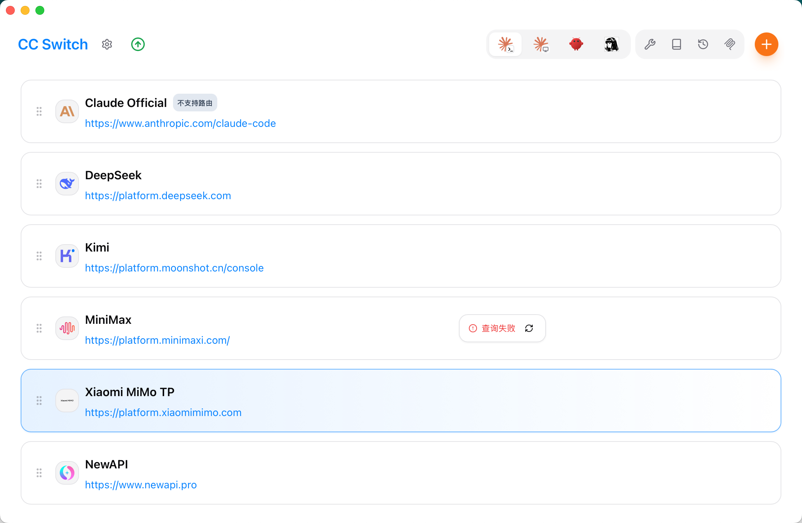
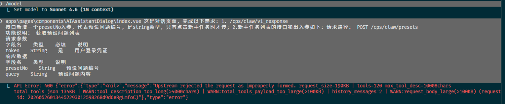
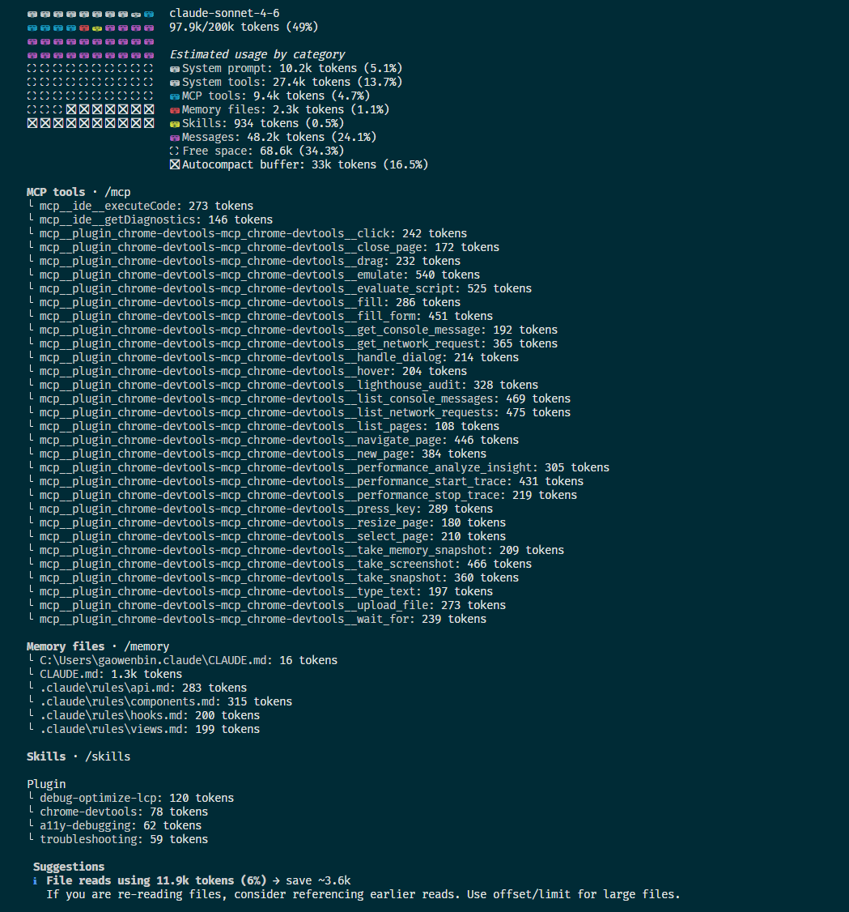
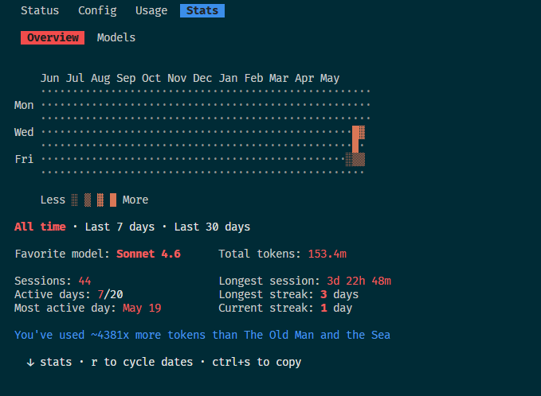
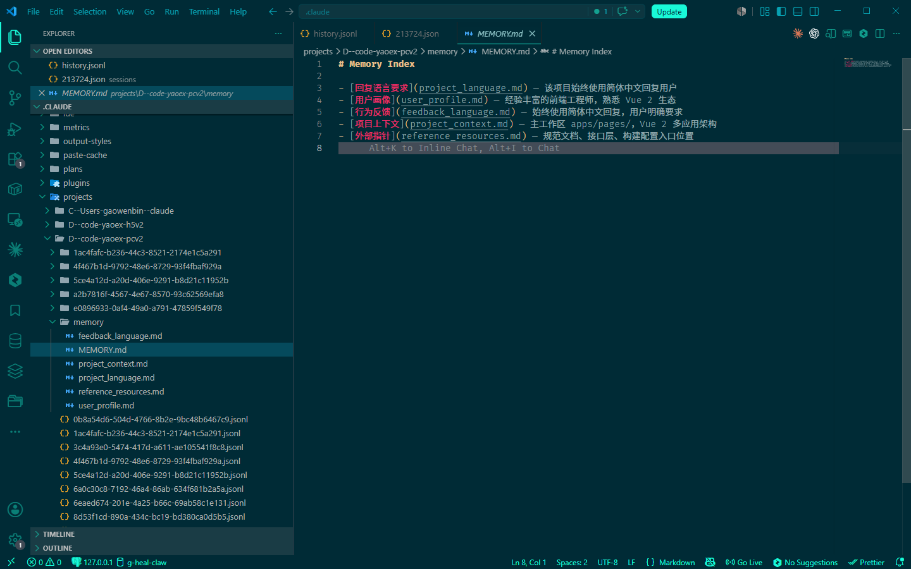

# Vibing Code 完整实践手册：让 AI 从「随机生成」变成「可控生产力」

> 「你有没有遇到过：给 AI 一个需求，它跑了半天，最后发现方向全错了？」
> 这不是 AI 的问题，是方法论的问题。

---

## 🎯 这篇文章解决什么问题

打开 Claude Code 就开干，和打开 IDE 就开写一样——**缺少方法论，效率反而更低**。

本文把 Vibing Code 实践按学习路径重新组织：从**你今天就能做的最小动作**开始，逐步叠加配置、流程、自动化、团队落地。读完你能带走一套可执行的 AI 协作工作流——不是「看完收藏」，是「明天就能用」。

---

## ⚡ 什么是 Vibing Code？

Vibing Code 不是一个工具，是一套 **AI 协作工程实践**。

核心公式只有一句话：

> **AI 负责生成，工程师负责判断。**
> 你的经验是护城河，不是负担。

三个支柱，缺一不可：

| 支柱 | 内容 | 解决什么问题 |
|------|------|-------------|
| ⚙️ 配置 | CLAUDE.md + Hooks + Skills | AI 每次对话能立刻进入状态 |
| ↻ 流程 | Research → Plan → Execute → Review | 防止 AI 在错误方向上越跑越远 |
| ✓ 检查 | typecheck + test + review | 给 AI 自我验证的能力 |

### 你的团队来了一位超级新人

把 AI 想象成你团队来了一位**技术能力满分、但对你的业务一无所知的超级新人**。

他能做什么？

- **全栈代码生成** ⭐⭐⭐⭐⭐ — 从 API 到组件，速度极快
- **重构与测试** ⭐⭐⭐⭐⭐ — 单元测试、类型定义、文档注释
- **调试分析** ⭐⭐⭐⭐ — 给出错误，他能快速定位
- **架构建议** ⭐⭐⭐ — 通用方案不错，业务特殊性需要你补充

他不能做什么？他不知道：你的业务为什么这样设计、这段代码为什么"奇怪"（有历史原因的）、这个改动 3 年后维护成本有多高、用户真正需要什么。

**这恰恰是工程师的护城河。**

### 人机分工边界

| 👤 你来负责（不可外包） | 🤖 AI 来负责（效率倍增器） |
|----------------------|-------------------------|
| **架构判断** — 什么该做，什么不该做，为什么 | **代码生成** — 把你的判断快速变成代码 |
| **验收标准** — 完成的定义是什么（AI 自我验证的依据） | **模式识别** — 发现你描述中的模糊点和遗漏 |
| **方向把控** — 整体产品/技术方向是否正确 | **知识检索** — API 用法、最佳实践、边界情况 |
| **上下文供给** — 业务背景、历史决策、团队规范 | **重复劳动** — 写测试、写文档、格式化、生成 commit |
| **最终决策** — 有歧义时你说了算，包括拒绝 Critic 的建议 | **方案探索** — 多个技术路径的快速原型 |

> **AI 不懂但你懂的**：业务上下文 · 历史包袱 · 工程权衡 · 团队文化 · 产品直觉 · **风险嗅觉**

### 工程师的护城河

你的经验是护城河，不是负担。AI 能生成代码，但有些东西它永远不知道：

- **业务上下文** — 这个功能为什么存在，用户是谁，背后的商业逻辑
- **历史包袱** — 这段代码为什么这么奇怪（有原因的，删了会出事）
- **工程权衡** — 现在这样做，3 年后维护成本是多少
- **团队文化** — 哪些规范是死规矩，哪些可以商量
- **产品直觉** — 用户真正需要的是什么，不是他们说的那个
- **风险嗅觉** — 哪个改动看起来简单但其实危险

### 真实 ROI 对比

**需求**：某连锁药店 AI 经营助手 —— 接入内部 LLM API，实现 SSE 流式对话输出。

| 方式 | 工作内容 | 预估时间 |
|------|---------|---------|
| 传统手写 | SSE 连接管理 + 流式解析 + 断线重连 + 流式渲染 + 多轮上下文 | **3–4 天** |
| Vibing Code | 你定接口协议 + 验收标准，AI 生成实现，Hook 自动验证 | **1–1.5 天** |

🔧 **真实场景**：在药品详情页，需要同时加载基本信息、说明书、相似药品推荐 3 个接口。用 `Promise.all` 把串行改并行，首屏从 1.8s 降到 0.6s —— 这就是面试时能讲出来的「实际影响」。

---

## 📋 第一步：写好 CLAUDE.md — AI 的项目记忆

> 如果只做一件事，先做这件。CLAUDE.md 是 AI 的「项目记忆」——没有它，每次都要重新介绍项目；有了它，AI 开口就在状态。

### 没有 CLAUDE.md vs 有 CLAUDE.md

**❌ 无 CLAUDE.md**：
```markdown
> 帮我给这个组件加个 loading 状态

// AI 输出：引入了 shadcn/ui 的 Spin
// 问题：项目用的是 antd，你还得手动纠正
```

**✅ 有 CLAUDE.md**：
```markdown
# CLAUDE.md 里写了：
# 禁止引入新 UI 库（已有 antd，够用）

> 帮我给这个组件加个 loading 状态

// AI 输出：使用 antd 的 Button isLoading prop
// 直接对，不需要纠正
```

### 黄金法则

每一行都问：**「删掉这行，Claude 会犯什么具体的错误？」**

- 能说出具体错误 → **保留**
- 说不出来 → **删除**，或移入 `docs/`

目标：**50 行以内**。超过 100 行说明你在用它代替文档。

### 三种创建方式

| 方式 | 操作 | 适合场景 | 推荐度 |
|------|------|---------|--------|
| `/init` 自动生成 | 在项目根目录执行 `/init` | 新项目首次接入，快速拿到框架 | ⚠️ 起步用，必须手动精简 |
| 模板复制 + 定制 | 复制下方模板，替换占位符 | 有经验的开发者，知道要写什么 | ✅ 最推荐，质量可控 |
| 纯手写 | 从空白文件开始 | CLAUDE.md 老手，或项目极简 | ✅ 最灵活，但门槛高 |

> **关键区分**：`/init` 是**扫描工具**，不是写作工具。它帮你发现项目结构和技术栈，但生成的内容需要你用「黄金法则」逐行过滤。`/init` 生成的内容里通常有大量噪音（"使用 TypeScript"、"遵循最佳实践"），直接用等于把草稿当正式文档。

❌ `/init` 生成了 200 行，包含 "使用 TypeScript"、"编写清晰的代码"——这些是废话，删掉 Claude 也不会犯错。结果：150 行噪音淹没了真正重要的规则。✅ 用「黄金法则」逐行过滤，保留 50 行以内的高密度规则。

### 完整模板（可直接复制）

```markdown
# 项目上下文
[项目类型 + 一句话描述核心价值]，使用 [核心技术栈]。

# 通用行为
- 优先编辑文件而非重写整个文件
- 不要重复读取本次对话中已读过的文件（除非被修改）
- 输出结果简洁；推理过程和计划必须详尽

# 技术栈
- 包管理器：pnpm（禁止使用 npm / yarn）
- 框架：Next.js 15 App Router
- 样式：Tailwind CSS v4 + CSS Variables
- 测试：Vitest（单元）+ Playwright（E2E）

# 代码规范
- 单文件不超过 400 行，超了就拆模块
- 函数嵌套不超过 4 层
- 详细规范见 @.claude/rules/coding.md

# 命令
- 开发：pnpm dev
- 类型检查：pnpm typecheck
- 单元测试：pnpm test
- E2E：pnpm e2e
- Lint：pnpm lint

# 工作流规则
- 每次修改后必须通过 typecheck 和 test，有失败立即修复
- 禁止 @ts-ignore，有类型问题先告诉我再解决
- 迁移文件只能在 migrations/ 目录下创建

# 禁止事项（违反 = 立即停止）
- 禁止引入新的 UI 库（已有 antd，够用）
- 禁止使用 any 类型，用 unknown + 类型守卫代替
- 禁止直接操作 DOM（除非在 useEffect 内）
- 禁止在 catch 块中吞掉错误

# 常见错误（高优先级）
- DON'T 新建文件前不检查 → ALWAYS 先 Grep 搜索类似实现
- DON'T 跳过类型检查 → ALWAYS 每次修改后运行 pnpm typecheck
- DON'T 引入未在 package.json 中的依赖 → ALWAYS 先确认再安装

# 参考文档
- 架构：@docs/architecture.md
- 编码规范：@.claude/rules/coding.md
- API 契约：@docs/api-contract.md
```

### 真实案例：某药店 AI 助手 · Vue 3 项目

这是从真实项目提炼的完整 CLAUDE.md，展示「每行都有具体原因」的写法：

```markdown
# chat app 上下文

药店 AI 经营助手，基于 Vue 3 + antd，以流式对话为核心交互。

# 通用行为

- 优先编辑文件而非重写整个文件
- 不要重复读取本次对话中已读过的文件（除非被修改）
- 输出结果简洁；推理过程和计划必须详尽

# 技术栈

- 框架：Vue 3 + Vite（MPA，此 app 唯一入口）
- UI：antd（已注册组件见 `vendors/ui/vant/index.js`）
- 状态：Vuex 4（仅 messages，业务状态基本在组件内用 ref/reactive）
- HTTP：`apis/request.js` 封装的 Axios 实例，**禁止直接 import axios**
- 样式：Less（全局变量自动注入，禁止手动 @import 全局变量文件）
- Markdown：marked.js（含思考面板、SQL 折叠等自定义扩展）
- 原生通信：jsBridge（通过 `useGlobalProperties` 获取）

# 目录职责

| 目录 | 职责 |
|------|------|
| `apis/` | 接口定义，`index.js` 聚合导出，`request.js` HTTP 封装 |
| `router/` | Hash 模式，仅一条路由 `/` → `views/home/index.vue` |
| `store/` | messages 列表（addMessage / clearMessages），其余状态在组件内管理 |
| `startup/` | 应用初始化，注册 antd 组件、插件、jsBridge 全局属性 |
| `views/home/` | 核心页面（index.vue + index.less） |
| `utils/` | `hasToken()` 检测登录，`getMallLoginUrl()` 生成登录跳转地址 |
| `hooks/` | `useGlobalProperties` 访问 jsBridge 等全局注入对象 |

# 命令

- 启动：npm run dev:chat
- 构建：npm run build

# 禁止事项（违反 = 代码跑不起来或出 bug）

- 禁止直接 `import axios`，统一走 `apis/request.js` —— 项目有自定义拦截器，直接用 axios 会绕过 token 刷新逻辑
- 禁止在 `<style>` 中手动 import 全局 Less 变量 —— 已全局注入，重复 import 会报"变量未定义"
- 禁止引用其他 app 的组件或工具 —— Monorepo 边界约束
- 禁止在 catch 块中吞掉错误，至少 Toast 或 console.error

# 常见陷阱

- `handleSend` 作为事件处理器时必须加括号 `@click="handleSend()"`，否则会把 MouseEvent 当参数传入
- Less 嵌套规则须在父选择器 `{}` 内，不能在外部使用 `&` 引用父类
- SSE 连接必须在 `onBeforeUnmount` 里调用 `close()`，否则组件销毁后还在收消息
```

> 💡 **关键洞察**：每条规则都对应 Claude 在没有上下文时会犯的**具体错误**。知识库文档用 `@` 引用，不内联，保持精简。

---

## ✍️ 第二步：掌握 CAC 公式 — 写好每一次 Prompt

CLAUDE.md 让 AI 知道了「你的项目是什么样的」。下一步是让 AI 知道「这一次你想让它做什么」。

这就是 CAC 公式：**Context（上下文）+ Action（动作）+ Criterion（验收标准）**。

看三个递进的例子：

**第 1 步：只有 Action（模糊需求）**
```markdown
帮我实现对话气泡
```
Claude 输出：用 div + 内联样式，引用了 react-chatbot-kit 第三方库。
❌ 项目用 antd 不知道；引入了新依赖；没考虑消息方向、时间戳。

**第 2 步：补 Context**
```markdown
参考 @src/components/Card.tsx 的现有布局模式，
项目用 antd，没有 Framer Motion。

帮我实现对话气泡
```
Claude 输出：用对了 antd 样式模式。
⚠️ 但没有区分发送/接收方向、没有时间戳格式。

**第 3 步：加 Criterion（完整 CAC）**
```markdown
【Context】
参考 @src/components/Card.tsx，项目用 antd。

【Action】
创建 ChatBubble 组件，区分发送/接收方向，支持文本和图片消息。

【Criterion】
- 只用已有依赖，不引入新包
- 长文本自动换行，图片消息有最大宽度限制
- 时间戳格式化显示，支持相对时间
- 完成后 pnpm typecheck && pnpm test 零错误
```
✅ 完整交付，支持双向气泡、文本/图片、时间戳、长文本换行。

**这就是 CAC 公式的威力——你的判断力 + AI 的执行力。**

> **反例：一次喂多个任务**
>
> ```
> 帮我做上传组件、修改 ProfilePage、写测试、更新 API 文档
> ```
>
> AI 会「全都做」，但每件都做得不够好；任何一步出错，整个 session 就乱了。**一次一件事，一件事一个清晰的验收标准。**

### CAC 完整示例：Modal 堆叠 + 焦点捕获

这是一个更接近真实场景的 CAC Prompt，展示如何约束 AI 不引入新依赖：

```markdown
【Context】
参考 @src/components/Modal/ 中现有 Modal 组件的实现模式，
当前使用 Radix UI Primitives + Tailwind，项目中没有 Framer Motion。

【Action】
为 Modal 组件增加"堆叠"和"焦点捕获"功能：
- 支持多个 Modal 同时打开，后打开的层级更高
- 打开时焦点自动移入 Modal，关闭后焦点回到触发元素
- 按 Escape 只关闭最顶层 Modal

【Criterion】
- 不改变现有 Modal 的 Props 接口（向后兼容，现有使用方无需改代码）
- 不引入新的 npm 包（Radix 已内置 FocusTrap，直接用）
- 添加 Vitest 单测覆盖堆叠场景（先写测试，后实现，确认红灯后再绿灯）
- 完成后 pnpm typecheck && pnpm test 零错误
```

> ⚠️ **探索性 Prompt 警告**：当你用 Prompt 探索/分析现有代码时（而非实现具体功能），AI 的输出是「启发」而非「结论」。**永远以你自己的工程经验为准**，AI 的分析是起点，不是答案。特别是「这段代码有什么问题」这类分析性问题，要用你的经验验证 AI 的判断。

---

## 🔄 第三步：走通四阶段流程 — 从单次 Prompt 到完整工作流

单次 Prompt 能解决「一个组件」级别的问题。但复杂功能涉及多个模块、新接口、数据模型变更时，直接开干 = 在错误方向上一路狂奔。

### 四阶段流程

```
01 Research  →  02 Plan  →  03 Execute  →  04 Review
只读，了解现有    输出文件清单    按确认计划实现    Reviewer Agent
实现，找复用代码   等你确认计划    每步跑 typecheck  只读审查，三级报告
```

### 完整开发流程：Step 1 → Step 7

**Step 1：需求分析（消除歧义，明确边界）**
```markdown
请阅读 @docs/product.md 了解产品背景。

我需要实现：[功能描述]

请：
1. 用自己的话复述你理解的需求（不要照搬原文）
2. 列出你认为需要澄清的问题（按重要性排序）
3. 识别潜在的边界情况和实现风险

暂不写代码，暂不给方案。
```

**Step 2：ADR 方案设计（有选择就记录；纯实现可跳过）**
```markdown
请阅读 @docs/architecture.md 和 @docs/tech-stack.md。

针对 [功能名称]，请提供技术方案：
1. 推荐方案及理由
2. 备选方案及取舍
3. 需要修改的文件清单
4. 你对这个方案最不确定的一件事

以 ADR 格式输出到 docs/decisions/YYYY-MM-DD-[title].md。暂不写代码。
```

| 情况 | 是否需要 ADR |
|------|------------|
| 涉及新的数据模型 | ✅ 必须 |
| 引入新的技术依赖 | ✅ 必须 |
| 有多种实现路径可选择 | ✅ 必须 |
| 纯 UI 调整、文案修改 | ❌ 跳过 |

**Step 2.5：Critic Agent（方案审查，一次性介入）**

Critic 只在 ADR 写完后、任务拆解前这一个节点介入。全程监督 = 分析瘫痪。

```markdown
请以 @.claude/agents/critic-agent.md 的角色，审查以下方案：

[粘贴 ADR 核心内容]

输出：
1. 找出 3 个最可能出错的假设
2. 列出被忽略的边界情况
3. 质疑技术选型：有没有更简单的解法？
4. 每个反对意见必须附替代方案
```

**Step 3：任务拆解（原子任务，不超过 200 行改动）**

拆解原则：INVEST —— **独立（I）/ 可验收（N）/ 有价值（V）/ 可估算（E）/ 小（S）/ 可测试（T）**。

每个任务粒度 ≤ 1 人日，必须有明确的 AC（验收条件）：

```markdown
# FEAT-042：用户头像上传

## 依赖顺序
T1 → T2 → T3（顺序执行）；T4 可与 T2/T3 并行

## 任务清单
- [ ] T1：创建 /api/upload 接口（含文件类型/大小/MIME 校验）
      AC：POST /api/upload，返回 { url }；超过 5MB 返回 400；非图片 MIME 返回 415
- [ ] T2：实现 AvatarUploader 组件（拖拽 + 点击，含进度条）
      AC：支持 JPG/PNG/WebP；显示上传进度条；失败有错误提示
- [ ] T3：集成到 ProfilePage，替换现有头像展示逻辑
      AC：旧头像逻辑删除；新头像 URL 写入用户 profile；刷新后持久化
- [ ] T4：Vitest 单测 + Playwright E2E（完整上传流程）
      AC：文件大小校验测试通过；E2E 覆盖上传成功 + 超大文件 + 格式错误三条路径
```

**Step 4：逐任务实现（标准工作模式）**
```bash
# 1. 进入 Plan Mode 先探索
> 请阅读 @src/api/ 了解现有接口结构，暂不修改任何代码

# 2. 确认现状后制定计划
> 我要实现 T1：/api/upload 接口，请给出实现计划

# 3. 确认计划后开始执行
> 按计划实现，完成后运行 pnpm typecheck && pnpm test

# 4. 完成后立即 commit
> 请生成 Conventional Commits 格式的 commit message 并提交
```

**Step 4.5：Test-Driven Vibing（两段式）**

先写失败的测试，再写通过的代码：

```markdown
# 第一段：只写测试（此时测试应当失败）
为 [功能名] 写单元测试，覆盖：
- 正常路径 / 边界情况 / 错误场景

写完后运行 pnpm test，确认测试失败（红灯）。暂不实现功能代码。

---（我确认测试用例正确后）---

# 第二段：让测试通过
写最少的代码让上面所有测试通过。
不多写一行，不提前优化，先让红灯变绿灯。
```

> ⚠️ **AI 语境下的关键风险：「测试迎合实现」** — AI 生成测试时容易写出「能通过但无意义」的测试，断言直接镜像实现逻辑。人工验收两件事：① 测试描述能独立读懂；② 故意传入错误输入，测试是否真的会失败。

**TDV 实战：AvatarUploader 文件大小校验**

```bash
# ── 第一段：只写测试（红灯）──────────────────────────
$ pnpm test src/components/AvatarUploader.test.tsx

✗ AvatarUploader > 应拒绝超过 5MB 的文件
✗ AvatarUploader > 应支持 JPG/PNG/WebP 格式
✗ AvatarUploader > 上传中应显示进度条
Tests: 3 failed, 0 passed

# （你确认测试用例描述准确、能独立读懂）

# ── 第二段：写最少代码让测试通过（绿灯）──────────────
$ pnpm test src/components/AvatarUploader.test.tsx

✓ AvatarUploader > 应拒绝超过 5MB 的文件
✓ AvatarUploader > 应支持 JPG/PNG/WebP 格式
✓ AvatarUploader > 上传中应显示进度条
Tests: 3 passed, 0 failed

# ── 验证三连 ──────────────────────────────────────
$ pnpm typecheck   ✓  零类型错误
$ pnpm test        ✓  3/3 通过
$ pnpm lint        ✓  零警告
```

> **TDV 的真正价值**：测试是用需求语言写的规格说明，而不是用代码语言写的实现描述。先有规格再写代码，保证了你验收的是「功能」而不是「Claude 的实现方式」。

**Step 5：验证三连（铁律）**
```bash
pnpm typecheck   # 类型检查（最快，先跑，0 容忍）
pnpm test        # 单元/集成测试（核心逻辑护城河）
pnpm lint        # 代码规范（最后跑）
```

**任一失败，立即停止，先修复再继续。堆积失败 = debug 黑洞。**

**Step 6：Code Review（Reviewer Agent）**
```markdown
请以 @.claude/agents/reviewer-agent.md 的角色，审查以下改动：

[文件列表]

以 🔴 Critical / 🟡 Warning / 🔵 Suggestion 三级输出。只分析不修改。
```

**Critic vs Reviewer 对比**：

| | Critic Agent（Step 2.5） | Reviewer Agent（Step 6） |
|---|---|---|
| **介入时机** | ADR 写完后，任务拆解前 | 代码实现完成后，PR 前 |
| **审查对象** | 方案设计 / 技术决策 | 实际代码变更 |
| **核心问题** | 「这个方案会出什么问题？」 | 「这段代码有没有 bug / 风险？」 |
| **Session** | 新 Session 隔离（外部视角） | 新 Session 隔离（外部视角） |

**Step 7：交付确认**
```markdown
# 交付前自检清单
1. pnpm typecheck && pnpm test && pnpm lint — 全部通过
2. 运行回归测试范围（见任务文档中的"回归范围"）
3. 生成 Conventional Commits 格式的 commit message
4. 创建 PR，关联 Issue，填写 PR 模板
```

### 流程降级规则

- **实现中途发现方案根本性错误**：立即停止 → `git stash`，开新 Session 重新做 ADR，**不要在错误方向上继续修补**
- **测试阶段发现设计缺陷**：`git reset` 到最近一个干净提交，不要试图在破损状态上继续堆 Prompt
- **Review 发现 Critical 级别问题**：必须修复后才能进入交付，不接受"下个版本修"

### 流程缩减原则

| 场景 | 处理方式 |
|------|---------|
| 纯 UI 调整 | 直接 Execute，跳过 Research + Plan |
| 小功能无架构决策 | 跳过 ADR |
| 快速原型验证 | 先 Vibe 后 Spec |
| 复杂跨模块功能 | **走完整四阶段，不能跳** |

> **快速判断标准**：
> - ✅ **可跳过 Plan**：改动文件 < 3 个 / 不涉及新接口或数据模型 / 只改样式或文案
> - ⚠️ **快速原型注意**：团队场景下「先 Vibe」的原型代码不能直接进主干，完成后必须补 Spec 再做正式实现，避免原型直接进生产
> - 🔴 **必须走完整流程**：涉及新依赖 / 修改核心数据流 / 影响已有接口契约

---

## ✅ 第四步：让验证自动化

> 核心论点：给 Claude 验证标准，它是最好的 QA；不给，你是唯一的 feedback loop。

### 验证五层金字塔

```
Level 5：AI Code Review
    /cr 触发 reviewer-agent，PR 前必跑
Level 4：视觉验证
    截图 + Figma MCP 结构化比对 + Chrome DevTools 自动截图
Level 3：E2E 测试
    pnpm e2e — 关键用户路径，改动涉及流程必跑
Level 2：单元/集成测试
    pnpm test — 核心逻辑护城河，新功能必须覆盖
Level 1：类型检查
    pnpm typecheck — 零成本，每次修改必跑，0 容忍
```

### Level 4 视觉验证三层手段

**手段一：截图对比（人工比对，快速粗筛）**
```markdown
请截图当前页面，与 @docs/ui-rules.md 中的设计规范对比，
列出视觉差异（颜色、间距、字号、圆角）。
```

**手段二：Figma MCP 结构化验证（参数级精比对）**

Figma MCP 不做像素对比，但能把设计稿的 tokens 提取为结构化数据，与代码中的实际值逐项比对。
```markdown
用 Figma MCP 读取 [设计稿链接] 的 design tokens，
然后检查 @src/components/AvatarUploader.tsx 中的样式值，
列出所有不一致的间距、颜色、字号。
```

**手段三：Chrome DevTools MCP 自动截图（多断点，可集成 CI）**
```markdown
用 Chrome DevTools MCP 打开 http://localhost:3000/profile，
分别在 1440px 和 375px 宽度下截图，
对比 @docs/ui-rules.md 中的响应式断点规范。
```

### 安全护栏：技术强制

```json
{
  "permissions": {
    "deny": [
      "Bash(rm -rf *)",
      "Write(.env*)",
      "Write(**/migrations/**)"
    ]
  }
}
```

流程约定同样重要：
- AI 绝不操作生产环境
- 每个原子任务完成后 git commit
- 并行任务用 Git Worktree 隔离
- 敏感操作（migration、配置）必须人工确认

### 定期安全扫描（每 Sprint 至少一次）

把下面这条 Prompt 作为 Sprint 结束时的固定环节，让 AI 做安全自检：

```markdown
请以安全审计视角，检查 @src/api/ 目录下的所有接口文件。

重点排查：
1. XSS / SQL 注入 / 路径遍历 / MIME 类型伪造
2. 身份验证和授权（是否有未保护的接口）
3. 敏感信息泄露（API Key、用户数据出现在日志或响应中）
4. 依赖安全（运行 pnpm audit，列出 high/critical 漏洞）

输出格式：🔴 高危 / 🟡 中危 / 🔵 低危，每条附修复建议。
只分析，不修改代码。
```

---

## 🪝 第五步：用 Hooks 构筑自动防线

前面四步建立的是「人工触发」的工作流。但人总会忘——忘记跑 typecheck、忘记检查是否引入了新依赖、忘记关闭 SSE 连接。

Hook 是把「人工纪律」变成「系统强制」的关键一步。

**关键区别**：CLAUDE.md 是「建议」，Claude 理解后遵循；Hook 是「法律」，确定性执行，不依赖 AI 理解。

| 规则类型 | 放 CLAUDE.md | 放 Hook |
|---------|-------------|---------|
| 不引入新 UI 库 | ✅ 语义约束 | — |
| 禁止 any 类型 | ✅ 编码习惯 | — |
| 编辑后自动格式化 | — | ✅ PostToolUse 确定执行 |
| **阻止写入 .env*** | ❌ 不可靠 | ✅ PreToolUse 强制拦截 |
| **阻止修改 migrations/** | ❌ 不可靠 | ✅ PreToolUse 强制拦截 |
| **阻止 rm -rf 类命令** | ❌ 不可靠 | ✅ PreToolUse 强制拦截 |

> 💡 危险操作（环境文件、数据库迁移、破坏性命令）**必须用 Hook 做技术强制**，不能靠 AI 自觉。

### Hook 事件一览

Hook 在 Claude Code 生命周期的特定节点自动触发：

| 事件 | 触发时机 | 典型用途 |
|------|---------|---------|
| PreToolUse | 工具执行前 | 日志记录、权限拦截 |
| PostToolUse | 工具执行后（成功） | 自动格式化、运行测试 |
| PostToolUseFailure | 工具执行后（失败） | 错误处理 |
| PermissionRequest | 权限弹窗前 | 自动放行/拦截 |
| UserPromptSubmit | 用户提交消息时 | 输入预处理、关键词拦截 |
| SessionStart | 会话启动时 | 初始化环境、加载动态上下文 |
| Stop | Claude 停止响应时 | 长任务完成后发通知 |
| PreCompact | 上下文压缩前 | 保存关键上下文 |
| PostCompact | 上下文压缩后 | 恢复上下文 |
| Notification | 通知触发时 | 自定义通知处理（如推送到手机） |

### settings.json + Hook 脚本示例

```json
{
  "hooks": {
    "PostToolUse": [
      {
        "matcher": "Edit|Write",
        "hooks": [{
          "type": "command",
          "command": ".claude/hooks/post-edit-quality.sh",
          "timeout": 30
        }]
      }
    ],
    "PreToolUse": [
      {
        "matcher": "Bash",
        "hooks": [{
          "type": "command",
          "command": ".claude/hooks/pre-bash-firewall.sh",
          "timeout": 10
        }]
      }
    ]
  }
}
```

```bash
#!/usr/bin/env bash
# .claude/hooks/post-edit-quality.sh
set -euo pipefail

# 自动格式化（失败不阻断）
npx prettier --write . --quiet 2>/dev/null || true

# 类型检查失败时通知 Claude
if ! pnpm typecheck --quiet 2>&1; then
  echo "⚠️ TypeScript 类型检查失败，请在继续前修复类型错误" >&2
fi

exit 0
```

```bash
#!/usr/bin/env bash
# .claude/hooks/pre-bash-firewall.sh
# PreToolUse：exit 2 = 阻断 + stderr 反馈给 Claude

input=$(cat)
command=$(echo "$input" | jq -r '.tool_input.command // ""')

# 危险模式检测
patterns=("rm -rf /" "git reset --hard" "DROP TABLE" "> /dev/null.*&&.*rm")
for pattern in "${patterns[@]}"; do
  if echo "$command" | grep -qiE "$pattern"; then
    echo "🚫 危险命令被拦截（匹配：'$pattern'）" >&2
    exit 2
  fi
done

# 保护敏感目录
if echo "$command" | grep -qE "\.(env|env\.local)|migrations/.*\.(sql|ts)"; then
  echo "🚫 禁止通过 Bash 直接操作 .env 或 migrations/ 文件" >&2
  exit 2
fi

exit 0
```

> **关键机制**：Hook 的 stderr 输出会直接反馈给 Claude，形成**自动纠错循环**。Claude 不需要你手动指出错误 — Hook 替你做了这一步，而且是每次编辑后都自动执行。

### Hook 实战 Before / After（某连锁药店项目）

**❌ 没有 Hook：**

> Claude 修改了 `ChatDialog.vue`，在组件里直接 `import axios`，Less 嵌套写成了：
> ```less
> .chat-wrap { ... }
> .chat-wrap &-bubble { ... }  // 错误写法，& 在外部引用
> ```
> 我手动跑 ESLint 才发现，来回修改花了 20 分钟。

**✅ 有 PostToolUse Hook（自动触发 ESLint --fix + typecheck）：**

> Claude 修改完文件 → Hook 立刻触发 ESLint → stderr 输出：
> ```
> ⚠️ error: 'axios' is not allowed, use apis/request.js instead
> ⚠️ error: Unexpected & (less-nesting)
> ```
> → Claude 立即收到反馈，自动修正。代价：0 分钟，全自动。

**你的 CLAUDE.md 负责告诉 AI「不要这样做」，Hook 负责「确保做不到」。两者缺一不可。**

---

## ⚡ 第六步：沉淀为 Skill — 可复用工作流命令化

当你发现自己反复在写同样结构的 Prompt（功能开发、Code Review、部署检查），就该把它们沉淀为 Skill 了。

Skill 放在 `.claude/skills/` 下，以**文件夹名**作为命令名（如 `.claude/skills/feat/SKILL.md` → `/feat`）：

```tree
my-skill/                          ← 文件夹名 = 命令名
│
├── SKILL.md                       ← [必须] Skill 定义（frontmatter + 行为指令）
│
├── references/                    ← [可选] 参考文档，SKILL.md 中 @import 按需读取
│   ├── strategy-a.md              ←     如方案模板、评分细则、Checklist
│   └── strategy-b.md
│
├── scripts/                       ← [可选] 可执行脚本（JS / SH / PY）
│   └── helper.js
│
├── examples/                      ← [可选] 示例文件，供 Claude 参考
│   └── sample-output.md
│
└── *.md                           ← [可选] 子 Agent Prompt
    ├── reviewer-prompt.md
    └── implementer-prompt.md
```

```markdown
---
name: my-skill
description: 一句话描述这个 Skill 做什么
---

# Skill 正文

这里写 Claude 拿到这个 Skill 后的行为指令。
可以包含步骤、规则、模板、输出格式等。
```

> 💡 创建新 Skill 可以用 `/skill-creator`，它会引导你完成描述、触发词、参数、正文的结构化生成，比手写更快也更规范。

### 真实 Skill 案例：/feat（端到端需求交付）

这是一个完整的 `/feat` Skill，把「流程」章节的 Step 1→7 编排成可执行命令。单阶段触发也加载此 Skill，以保持产出格式和可追溯 ID 一致。

````yaml
---
name: feat
description: |
  端到端需求交付流程，覆盖全生命周期：需求分析 → ADR 方案设计 → 任务拆解 → 逐任务实现 → 测试用例 → Code Review → 交付确认。
  以下任意情况触发：
  - "新需求 / 新功能 / 实现需求 / 需求交付 / 做一个功能"
  - "分析需求 / 拆分任务 / 写 PRD / 写 ARD / 设计接口"
  - "帮我实现 / 开发 / 编码这个功能"
  - "写测试用例 / 单元测试 / 集成测试"
  - "Code Review / CR / 审查代码 / 帮我 review"
  单阶段触发也加载此 Skill，以保持产出格式和可追溯 ID 一致。
triggers:
  - 新需求
  - 新功能
  - 实现需求
  - 需求交付
  - 做一个功能
  - 分析需求
  - 拆分任务
  - 写PRD
  - 写ARD
  - Code Review
  - CR
  - 代码审查
  - 写测试用例
invocable: true
arguments:
  - name: requirement
    hint: "<需求描述>"
    required: true
capabilities:
  - read
  - write
  - search
  - execute
extensions:
  claude:
    allowed-tools: "Read Write Edit Glob Grep Bash Agent"
---

# 端到端需求交付（feat）

一句话需求 → 完整交付链路。每阶段有明确质量门和用户确认卡点，产出带可追溯 ID。

## 流程全景

```
P1:需求理解 → P2:ADR方案设计 → P3:任务拆解 → P4:逐任务实现 → P5:测试用例 → P6:Code Review → P7:交付确认
  5W1H         备选方案+推荐       INVEST+可追溯ID    遵循rules/*       金字塔+六维      六维评分+四级严重度   变更清单+验证状态
  In/Out       写入decisions/     写入CURRENT.md      每任务更新状态    AC覆盖矩阵      Critical归零方可合并   文档传导
```

- **阶段可独立触发**：先检查上下文是否有前序产出，有则复用，无则直接执行
- **反馈闭环**：P6 发现问题回溯 P4/P5；P1 边界变更重走 P2→P3
- **交互原则**：每阶段结束询问是否继续；单次追问 ≤3 条；P6 每个扣分项必须附 Before/After

## 目录结构

```
.claude/skills/feat/
├── SKILL.md                        ← Body（本文件）—— 流程框架 + 质量门 + 引用指针
└── references/
    ├── prd-template.md             ← P1/P3 产品需求文档模板
    ├── ard-template.md             ← P1/P3 接口需求文档模板（含 PRD/ARD/ADR 决策树）
    ├── review-rubric.md            ← P6 评分细则（六维量规 + 严重度速查 + 校准示例 + 反模式清单）
    └── test-patterns.md            ← P5 测试模式库（NestJS/Zod/React/SDK 代码模板 + Mock 策略）
```

> **设计原则**：SKILL.md 只写框架型判断；完整模板和评分细则放入 `references/`，按需读取。

---

## Phase 1：需求理解

**目标**：模糊输入 → 结构化理解，识别歧义和风险。
**方法**：5W1H + In/Out Scope + 假设登记册 + 追问三原则

### 执行步骤

1. 读取上下文（按序）：`docs/PRD.md` → `docs/SPEC.md` → `docs/ARCHITECTURE.md` → `docs/DESIGN.md` → `docs/tasks/CURRENT.md` → `docs/decisions/` → `.claude/rules/`
2. 5W1H 拆解：Who（角色）、What（边界）、Why（价值）、When（场景）、Where（模块/队列/表）、How（方向）
3. 识别假设与风险，标注优先级（高/中/低）
4. 模糊点选最关键 ≤3 条追问

### 产出

- 需求概述（一句话）+ PRD 章节归属
- **In Scope / Out of Scope** 功能边界表格
- 涉及应用/模块、队列、数据表、契约清单
- 假设与风险登记册（编号 + 影响 + 优先级）
- 关键约束（如 SDK 无 Node API、不绕过 GatewayModule）
- 追问清单（≤3 条，有疑问时）

> 完整 PRD/ARD 模板见 [`references/prd-template.md`](references/prd-template.md) 和 [`references/ard-template.md`](references/ard-template.md)。

### 质量门

- [ ] In/Out Scope 明确，高优先级风险已标记，涉及模块/队列/表已识别
- [ ] 有疑问时追问 ≤3 条；无疑问时直接进入 P2（仍输出理解摘要）

---

## Phase 2：方案设计（ADR）

**目标**：产出架构决策记录，作为实现契约。
**方法**：备选方案评估 + 推荐方案 + ADR 写入 `docs/decisions/`

### 文档类型决策树

```
需要什么类型的文档？
├─ 涉及 UI/用户交互 → PRD（references/prd-template.md）
├─ 涉及新接口/数据模型/队列 → ARD（references/ard-template.md）
├─ 涉及架构决策（新技术/模块重组/通信模式变更）→ ADR（docs/decisions/）
└─ 轻量变更 → 直接更新 docs/SPEC.md，不建独立文档
```

### 执行步骤

1. 确定 ADR 编号（`docs/decisions/` 最大编号 + 1）。小体量决策可在 `docs/decisions/README.md` 索引表新增一行，不建独立文件
2. 设计 1~3 个备选方案，每个含：技术路径、接口草稿、优缺点/成本/风险、对架构的影响
3. 推荐方案（对齐需求 + 符合架构红线 + 最小变更）
4. 按 `docs/decisions/README.md` 模板写入 ADR + 更新索引
5. 输出 ADR 摘要请求 Review：决策一句话、推荐方案、文件路径、关键影响（SPEC/ARCHITECTURE/模块边界）

### 质量门

- [ ] ≥1 备选方案被评估，推荐方案符合架构红线，ADR 已写入 + 索引已更新

**卡点**：须等用户确认 ADR 后才进入 P3。

---

## Phase 3：任务拆解

**目标**：将方案拆为可独立交付、有明确 AC 的任务，建立可追溯 ID 链。
**方法**：INVEST + 垂直切片 + 依赖显式化 + 可追溯 ID

### 拆解原则

- **INVEST**：Independent, Negotiable, Valuable, Estimable, Small（≤1d）, Testable
- **垂直切片**：每个 Story 独立交付业务价值，避免纯技术 Task
- **粒度**：≤1 人日（AI 约 1~2 轮对话），底层先于上层（shared Schema → Processor → Controller → UI）
- **测试随功能同步**，SDK 变更须附带体积预算（gzip ≤ 15KB）

### 可追溯 ID 体系

```
REQ-001 → ADR-NNNN → TX.Y.Z（CURRENT.md 任务）→ TC-U01（测试用例）→ CR-C01（CR 问题）
```

### 执行步骤

1. 读取 `docs/tasks/CURRENT.md`，取下一个 `T<Phase>.<M>.<Seq>` 编号
2. 拆解任务，格式：`[ ] TX.Y.Z {标题} — {估时}d` + 输入/输出/Given-When-Then 验收/依赖
3. 写入 CURRENT.md 对应 Milestone，更新"当前焦点"
4. 输出任务清单 + 关键依赖链 + 预估总工时，请求 Review

### 质量门

- [ ] 每个 Story 可独立交付，每个 Task 有 Given/When/Then AC，依赖显式标注，ID 无冲突

**卡点**：须等用户确认任务拆解后才进入 P4。

---

## Phase 4：逐任务实现

**目标**：按依赖顺序逐个交付任务，每个任务 typecheck/lint/test 全绿。

### 每任务执行流程

1. **切换状态** `[ ]` → `[~]`，更新 CURRENT.md
2. **先读后写**：理解现有实现模式（Zod 命名风格、NestJS 模块组织）
3. **编码 + 测试**：遵循 `.claude/rules/coding.md` + `architecture.md`；测试文件放 `<package>/tests/`，禁止散落 `src/`
4. **本地验证**：`pnpm typecheck && pnpm lint && pnpm test`
5. **自检**：对照 `.claude/rules/review.md` Checklist
6. **Demo + 文档 + 传导**（用户可感知需求必做，详见 `.claude/rules/review.md §9）：`examples/nextjs-demo/` 新建场景 → `apps/docs/` 补 How-to → 按序传导 PRD/SPEC/ARCHITECTURE/DESIGN → ADR → CURRENT.md → GETTING_STARTED → README；ADR「后续」→ demo 路径 + apps/docs 链接
7. **收尾** `[~]` → `[x]` + 日期，更新"当前焦点"
8. **报告完成**，继续下一个任务

### 质量门

- [ ] typecheck/lint/test 全部通过，测试文件在 `tests/`，Demo 和 docs 已建立，文档已传导

**流转规则**：无依赖任务可合并执行；遇阻塞立即暂停询问；**禁止自动 git commit/push**。

---

## Phase 5：测试用例设计

**目标**：确保每条 AC 有对应测试用例，覆盖正常路径、边界、异常。
**方法**：测试金字塔（E2E 10% / 集成 30% / 单元 60%）+ 六维用例设计

> 详细代码模式（NestJS/Zod/React/SDK 模板 + Mock 策略）见 [`references/test-patterns.md`](references/test-patterns.md)。

### 六维用例设计

| 维度 | 核心思路 |
|------|----------|
| **Happy Path** | 正常输入 → 期望输出 |
| **边界值** | 空值 / 零值 / 最大最小值 |
| **异常输入** | 非法类型 / 超长 / 恶意 payload |
| **并发/竞态** | 幂等性 / 重复提交 |
| **权限/安全** | 未授权 401 / 越权 403 |
| **性能边界** | 大数据量 / 高频调用 / 超时 |

### 产出

1. **AC 覆盖矩阵**：每条 AC → 单元/集成/E2E 测试映射
2. **单元测试**：覆盖任务 ID + 测试对象 + 维度 + Given-When-Then
3. **集成测试**：模块间交互链路，使用 Dockerized PG（禁止 mock 数据库）
4. **E2E 测试**：用户故事级别场景，对应 AC

### 质量门

- [ ] AC 覆盖 100%，Happy Path + 边界 + 异常三个维度已覆盖
- [ ] 涉及队列/并发有竞态测试，涉及权限有安全测试，测试文件在 `tests/`

---

## Phase 6：Code Review

**目标**：六维量化评分 + 四级严重度 + 改进建议。Critical 归零方可合并。
**方法**：六维评分（/100）+ 严重度决策树 + Before/After

> 详细量规（分数段标准 + 检查要点）、校准示例、反模式清单见 [`references/review-rubric.md`](references/review-rubric.md)。

### 评分维度

| 维度 | 权重 | 核心关注点 |
|------|------|-----------|
| 正确性 | 25 | 逻辑缺陷、边界处理、异常传播、幂等性 |
| 可读性 | 20 | 命名自解释、控制流扁平、函数 ≤30 行 |
| 可维护性 | 20 | 单一职责、依赖方向、无重复代码 |
| 安全性 | 15 | 输入校验、密钥管理、权限控制 |
| 性能 | 10 | N+1 查询、并行化、SDK 体积预算 |
| 测试覆盖 | 10 | AC 覆盖完整性、边界用例 |

### 严重度决策树

```
发现问题
├─ Bug / 安全漏洞 / 数据损坏 / 架构红线违反？→ 🔴 Critical（阻塞合并）
├─ 影响可维护性/性能/扩展性？→ 🟠 Major（强烈建议）
├─ 代码质量可后续改进？→ 🟡 Minor（建议）
└─ 风格/习惯问题？→ 🔵 Nitpick（可选）
```

**速查**：`any`/空 catch/apps 间 import/硬编码密钥/SQL 注入/SDK 引 Node API → 🔴；队列名硬编码/N+1/手写类型代替 `z.infer<>`/测试文件在 `src/` → 🟠

### 产出

- 综合评分（六维表格 + 总分 + 评级）：≥90 ✅ / 75-89 🟡 / 60-74 🟠 / <60 🔴
- 问题清单按严重度分组，每个附 `[CR-Cxx]` 编号 + `文件:行号` + Before/After
- 亮点至少 1 条（不可省略）
- 行动项分 Blocker / Non-blocker

### 质量门

- [ ] 六维均已打分（附评语），Critical = 0，总分 ≥ 75，每扣分项附 Before/After

**卡点**：有 Critical 时须修复后重审。

---

## Phase 7：交付确认

全部任务完成后输出交付摘要：

- **可追溯链路**：REQ → ADR → Tasks → TCs → CRs（全部 Closed）
- **变更清单**：新增/修改文件 + SPEC/ARCHITECTURE/DESIGN 更新状态
- **Demo + docs**：场景路径 + 触发方式 + 使用说明落点
- **文档传导**：PRD/SPEC/ARCHITECTURE/DESIGN/ADR/CURRENT/GETTING_STARTED/README/CLAUDE/AGENTS
- **验证状态**：typecheck / lint / test / SDK 体积预算 | **CR**：总分 / Critical / Major / 评级

---

## 可追溯性

```
REQ-001 → ADR-NNNN → TX.Y.Z（CURRENT.md）→ TC-U01（测试）→ CR-C01（CR问题）
```

- P3 输出时建立 REQ → ADR → Task 链路
- P5 输出时建立 Task → TC 映射（AC 覆盖矩阵）
- P6 输出时 CR 问题关联到具体 TC 或 Task
- P7 交付摘要汇总完整链路

## 约束

- 遵循 `.claude/rules/` 所有硬性规则
- ADR 使用 `docs/decisions/README.md` 模板；任务 ID 遵循 `T<Phase>.<M>.<Seq>` 格式
- 测试文件必须位于 `<package>/tests/`，禁止散落 `src/`
- 不自动 `git commit` / `git push` / 分支操作
- 单阶段触发时先检查前置上下文
- 各阶段输出均携带可追溯 ID
````

> 💡 `/feat` 不只是一个命令，而是把 CAC Prompt 三要素、四阶段流程、Reviewer Agent、交付确认串成了一条完整链路，每个阶段有明确质量门和用户确认卡点。**流程是骨，Skill 是魂。**

### docs/prompts.md 维护规则

把复用率高的 Prompt 沉淀为片段库：

**沉淀触发条件**：某个 Prompt 在一个月内被复用 3 次以上 → 提炼进来

```markdown
### [场景名称]
> 适用时机：[描述什么情况下用]
> 最后更新：YYYY-MM-DD

[Prompt 正文]
```

**清理规则**：超过 6 个月未使用的条目 → 移入 `docs/prompts-archive.md`

---

## 🏗️ 进阶：项目配置全景

前面六步是从「个人实操」角度层层递进。当你掌握了这些，就可以俯瞰整个配置体系的完整图景了。

### 推荐的项目配置结构

```tree
project-root/
│
├── CLAUDE.md               # Claude 每次对话必读（项目级）；精简！
├── AGENTS.md               # 兼容 Codex / Gemini CLI 等其他 agent 工具
├── README.md               # 项目概述，Claude 会读取
├── .claudeignore           # 不让 Claude 读取的文件/目录
│
├── .claude/
│   ├── settings.json       # 权限规则、Hooks 注册；团队共享，纳入 git
│   ├── settings.local.json # 个人覆盖（调试开关等）；加入 .gitignore
│   │
│   ├── skills/             # Skill = Slash Command，文件名即命令名
│   │   ├── feat.md         # 功能开发全流程（/feat T1:用户上传）
│   │   └── cr.md           # Code Review 检查清单（/cr @src/api/upload.ts）
│   │
│   ├── rules/              # 细粒度规则文件，CLAUDE.md 中用 @import 引入
│   │   ├── architecture.md # 架构约束：模块边界、禁止的依赖方向
│   │   ├── coding.md       # 编码规范：命名、文件结构、禁用 API
│   │   └── review.md       # Review 标准：性能、安全、可维护性清单
│   │
│   ├── hooks/              # Hook 脚本（由 settings.json 注册）
│   │   ├── post-edit-quality.sh   # 编辑后：自动格式化 + 类型检查
│   │   └── pre-bash-firewall.sh   # 执行前：危险命令拦截
│   │
│   └── agents/             # 专职 Agent 定义
│       ├── critic-agent.md    # 批判角色：方案确认前挑战假设
│       ├── reviewer-agent.md  # 审查角色：PR 前只读审查
│       ├── frontend-agent.md  # 专注 UI 层
│       └── backend-agent.md   # 专注服务层
│
├── docs/                   # 项目知识库（Claude 的"长期记忆"）
│   ├── product.md          # 产品背景、用户画像
│   ├── architecture.md     # 系统架构决策
│   ├── tech-stack.md       # 技术选型及理由
│   ├── coding-style.md     # 代码风格详细规范
│   ├── api-contract.md     # 前后端接口契约
│   ├── database.md         # 表结构、索引策略
│   ├── ui-rules.md         # UI 规范、设计 Token
│   ├── prompts.md          # 团队沉淀的高效 Prompt 片段库
│   ├── decisions/          # ADR 归档
│   └── tasks/              # 任务拆解文档归档
│
└── tests/
    # unit/ | integration/ | e2e/ | fixtures/
    # 铁律：Claude 必须能通过跑测试来自我验证
```

> **多工具 Tip**：同时使用 Claude Code、Codex、Gemini CLI 时，可在 `CLAUDE.md` 末尾用 `@AGENTS.md` 引用，各工具保持各自入口；或将 `CLAUDE.md` 软链接到 `AGENTS.md`（`ln -s AGENTS.md CLAUDE.md`），零维护成本。

### 两套独立配置体系

**关键区分**：CLAUDE.md 是**指令体系**（告诉 AI 怎么做），settings.json 是**权限体系**（控制 AI 能做什么）。

| 配置 | 层级 | 纳入 Git |
|------|------|---------|
| CLAUDE.md | 个人全局 `~/.claude/` / 项目根 / 子项目 | 项目级 ✅ |
| settings.json | 全局 / 项目共享 / 项目本地 | 共享版 ✅ |

### Monorepo 分层配置方案

Monorepo 的核心问题：**哪些配置放根目录共享，哪些放子项目隔离？** 答案取决于「这条规则是否适用于所有子项目」。

```tree
my-monorepo/
│
│ ━━━ 根目录：全局共享 ━━━━━━━━━━━━━━━━━━━━━━━━━━━━━━━━━━━━━━━
│
├── CLAUDE.md                       # 全局规则（所有子项目共享）
│                                     如：Monorepo 约束、Git 规范、通用禁止事项
│
├── .claude/
│   ├── settings.json               # 团队共享配置（入 Git）
│   │                                 权限白名单、全局 Hooks
│   ├── rules/                      # 全局规则（子项目可 @import）
│   │   ├── monorepo-boundary.md    #   跨应用 import 禁令
│   │   └── shared-coding.md        #   通用编码规范
│   └── skills/                     # 全局 Skill（所有子项目可用）
│
│ ━━━ 子项目：各自隔离 ━━━━━━━━━━━━━━━━━━━━━━━━━━━━━━━━━━━━━━
│
├── apps/
│   ├── web/                        # 前端应用
│   │   ├── CLAUDE.md               # 前端专属规则（覆盖 + 补充根目录）
│   │   │                             如：React 规范、组件命名、样式约定
│   │   └── src/
│   │
│   └── api/                        # 后端应用
│       ├── CLAUDE.md               # 后端专属规则
│       │                             如：数据库规范、API 设计、安全约束
│       └── src/
│
└── packages/
    └── shared/                     # 共享包
        ├── CLAUDE.md               # 类型体操 / 泛型约束等专属规则
        └── src/
```

> **CLAUDE.md 读取规则**：Claude 启动时会读取**当前工作目录**下的 CLAUDE.md，并**向上递归**读取父目录的 CLAUDE.md，直到项目根目录。子项目规则优先。

### ~/.claude/ 全局目录结构

`~/.claude/` 是 Claude Code 的全局根目录，分为 6 层：全局配置 → 项目隔离 → 会话管理 → 扩展系统 → 运行时数据 → 监控追踪。

```
~/.claude/
│
│ ━━━ 全局配置层 ━━━━━━━━━━━━━━━━━━━━━━━━━━━━━━━━━━━━━━━━━━━━━━
│
├── CLAUDE.md                   # 个人全局指令（跨项目生效）
│                                 如：「始终用中文回复」「输出简洁」
├── settings.json               # 核心配置：权限、Hooks、插件、环境变量
├── settings.local.json         # 个人覆盖（调试开关等，不入 git）
│
│ ━━━ 项目隔离层 ━━━━━━━━━━━━━━━━━━━━━━━━━━━━━━━━━━━━━━━━━━━━━━
│
├── projects/                   # ⭐ 按项目路径隔离（核心机制）
│   │   目录名 = 绝对路径转义
│   │   /Users/robin/appA → -Users-robin-appA
│   │   切换项目 = 切换上下文，记忆互不干扰
│   │
│   ├── -Users-robin-projectA/
│   │   ├── memory/             # 自动记忆（跨会话持久化）
│   │   │   ├── MEMORY.md       #   记忆索引（自动维护）
│   │   │   ├── user_*.md       #   用户画像
│   │   │   ├── feedback_*.md   #   行为纠正
│   │   │   ├── project_*.md    #   项目上下文
│   │   │   └── reference_*.md  #   外部资源指针
│   │   └── *.jsonl             #   该项目的会话记录
│   │
│   └── -Users-robin-projectB/
│       └── ...
│
│ ━━━ 会话管理层 ━━━━━━━━━━━━━━━━━━━━━━━━━━━━━━━━━━━━━━━━━━━━━━
│
├── sessions/                   # 完整会话数据（每会话一个目录）
├── session-env/                # 会话环境快照（环境变量 + shell 状态，用于 /resume）
├── session-data/               # 会话临时数据 + 上下文压缩日志
│
│ ━━━ 扩展系统层 ━━━━━━━━━━━━━━━━━━━━━━━━━━━━━━━━━━━━━━━━━━━━━━
│
├── skills/                     # 全局 Skill（安装的技能）
├── plugins/                    # 插件系统（已安装插件 + 市场数据）
├── output-styles/              # 输出样式模板（.md）
├── commands/                   # 自定义斜杠命令
├── agents/                     # 自定义 Agent 定义
├── plans/                      # Plan Mode 生成的实现计划
│
│ ━━━ 运行时数据层 ━━━━━━━━━━━━━━━━━━━━━━━━━━━━━━━━━━━━━━━━━━━━
│
├── file-history/               # 文件编辑历史（支持撤销和变更追踪）
├── shell-snapshots/            # Zsh 环境快照（恢复别名、函数、PATH）
├── backups/                    # .claude.json 自动备份（带时间戳）
├── tasks/                      # TaskCreate 任务持久化（JSON）
│
│ ━━━ 监控追踪层 ━━━━━━━━━━━━━━━━━━━━━━━━━━━━━━━━━━━━━━━━━━━━━━
│
├── metrics/
│   └── costs.jsonl             # 按会话记录的 API 调用成本
├── bash-commands.log           # Bash 命令执行日志
├── history.jsonl               # 全局命令历史
└── ccline/                     # 状态栏组件（config.toml + 主题）
```

> **核心设计**：`projects/` 用项目绝对路径作为隔离维度，不同项目的记忆、配置、会话记录**完全独立**。`memory/` 下的 4 类记忆（user / feedback / project / reference）在每次对话启动时自动加载，实现"跨会话记忆"。
>
> 💡 **源码学习**：深入了解 Claude Code 内部实现，可参考 [claude-code-analysis](https://github.com/liuup/claude-code-analysis)，包含目录结构解析、核心模块源码分析与架构梳理。

### Claude Code 操作技巧速查

**基础技巧**

| # | 技巧 | 说明 |
|---|------|------|
| 1 | 多问题合并一条消息 | 相关问题一次提出，避免多轮问答浪费 context |
| 2 | 出错新起消息纠正 | 编辑原消息会清空上下文，永远新起一条 |
| 3 | 临时提问用 `/btw` | 不影响当前任务上下文，问完 Claude 继续原任务 |
| 4 | 引用文件用 `@路径` | 比描述位置精准；引用目录要谨慎（会读全部文件） |
| 5 | 新任务开新 Session | `/new` 或 `Ctrl+N`；避免不相关上下文污染 |
| 6 | 截图直接粘贴 | UI 问题最快的上下文传递方式，`Ctrl+V` 粘贴图片 |

**上下文操作**

| # | 命令 | 说明 |
|---|------|------|
| 7 | `/compact [指令]` | 主动压缩对话历史，Claude 开始"忘事"时立即执行 |
| 8 | `/resume` | 恢复上一次对话（关闭终端后续接），上下文自动恢复 |
| 9 | `/rewind` | 撤回 Claude 最近的文件修改，比 `git checkout` 更快更精准 |
| 10 | `/recap` | 生成当前 Session 单行摘要，适合交接或记录进度 |
| 11 | `/context [all]` | 可视化上下文窗口使用情况（比状态栏更详细） |
| 12 | `/clear` | 开始全新对话，清空上下文 |
| 13 | 管道传数据 | `cat error.log \| claude "分析原因，不修改文件"` |

**工作流进阶**

| # | 命令 / 操作 | 说明 |
|---|------------|------|
| 14 | `Shift+Tab` 两次 | 进入 Plan Mode；`Ctrl+G` 在编辑器直接修改生成的计划 |
| 15 | 新任务盯着前几步 | 确认方向正确再离开；早发现偏差成本低 |
| 16 | Auto Mode | `settings.json` 开启，分类器自动处理低风险操作 |
| 17 | Git Worktree 并行 | `git worktree add ../feat-xyz`，独立分支独立 Agent |
| 18 | `/permissions` 白名单 | 安全命令加白名单（如 `pnpm lint`），免确认提速 |
| 19 | Critic/Reviewer 节点介入 | 只在 ADR 后和 PR 前，开独立 Session |
| 20 | `/fast` 速度模式 | 简单任务用 `/fast`，速度 2.5x，质量不变 |
| 21 | `claude -p` 无头模式 | `claude -p "prompt"` 脚本化调用，适合 CI / 批量 |

**系统与扩展**

| # | 命令 | 说明 |
|---|------|------|
| 22 | `/plugin` | 管理插件（安装/卸载/查看已装插件） |
| 23 | `/mcp` | 管理 MCP 服务器连接状态 |
| 24 | `/skills` | 列出当前可用 Skill（含自定义 + 已安装） |
| 25 | `/hooks` | 查看已注册的 Hook 配置 |
| 26 | `/config` | 打开交互式设置界面（别名 `/settings`） |
| 27 | `/effort [level]` | 设置推理强度：`low` / `medium` / `high` / `xhigh` / `max` |
| 28 | `/branch [name]` | 在当前节点创建对话分支（别名 `/fork`） |
| 29 | `/memory` | 编辑 CLAUDE.md 记忆文件 |
| 30 | `/init` | 扫描项目结构生成 CLAUDE.md（记住要用「黄金法则」精简） |

**诊断与监控**

| # | 命令 | 说明 |
|---|------|------|
| 31 | `/usage` | 查看 token 用量和费用（别名 `/cost`、`/stats`） |
| 32 | `/status` | 查看版本、模型、账户和连接状态 |
| 33 | `/doctor` | 检查环境配置（安装问题时先跑这个） |
| 34 | `/insights` | 生成用量分析报告，输出到 `.claude/usage-data/report.html` |
| 35 | `/context [all]` | 彩色网格可视化上下文窗口，加 `all` 展开逐项明细 |
| 36 | `/model` | 中途切换 Opus/Sonnet/Haiku |
| 37 | `/login` / `/logout` | 账号登录/登出，切换订阅计划 |
| 38 | `/export` | 导出当前对话为纯文本文件 |

> 💡 **完整命令列表**：Claude Code 共有 96 个命令（含别名），完整列表见 [官方文档 — 所有命令](https://code.claude.com/docs/zh-CN/commands#%E6%89%80%E6%9C%89%E5%91%BD%E4%BB%A4)。

### Effort Level 思维档位

> Effort Level 控制模型的推理深度（adaptive reasoning）。设置方式：`/effort high`（交互式）、`--effort high`（CLI flag）、`CLAUDE_CODE_EFFORT_LEVEL`（环境变量）、`effortLevel`（settings.json）。`low`～`xhigh` 跨会话持久化；`max` 和 `ultracode` 仅当前会话生效。

| 档位 | 特点 | 典型适用场景 |
|------|------|------------|
| `low` | 低推理开销 | 改文案、重命名、加注释、格式调整 |
| `medium` | 平衡成本与智能 | 常规编码、单文件修改、简单 bug 修复 |
| `high` | 默认档位，深度推理 | 算法设计、跨模块重构、复杂逻辑 |
| `xhigh` | 更强推理，更高 Token 消耗 | 复杂 bug 调试、安全审查、架构决策 |
| `max` | 最深推理（仅当前会话） | 重大架构决策、跨系统分析 |

**两个特殊关键词**：

- **`ultrathink`**：在 prompt 中加入此关键词，当轮触发更深推理，不改变全局 effort 设置。注意："think"、"think hard" 等短语**不会**被识别为关键词。
- **`ultracode`**：通过 `/effort ultracode` 启用，以 `xhigh` 推理 + 动态多 Agent 工作流编排处理实质性任务。仅当前会话生效，是 Claude Code 的工作流模式，而非 effort level。

💡 **省 Token 小技巧**：`/fast` 开启速度模式，简单改动（改文案、重命名、加注释）用它，速度约 2.5×。
**CI 无头模式**：`claude -p "审查安全风险" < src/api/upload.ts`

---

## 🧠 进阶：上下文管理 — 一切能跑通的地基

CAC 公式决定了你「怎么写 Prompt」，四阶段流程决定了你「什么时候做什么」— 但这两件事都建立在一个前提之上：**Claude 能记住你说过的话**。

### 消耗来源（从大到小）

完整文件读取 > 命令输出 > 对话历史 > CLAUDE.md > 单条消息

### 劣化信号

出现以下现象说明 context 快满了或已"乱"：

- Claude 开始忽略 CLAUDE.md 里的规则
- 回答与之前的讨论出现矛盾
- 代码质量下滑，开始引入明确禁止的模式
- 对同一问题给出不同答案
- 开始用"如前所述"但"前面"其实没有说过

### 四种应对策略

| 策略 | 操作 | 时机 |
|------|------|------|
| **预防** | 一任务一 Session，每个独立任务开新对话 | 日常 |
| **压缩** | `/compact` — 主动压缩对话历史 | 感觉 Claude 开始"忘事"时 |
| **重置** | 开新 Session + 精确初始化 | 一旦"乱了"，不要纠正，直接重开 |
| **监控** | 状态栏指示器 / `/context` 查看用量 | context 用到 60% 就开始考虑处理 |

### 上下文劣化真实案例

一个 Session 连做 5 个任务会发生什么？

| Context 用量 | 现象 | 处理 |
|-------------|------|------|
| ~40% | 一切正常 | 继续工作 |
| ~60% | 开始忘规则（用了 npm 而不是 pnpm） | `/compact` 后症状消失 |
| ~80% | 自相矛盾（前面说用 A 方案，后面改用 B） | 必须开新 Session |
| ~90% | 幻觉（引用从未讨论过的文件和函数名） | 必须开新 Session，`git stash` 保存进度 |

> 教训：**等到 AI 开始产生幻觉才重置，之前的对话记录就是垃圾**。60% 是行动的阈值，不是 95%。

> **Auto-Compaction 机制**：Claude Code 在上下文使用达到 ~95% 时自动触发压缩。但**劣化症状在 60% 就已出现**，等到 95% 才压缩为时已晚。主动 `/compact` 才是正确做法。

> **Monorepo 黄金法则**：启动时 `cd` 到目标子目录再开 Claude Code，而不是在仓库根目录操作。配合子目录 `.claude/settings.json`，搜索范围和工具加载都限定在子项目内，速度提升 3–5 倍。

---

## 👥 团队落地

> 不要试图一次性改变整个团队。从「个人受益」开始，让团队「想要」而不是「被要求」。

### 分阶段上手路线

**阶段一 · 地基**
- 配置好 CLAUDE.md（50 行以内）
- 新任务开新 Session（建立肌肉记忆）
- 验证三连：typecheck → test → lint
- 目标：养成 Verification First 的习惯

**阶段二 · 结构化**
- Plan Mode + ADR 流程
- 任务拆解文档（FEAT-xxx.md）
- Critic Agent 在方案后单点介入
- 目标：复杂任务不再「直接开干」

**阶段三 · 自动化**
- Hooks（formatter + 安全门）
- 沉淀第一批 Skills（/feat /cr）
- 团队共享 .claude/settings.json
- 目标：重复错误被系统拦截，不靠记忆

**阶段四 · 规模化**
- Reviewer Agent + Worktree 并行
- Extended Thinking 按场景选档位
- CI 集成 `claude -p` 无头模式
- 目标：专注判断和方向，把执行交给系统

### 团队统一五件套

**1. CLAUDE.md 版本化入 Git** — 全员共享同一份"AI 操作手册"，新人 clone 后 Claude 自动对齐。

**2. settings.json 入 Git** — 统一管理 MCP、权限、hooks，PR Review 时检查配置变更。

**3. Shared Hooks** — 在 settings.json 中定义，自动执行团队规范（编辑后类型检查、pre-push 跑 lint + test）。

**4. 团队 Skills** — 将重复工作流沉淀为 `/feat`、`/cr`、`/deploy` 等自定义命令，存放在 `.claude/skills/` 并入 Git。

**5. MCP & 权限策略** — 默认关闭所有 MCP server，用时再开；`permissions.deny` 拦截危险操作。

### 常见阻力与应对

**「配置这么麻烦，直接写代码更快。」**
→ 前 3 个项目花 10 分钟写 CLAUDE.md，第 4 个项目 AI 开口就在状态，不用再解释「我们用 pnpm、用 antd、不许引入新库」。

**「AI 写的代码质量不行。」**
→ 质量不是靠 AI 自觉，是靠你的验收标准。Prompt 里不给标准 = 开盲盒。

**「走流程太浪费时间。」**
→ 简单任务直接 Execute，不需要走完整流程。只有复杂任务才需要 Plan——问题是很多人以为简单，其实涉及多个模块。

---

## 🔧 工具栈一览

> **原则**：每个工具解决一个具体问题，避免功能重叠。本文以 Claude Code 为例展开实践。

### 必装工具

| 工具 | 用途 | 安装方式 |
|------|------|---------|
| VS Code | 主 IDE | — |
| Claude Code CLI | 核心 agent 引擎 | `npm i -g @anthropic-ai/claude-code` |
| Claude Code VSCode 扩展 | IDE 深度集成，内联操作 + diff 视图 | VS Code 扩展市场搜索 |
| GitHub CLI (gh) | PR / Issue 自动化 | `brew install gh` |

### 推荐按需接入

| 工具 | 用途 | 接入方式 |
|------|------|---------|
| Playwright MCP | UI 自动测试 + 截图验证 | `claude mcp add playwright` |
| Figma MCP | 直接读取设计稿 tokens | `claude mcp add figma` |
| 数据库 MCP | 直接查表结构 / 数据 | `claude mcp add <db-mcp>` |
| Sentry MCP | 生产错误上下文直接喂给 Claude | `claude mcp add sentry` |
| Chrome DevTools MCP | 性能分析 + 自动截图 + Console 日志 | `claude mcp add chrome-devtools` |
| Git Worktree | 多任务并行隔离 | 内置于 git，Claude Code 原生支持 |
| cc-switch | 多账号 / 多 API Key 快速切换 | `npm i -g cc-switch`（可选） |

> 💡 **MCP 按需开关**：默认关闭所有 MCP server，用时再开：`claude mcp enable chrome-devtools`，用完关掉。每个 server 省 10–20 个工具描述体积，显著降低 context 消耗和 API 费用。

cc-switch 实际效果：



---

## ⚠️ 常见陷阱与 FAQ

### 9 个高频坑

掌握方法论之后，这些坑是最容易踩进去的。识别它们，比再学一个技巧更有价值。

| # | 陷阱名 | 现象 | 解法 | 严重度 |
|---|--------|------|------|--------|
| 1 | **Context Rot** | Claude 开始忽略规则，代码质量无故下滑 | 立即 `/compact` 或开新 Session | 🔴 Critical |
| 2 | **Doom Loop** | 反复修同一个 bug，越修越多，越改越乱 | 停下来，`git reset` 回最近干净提交，从头分析 | 🔴 Critical |
| 3 | **方向漂移** | 实现了很多功能，但不是你想要的 | Plan Mode + 人工确认计划后再执行 | 🟠 Warning |
| 4 | **验证缺失** | 代码看起来对，跑起来才出错 | Verification First：每次实现后立即跑验证三连 | 🟠 Warning |
| 5 | **配置臃肿** | CLAUDE.md 超过 100 行，AI 开始选择性忽略 | 定期清理，详细规范移入 `docs/`，保持 50 行以内 | ℹ️ Info |
| 6 | **依赖蔓延** | AI 悄悄引入新的 npm 依赖，你没注意 | Hook 拦截 + CLAUDE.md 禁止列表双保险 | ℹ️ Info |
| 7 | **幻觉 API** | 调用了不存在的函数或接口，typecheck 时才发现 | 先读文件再写代码；验证三连会捕获 | ℹ️ Info |
| 8 | **分析瘫痪** | 多个 Agent 互相否定，讨论不停，没有进展 | Critic 只在 ADR 后单点介入，工程师拍板，不接受无限讨论 | ℹ️ Info |
| 9 | **过度工程** | 简单的 UI 调整也走完整 7 步流程 | 按实际复杂度决定流程深度（< 3 文件 + 无新接口 → 直接 Execute） | ℹ️ Info |

> **坑 1 + 坑 2 是最危险的**：Context Rot 让你不知道问题出在 AI 身上；Doom Loop 让你一直在错误方向上投入时间。这两个坑的解法一样：**停下来，重置，重开**。

### Q1：API Error 400 — tool_description_too_long

**现象**：Agent 配置了 120 个工具，单次请求体达到 190KB，超过 Claude 限制。



**修复方案（按优先级）**：
- 工具数量从 120 个减到 **15–25 个**以内
- 每个 description 控制在 **300–600 字符**
- 长期方案：分层 Agent 架构（Supervisor 调度子 Agent）
- 临时止血：新建对话清空历史

MCP 是主要开销 — 每个 server 注册的工具描述随每次请求发送。推荐**默认全关，用时再开**：

```bash
claude mcp disable chrome-devtools
claude mcp enable chrome-devtools
```



### Q2：大项目 / Monorepo 里 Claude Code 很慢怎么办？

**三个瓶颈**：搜索范围太大 / 上下文被"垃圾"挤满 / MCP 工具"搭便车"

**优化方案（按效果排序）**：

- **用 Explore Agent 代替手动搜索**（效果最大）— 子 Agent 只读相关文件片段，不污染主上下文
- **子目录 `.claude/` 局部配置** — 只启用本子项目相关 MCP 和权限
- **`/compact` 主动压缩** — 上下文超过 70% 时主动运行
- **MCP 按需开关** — 默认关闭，用时再开
- **CLAUDE.md 精简** — 控制在 200 行以内

> 🏆 Monorepo 黄金法则：启动时 `cd` 到目标子目录再开 Claude Code，而不是在仓库根目录操作。速度提升 3–5 倍。

### Q3：团队引入 Claude Code 的成本怎么控制？

**消耗大头排序**：

| 消耗来源 | 量级 | 控制手段 |
|---------|------|---------|
| 读取大文件 / 全量文件树 | 极高 | 用 Explore Agent 代替全量读取 |
| `xhigh`/`max` 深度推理 | 高 | 按需使用（参见 Effort Level），日常用默认的 `high` |
| 长 Session 不清理 | 高 | 上下文 >70% 时主动 `/compact` |
| MCP 全时启用 | 中 | 默认关闭，用时再开 |
| 单条消息本身 | 低 | 无需特别优化 |

**成本可见性**：
- `/usage` — 查看当前会话的 token 用量和费用，按工具分项统计
- `/context` — 可视化上下文占用，定位哪部分内容消耗最多空间
- `~/.claude/.../metrics/costs.jsonl` — 历史费用日志，可用于团队月度核查和预算分析

> **实践建议**：团队初期设置月度预算上限。先跑 1–2 周记录实际消耗，再根据数据调整 MCP 开关策略和 `/compact` 触发阈值。

### Q4：如何实时监控上下文和资源消耗？

| 命令 | 用途 |
|------|------|
| `/context [all]` | 彩色网格可视化上下文窗口使用情况 |
| `/usage` | 查看会话费用、token 用量、计划限制 |
| `/status` | 查看版本、模型、账户和连接状态 |
| `/compact [指令]` | 总结当前对话，释放上下文空间 |
| `/clear` | 开始新对话，清空上下文 |
| `/recap` | 生成当前会话的单行摘要 |




**实战节奏**：上下文超过 **70%** 时主动 `/compact`；每次大改动前先 `/context` 确认空间。

### Q5：如何让 Claude Code 保持长期记忆？

记忆体系分三层：

**L1 — CLAUDE.md**（即时上下文）
项目根目录每次对话自动加载，适合存放架构约定、代码规范、常用命令。入 Git 后全团队共享同一份"项目记忆"。

**L2 — Memory 系统**（持久记忆）
存储在 `~/.claude/projects/<项目路径>/memory/`，按项目隔离，跨会话持久化。

**Memory 四种类型详解**：

| 类型 | 用途 | 典型示例 |
|------|------|---------|
| `user` | 用户画像：角色、技术栈、偏好 | 「10 年前端经验，React 熟练，Go 新手」→ Claude 自动用前端概念类比后端 |
| `feedback` | 行为反馈：纠正过或认可过的做法 | 「不要在测试里 mock 数据库」→ 以后所有测试都走真实 DB |
| `project` | 项目上下文：迭代目标、截止日期、阻塞项 | 「3/5 之后冻结合并，移动端在切 release 分支」→ 自动跳过非紧急 PR |
| `reference` | 外部指针：去哪里找信息 | 「pipeline bug 在 Linear 的 INGEST 项目里」→ 以后查 bug 直接定位 |

**L3 — /resume 恢复**（会话续接）
关闭终端后用 `/resume` 恢复上一次对话，上下文自动回滚。配合 `/recap` 生成摘要，断点续工零损耗。

**实战：一句话写入记忆**

```
「记住：我们用 pnpm 不用 npm」          → 写入 feedback，以后自动用 pnpm
「我是后端转前端的，React 刚学」        → 写入 user，解释时用后端类比
「这个项目的 bug 跟踪在 Linear INGEST」 → 写入 reference，后续自动查阅
「忘记之前关于 mock 的那条记忆」        → 自动查找并删除对应 memory 文件
```



### Q6：Vibing Code 有哪些常见陷阱？

详见上文 [9 个高频坑](#9-个高频坑)，按严重程度分级。遇到 🔴 立即停止当前操作。

### Q7：Vibing Code 会被模型迭代吸收吗？

**结论：操作层的经验会被吸收，判断层的经验不会。**

**会被模型吸收的**：
- CLAUDE.md 写法、Hook 脚本、Prompt 模板
- 工具调用、上下文管理、错误恢复
- 通用编码规范

**不会被吸收的**：
- 业务上下文 — 模型不知道你的项目是药店还是电商
- 团队约定 — 禁止用哪个库、迁移文件放哪里，是组织知识
- 工程权衡 — 这个改动现在能跑，3 年后维护成本是多少
- **判断力** — 什么该做、什么不该做，AI 无法替代你做决策

> CLAUDE.md 里「禁止引入新 UI 库」背后的业务决策，模型永远不会自己知道——除非你告诉它。**这个思维模式不会过时。**

---

## 🔄 持续改进：每周四问

Vibing Code 不是一次性配置，是一个持续沉淀的循环。每周花 15 分钟回答这 4 个问题，你的 CLAUDE.md 就是团队每周学习的提炼：

| # | 问题 | 行动 |
|---|------|------|
| 01 | **这周 Claude 犯了哪些重复性错误？** | → 更新 CLAUDE.md 或 Hook 脚本，下次系统性避免 |
| 02 | **哪些 Prompt 特别有效？** | → 提炼成 Skill，放入 `.claude/skills/`，下次用 `/命令` 一键调用 |
| 03 | **哪个步骤最耗时、最让人不爽？** | → 考虑用 Hook 或 Agent 自动化掉它 |
| 04 | **Critic Agent 的反对意见哪些后来证明是对的？** | → 提炼成规则，加入 CLAUDE.md 或 `rules/architecture.md` |

**核心循环**：发现问题 → 系统化 → 写入配置 → 下次自动规避。

这个循环才是 Vibing Code 的真正复利所在——你的配置文件不是一次性设置，是每周积累的工程经验的结晶。

---

## 💡 一张图总结

| 支柱 | 核心工具 | 解决问题 | 关键心法 |
|------|---------|---------|---------|
| 配置 | CLAUDE.md + Hooks | AI 不了解你的项目 | 50 行以内，每行能说出删掉会犯什么错 |
| 流程 | CAC + 四阶段 | AI 在错误方向越跑越远 | 先 Research，再 Plan，再 Execute |
| 检查 | typecheck + test + Review | 没有验证，效率全还给 debug | 给 AI 自我验证标准，它是最好的 QA |

**Vibing Code 的本质**：
- **表层** — 更准确的代码 + 更少的 token
- **中层** — 减少 AI 协作中的不确定性
- **深层** — 让工程师的时间从「生成」转移到「判断」

### 学习路径回顾

```
第一步：CLAUDE.md（项目记忆）
  ↓
第二步：CAC 公式（单次 Prompt 质量）
  ↓
第三步：四阶段流程（多步协作）
  ↓
第四步：验证自动化（质量兜底）
  ↓
第五步：Hooks 防线（系统强制）
  ↓
第六步：Skill 沉淀（可复用命令）
  ↓
进阶：配置全景 → 上下文管理 → 团队落地 → 持续改进
```

---

## 📝 留个问题

在你目前的项目中，如果明天开始用 Vibing Code，你会先从哪个支柱下手？为什么？

欢迎在评论区分享你的实践场景和踩坑经历。

---

> 🔖 本文来自内部 Vibing Code 实践分享（2026.06），配套演示页：`career-roadmap/app/vibing-code`
