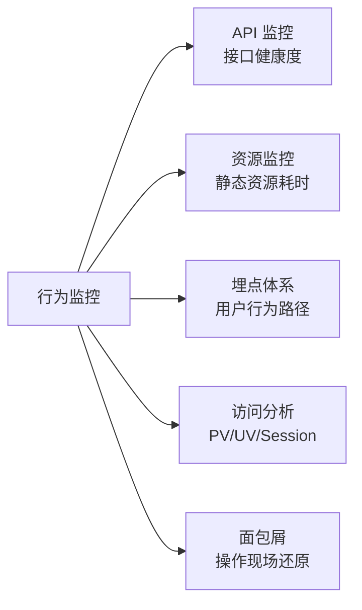

# 手写行为监控 SDK：API 拦截、埋点体系与访问分析全链路（面试收藏级）

> 告警大盘出现了一个「低成功率接口」，你点进去，看到请求量、p95、报错率三张图。然后点进某个报错 Issue——旁边有一条面包屑：出错前用户点了「提交」，发了一个 POST，然后页面白了。
>
> 这就是行为监控和错误监控最大的差别：错误监控告诉你「哪里坏了」，行为监控告诉你「用户当时在做什么、走了哪条路、踩了哪个坑」。只有两者结合，才能还原完整的事故现场。

---

## 🎯 这篇文章解决什么问题

前端监控的四个支柱——性能、异常、行为、自定义——很多团队只做了前两个。「行为监控」被遗漏的原因很简单：装个 `window.onerror` 就能捕错误，但行为数据没有一个 API 帮你兜底，你得自己劫持、自己采集、自己设计数据结构。

本篇覆盖行为监控的五个模块：

| 模块 | 核心能力 |
|---|---|
| API 监控 | 自动拦截 XHR / fetch，采集成功率、耗时分位、异常上下文 |
| 资源监控 | PerformanceResourceTiming 全字段，缓存命中 + CDN 测速 |
| 埋点体系 | 代码埋点 + 全埋点 + 曝光埋点，三层方案各司其职 |
| 访问分析 | SPA PV/UV + Session 策略 + UTM 来源解析 |
| 面包屑 | FIFO 队列，随 error 打包还原操作现场 |

读完既懂原理，也能直接用在面试上。

---

## 🔍 行为监控全景：为什么这四块缺一不可



- **API 监控**：知道「哪个接口成功率低」「哪个接口 p95 异常」，是后端优化的直接依据
- **资源监控**：知道「是哪张图片拖慢了 LCP」「CDN 哪个节点有问题」，性能优化的手术刀
- **埋点体系**：知道「用户在哪一步离开了漏斗」「哪个按钮转化率高」，产品决策的数据基础
- **访问分析**：知道「用户从哪个渠道来」「在哪个页面停留最久」，运营投放的依据
- **面包屑**：所有异常 Issue 旁边的「操作历史」，复现难题的利器

---

## ⚙️ API 监控：XHR + fetch 双重劫持

### 是什么

API 监控通过 monkey-patch 劫持 `XMLHttpRequest` 和 `window.fetch`，对每个请求记录 method、url、status、duration，对异常请求额外记录请求参数片段，无需业务代码改造。

一旦接入，你就能在大盘上看到：
- 每个接口的成功率、调用量、p50/p75/p95/p99 耗时
- 慢请求 Top N（给后端优化提供方向）
- 异常请求上下文（报错时自动关联到面包屑）

### 核心原理：monkey-patch 的三条铁律

monkey-patch 的本质是「用 wrapper 替换原始方法，在 wrapper 里插入采集逻辑」。三条铁律：

1. **返回值原样透传**：`fetch` 返回 `Promise<Response>`，wrapper 必须也返回同样的值，不能消费 body（`response.json()` 会让 body 只能被读一次）
2. **错误必须重新抛出**：`.catch` 里捕获错误上报后，`throw err` 把错误还给调用方，不能吞掉
3. **中止场景要处理**：`AbortController` 中止的请求会走 `catch`，需要区分「用户主动中止」和「网络错误」

### 手写实现：fetch 劫持

```javascript
const originalFetch = window.fetch
window.fetch = function (...args) {
  const url = typeof args[0] === 'string' ? args[0] : args[0].url
  const startTime = Date.now()
  return originalFetch.apply(this, args)
    .then(res => {
      hub.report({ type: 'api', url, status: res.status,
        duration: Date.now() - startTime })
      return res  // 必须原样返回，不消费 body
    })
    .catch(err => {
      const isAbort = err.name === 'AbortError'
      hub.report({ type: 'api', url, status: 0,
        error: isAbort ? 'abort' : err.message,
        duration: Date.now() - startTime })
      throw err   // 必须重新抛出，不能吞掉
    })
}
```

### 手写实现：XHR 劫持

XHR 和 fetch 的事件模型完全不同，需要独立劫持。关键在于 `readyState === 4` 才是请求完成：

```javascript
const OriginalXHR = window.XMLHttpRequest
window.XMLHttpRequest = function () {
  const xhr = new OriginalXHR()
  const startTime = Date.now()
  let method, url
  const origOpen = xhr.open.bind(xhr)
  xhr.open = function (m, u) { method = m; url = u; origOpen(m, u) }
  xhr.addEventListener('readystatechange', () => {
    if (xhr.readyState !== 4) return
    hub.report({ type: 'api', method, url,
      status: xhr.status, duration: Date.now() - startTime })
  })
  xhr.addEventListener('abort', () => {
    hub.report({ type: 'api', method, url, status: 0,
      error: 'abort', duration: Date.now() - startTime })
  })
  return xhr
}
```

> 💬 **面试官**：为什么 XHR 和 fetch 都要劫持，不能只选一个？
>
> ✅ 标准答案：两者并行存在于生产环境——旧代码和第三方库可能用 XHR，新代码和 axios 默认用 fetch（在现代浏览器下）。只劫持一个会有覆盖盲区。另外两者事件模型完全不同，XHR 是事件驱动（`readystatechange`），fetch 是 Promise 链，不能复用同一套逻辑。
> 🎁 加分答案：fetch 劫持还需要处理 `AbortError` 场景——`AbortController.abort()` 让 fetch 走 reject 路径，`err.name === 'AbortError'` 是识别它的唯一方式；如果把这个当成普通网络错误上报，会大量误报。

### 手写实现：TraceID 注入

TraceID 实现前后端链路串联——同一个请求在前端监控和后端日志里拥有同一个 ID：

```javascript
function generateTraceId () {
  return 'tr-' + Math.random().toString(36).slice(2, 10)
    + '-' + Date.now().toString(36)
}

// fetch 版本：在 headers 里注入
const traceId = generateTraceId()
const headers = new Headers(args[1]?.headers)
headers.set('x-trace-id', traceId)
args[1] = { ...args[1], headers }

// XHR 版本：在 send 前 setRequestHeader
xhr.setRequestHeader('x-trace-id', traceId)
```

后端在响应头里回写同一个 `traceId`，前端采集时从 response headers 读取——这样一条请求的前端采集记录和后端日志就能用同一个 ID 关联。

### 生产级实践

**慢请求识别**：超过阈值（默认 2000ms，可配置 `slowApiThreshold`）的请求标记 `slow=true`，在大盘上单独展示「慢请求 Top N」。

**请求体截断**：上报请求体时截断至前 2KB，避免上报大 JSON 或二进制数据：

```javascript
function truncateBody (body) {
  if (!body || typeof body !== 'string') return undefined
  return body.length > 2048 ? body.slice(0, 2048) + '...[truncated]' : body
}
```

**分位数策略**：前端只上报每次请求的 `duration` 单值，服务端按接口分组后聚合计算 p50/p75/p95/p99——前端不做统计，减少计算量和上报体积。

> 💬 **面试官**：接口的 p95 耗时是怎么算出来的，是前端算还是后端算？
>
> ✅ 标准答案：前端只上报每次请求的原始 `duration`，后端在存储层按接口 URL 分组、按时间窗口聚合，用窗口内所有 duration 排序取分位数。
> 🎁 加分答案：前端做分位计算需要积累大量样本，一来有内存压力，二来采样率（30%）下样本量更少，统计误差大。服务端汇聚了所有用户数据，分位数更准确。

🔧 **真实场景**：某医疗电商平台在大促前例行巡检，API 大盘发现「药品搜索」接口的 p95 从基线 180ms 突然升到 1.8s，但 p50 没有变化。说明慢的只是少部分请求。深查后发现是某个特定关键词触发了数据库全表扫描，缺少索引。API 监控在用户开始抱怨前 40 分钟发现了这个问题。

---

## ⚙️ 资源监控：PerformanceResourceTiming 全字段解析

### 是什么

资源监控通过 `PerformanceObserver('resource')` 自动采集页面所有静态资源的加载数据，涵盖 JS、CSS、图片、字体、媒体文件。不需要业务代码改动，Observer 自动收集。

### 核心原理：关键字段的含义

`PerformanceResourceTiming` 继承自 `PerformanceEntry`，关键字段：

| 字段 | 含义 | 面试价值 |
|---|---|---|
| `initiatorType` | 资源类型：script/link/img/font/fetch/xmlhttprequest | 分类统计的基础 |
| `transferSize` | 实际网络传输大小（字节） | 0 时表示缓存命中或跨域屏蔽 |
| `encodedBodySize` | 压缩后的响应体大小 | 与 transferSize 差值 = 响应头大小 |
| `decodedBodySize` | 解压后的响应体大小 | 与 encodedBodySize 差值 = 压缩效益 |
| `nextHopProtocol` | 传输协议：h2/http/1.1 | 判断是否走了 HTTP/2 |
| `duration` | 总加载耗时 | 直接用于性能排序 |

**缓存命中判断**：

```javascript
function getCacheStatus (entry) {
  if (entry.transferSize === 0 && entry.decodedBodySize > 0) return 'hit'
  if (entry.transferSize > 0 && entry.transferSize < entry.decodedBodySize) return 'revalidate'
  return 'miss'
}
```

注意：`transferSize === 0` 不一定是缓存命中——跨域资源未设置 `Timing-Allow-Origin` 头时，这些字段会被浏览器屏蔽置零。需要结合 `decodedBodySize > 0` 来区分。

> 💬 **面试官**：`transferSize === 0` 就一定代表缓存命中吗？
>
> ✅ 标准答案：不一定。跨域资源如果没有设置 `Timing-Allow-Origin` 响应头，浏览器会把 `transferSize`、`encodedBodySize`、`decodedBodySize` 都置零——这是 Timing API 的跨域隐私保护机制，和缓存无关。
> 🎁 加分答案：正确的缓存判断是 `transferSize === 0 && decodedBodySize > 0`——如果 decodedBodySize 也是 0，说明是跨域屏蔽而不是缓存命中。

### 手写实现

```javascript
new PerformanceObserver((list) => {
  list.getEntries().forEach(entry => {
    if (!['script','link','img','font','media'].includes(entry.initiatorType)) return
    hub.report({
      type: 'resource',
      initiatorType: entry.initiatorType,
      url: entry.name,
      duration: Math.round(entry.duration),
      transferSize: entry.transferSize,
      encodedBodySize: entry.encodedBodySize,
      decodedBodySize: entry.decodedBodySize,
      cache: getCacheStatus(entry),
      protocol: entry.nextHopProtocol,
      host: new URL(entry.name, location.href).hostname,
    })
  })
}).observe({ type: 'resource', buffered: true })
```

### 生产级实践

**CDN 测速**：按 `host` 分组，计算每个 CDN 节点的平均 `duration`。如果某节点的平均耗时超过其他节点的 3 倍，说明该节点有问题：

```javascript
function detectSlowCdn (entries) {
  const byHost = {}
  entries.forEach(e => {
    if (!byHost[e.host]) byHost[e.host] = []
    byHost[e.host].push(e.duration)
  })
  return Object.entries(byHost).map(([host, durations]) => ({
    host,
    avg: durations.reduce((a, b) => a + b) / durations.length,
    count: durations.length,
  }))
}
```

**大资源告警**：`transferSize > 500 * 1024`（500KB）的资源自动标记 `large=true`，在大盘上提示优化。

**与异常监控串联**：资源加载失败时，`ErrorPlugin` 的捕获阶段监听会产生一条 `resource_error` 事件，包含失败的 url。资源监控里正常加载的同一个 url 有耗时记录——两者在 Issue 详情页按 url 关联，能同时看到「这个资源加载了多久，然后失败了」。

🔧 **真实场景**：某医疗平台药品详情页 LCP 异常升高，定位困难。接入资源监控后发现，`/drug-images/large/` 路径下的图片平均 `transferSize` 是 1.2MB，而同类页面只有 80KB。进一步查看 CDN 测速，发现华南节点的图片未走 CDN，回源到源站——是 CDN 配置没有覆盖这个路径。修复后 LCP 从 4.2s 降回 2.1s。

---

## ⚙️ 埋点体系：三层方案的完整实现

### 是什么

埋点分三层，按「精准度 vs 接入成本」选择：

| 层级 | 方案 | 精准度 | 接入成本 | 适用场景 |
|---|---|---|---|---|
| 第一层 | 代码埋点 | 最高 | 高（改业务代码） | 核心转化漏斗、业务强语义事件 |
| 第二层 | 全埋点（无痕） | 中 | 低（加 HTML 属性） | 快速覆盖，不改 JS 逻辑 |
| 第三层 | 曝光埋点 | 中 | 低（加 HTML 属性） | 广告位、商品卡片曝光统计 |

### 核心原理

**代码埋点**：调用 SDK 的 `track` 方法手动上报，精确绑定业务语义：

```javascript
// 药品加入购物车
monitor.track('cart_add', { drugId: '123', price: 18.5, source: 'detail_page' })
```

**全埋点**：监听全局 `click` 事件（利用事件冒泡），从被点击元素往上遍历 DOM 树查找 `data-track` 属性：

```javascript
document.addEventListener('click', (e) => {
  const el = e.target.closest('[data-track]')
  if (!el) return
  const name = el.dataset.track
  const props = el.dataset.trackProps ? JSON.parse(el.dataset.trackProps) : {}
  hub.report({ type: 'track', trackType: 'click', name, properties: props })
}, true)
```

**曝光埋点**：利用 `IntersectionObserver` 检测元素进入视口，停留 ≥ 500ms 才算有效曝光：

### 手写实现：全埋点（data-track 完整解析）

HTML 端：
```html
<button data-track="buy_now"
        data-track-props='{"drugId":"123","scene":"detail"}'>
  立即购买
</button>
```

SDK 端（上方代码已展示，这里补充 submit 事件）：

```javascript
document.addEventListener('submit', (e) => {
  const form = e.target.closest('[data-track-form]')
  if (!form) return
  hub.report({
    type: 'track', trackType: 'submit',
    name: form.dataset.trackForm,
    properties: { action: form.action, method: form.method },
  })
}, true)
```

### 手写实现：曝光埋点

```javascript
function setupExposureTracking () {
  const io = new IntersectionObserver((entries) => {
    entries.forEach(entry => {
      if (!entry.isIntersecting) {
        clearTimeout(entry.target._exposeTimer)
        return
      }
      entry.target._exposeTimer = setTimeout(() => {
        hub.report({
          type: 'track', trackType: 'expose',
          name: entry.target.dataset.trackExpose,
          properties: { ratio: entry.intersectionRatio },
        })
      }, 500)
    })
  }, { threshold: 0.5 })
  document.querySelectorAll('[data-track-expose]')
    .forEach(el => io.observe(el))
  return io
}
```

为什么是 500ms？快速滑动时，元素会瞬间穿过视口，如果立刻上报会大量误报——用户根本没有「看到」这个元素。500ms 是「用户真正注意到这个元素」的最低停留时间。

> 💬 **面试官**：全埋点和代码埋点怎么选，能说说各自的取舍吗？
>
> ✅ 标准答案：全埋点成本低、不改 JS 逻辑，适合快速覆盖大量页面元素；代码埋点精度高、可携带业务语义（如购物车里的 drugId），适合核心转化路径。生产中组合使用——全埋点做基础覆盖，核心漏斗节点用代码埋点补强。
> 🎁 加分答案：全埋点有两个脆弱点：① 依赖 DOM 结构，前端重构时容易默默丢数据；② `data-track-props` 是 JSON 字符串，如果值里有单引号会解析失败。这两个问题在纯全埋点的项目里很常见，所以核心路径必须要用代码埋点兜底。

### 生产级实践

**漏斗分析前端数据设计**：服务端支持动态 N 步漏斗，前端只需要在每个漏斗节点上报 `funnel_id` 和 `step_name`：

```javascript
monitor.track('funnel_step', {
  funnelId: 'purchase_flow',
  stepName: 'view_detail',   // → add_to_cart → checkout → payment_done
  stepIndex: 1,
})
```

服务端按 `funnelId` 分组，统计各步骤到达用户数，计算步骤间转化率——这样无需前端预定义漏斗步骤数量，后台就能灵活配置。

🔧 **真实场景**：在某医疗电商的药品详情页，把「加入购物车」「立即购买」「查看说明书」三个按钮用全埋点覆盖（加 `data-track` 属性），再对「加入购物车 → 结算 → 支付完成」核心漏斗用代码埋点打 `funnel_step` 事件。运营发现「加入购物车 → 结算」这一步流失率高达 52%，主动排查发现结算页有一个「必须注册才能购买」的强制弹窗——去掉强制注册后，漏斗转化率提升了 31%。

---

## ⚙️ 访问分析：SPA PV/UV + Session + 来源解析

### 是什么

访问分析记录每次页面访问（PV）、去重用户（UV）、会话轨迹、访问来源（UTM + 搜索引擎）和终端环境。

这类数据回答的问题是：「用户从哪来、在哪停留最久、哪个渠道带来的用户质量最高」。

### 核心原理

**SPA 的 PV 统计难点**：SPA 路由切换不触发页面刷新，浏览器的 `pageshow` 只在初始加载时触发一次。要完整捕获 SPA 的 PV，必须劫持四个事件：

```javascript
function wrapHistoryMethod (method) {
  const orig = history[method]
  return function (...args) {
    orig.apply(this, args)
    reportPageView()
  }
}
history.pushState = wrapHistoryMethod('pushState')
history.replaceState = wrapHistoryMethod('replaceState')
window.addEventListener('popstate', reportPageView)
window.addEventListener('hashchange', reportPageView)
```

漏掉任何一个都会有漏报：
- `pushState`：前进导航（`<Link>` 点击）
- `replaceState`：重定向（登录后跳转）
- `popstate`：浏览器前进/后退按钮
- `hashchange`：Hash Router（`#/about`）

### Session 策略实现

Session 是访问分析的基础单元，设计要点：

```javascript
const SESSION_KEY = `ghc_session_${projectId}`
const SESSION_TIMEOUT = 30 * 60 * 1000  // 30 分钟

function getOrCreateSession () {
  const raw = localStorage.getItem(SESSION_KEY)
  const now = Date.now()
  if (raw) {
    const data = JSON.parse(raw)
    if (now - data.lastActive < SESSION_TIMEOUT) {
      data.lastActive = now
      localStorage.setItem(SESSION_KEY, JSON.stringify(data))
      return data.sessionId
    }
  }
  const sessionId = 'sess-' + Math.random().toString(36).slice(2, 12)
  localStorage.setItem(SESSION_KEY, JSON.stringify({ sessionId, lastActive: now }))
  return sessionId
}
```

**跨标签页共享**：多个 Tab 打开同一个应用时，应该共享同一个 Session（同一次访问）。用 `BroadcastChannel` 同步，降级用 `storage` 事件：

```javascript
function syncSessionAcrossTabs (sessionId) {
  if ('BroadcastChannel' in window) {
    const bc = new BroadcastChannel('ghc_session')
    bc.postMessage({ type: 'session_active', sessionId })
    bc.onmessage = (e) => {
      if (e.data.type === 'session_active') updateLastActive(e.data.sessionId)
    }
  } else {
    window.addEventListener('storage', (e) => {
      if (e.key === SESSION_KEY) updateLastActive(JSON.parse(e.newValue).sessionId)
    })
  }
}
```

### UTM + 搜索引擎来源解析

```javascript
function parsePageSource () {
  const params = new URLSearchParams(location.search)
  const utm = {
    source:   params.get('utm_source'),
    medium:   params.get('utm_medium'),
    campaign: params.get('utm_campaign'),
    term:     params.get('utm_term'),
    content:  params.get('utm_content'),
  }
  const SE_LIST = ['google','baidu','bing','sogou','so.com','duckduckgo','yahoo']
  const searchEngine = SE_LIST.find(se => document.referrer.includes(se)) ?? null
  return { utm, searchEngine, referrer: document.referrer }
}
```

这样大盘就能区分「直接访问 / 搜索引擎自然流量 / 广告投放 / 社交媒体分享」四个来源渠道。

> 💬 **面试官**：SPA 的 PV 统计为什么不准？你怎么解决的？
>
> ✅ 标准答案：SPA 路由切换使用 History API，浏览器不触发页面刷新，`pageshow` 只在首次加载时触发一次。解决方案是劫持 `history.pushState` / `replaceState` 并监听 `popstate` / `hashchange` 四个事件，每次路由变化都主动上报一条 `page_view`。
> 🎁 加分答案：还要注意两个边界：① SDK 初始化时已经在某个路由页面上，要立刻上报一次初始 PV，不能等路由切换；② 同一个 URL 的快速反复切换（tab 来回点击）要做 300ms 防抖，避免同一个 URL 重复计 PV。

### 生产级实践

**停留时长精确计算**：用 `visibilitychange` 累积，排除用户切到后台挂机的时间：

```javascript
let enterTime = Date.now()
document.addEventListener('visibilitychange', () => {
  if (document.visibilityState === 'hidden') {
    hub.report({ type: 'page_duration',
      activeMs: Date.now() - enterTime })
  } else {
    enterTime = Date.now()  // 从后台切回，重新开始计时
  }
})
```

这比 `beforeunload` 的方案更准——`beforeunload` 把挂机时间也算进去了，导致停留时长虚高。

🔧 **真实场景**：某医疗资讯 SPA 上线新版后，运营反馈「某篇药品科普文章的阅读量比以前低很多」。排查后发现旧版是 MPA（多页刷新），PV 自然触发；新版 SPA 化后，从文章列表进入详情页是 `pushState` 跳转，根本没触发监控上报。补齐四个路由事件后，数据恢复正常。

---

## 🧩 面包屑：行为现场的还原利器

Sourcemap 告诉你「代码在第几行出错」，面包屑告诉你「用户当时在做什么」。两者缺一不可。

### 数据结构设计

面包屑是一条 FIFO 队列，默认最多 100 条：

```typescript
interface Breadcrumb {
  timestamp: number
  category: 'navigation' | 'click' | 'console' | 'xhr' | 'fetch' | 'ui' | 'custom'
  level: 'debug' | 'info' | 'warning' | 'error'
  message: string
  data?: Record<string, unknown>
}
```

### 手写实现：队列管理

```javascript
class BreadcrumbQueue {
  constructor (maxLength = 100) {
    this._queue = []
    this._max = maxLength
  }
  push (crumb) {
    this._queue.push({ ...crumb, timestamp: Date.now() })
    if (this._queue.length > this._max) this._queue.shift()
  }
  flush () { return [...this._queue] }
}
```

SDK 在 error / api 事件上报时，把 `queue.flush()` 的结果一起打包：

```javascript
hub.on('report', (event) => {
  if (event.type === 'error' || (event.type === 'api' && event.failed)) {
    event.breadcrumbs = breadcrumbQueue.flush()
  }
})
```

### SDK 自动采集的 7 类面包屑

| category | 触发时机 | 典型内容 |
|---|---|---|
| `navigation` | 路由切换 | `from: /home → to: /drug/123` |
| `click` | 用户点击 DOM 元素 | `button#buy-now` |
| `console` | `console.warn/error` 调用 | 控制台输出内容 |
| `xhr` / `fetch` | API 请求完成 | `POST /api/cart 200 142ms` |
| `ui` | 表单提交、输入框变更 | `input[name=keyword] changed` |
| `custom` | `addBreadcrumb()` 手动追加 | 业务自定义事件 |

> 💬 **面试官**：面包屑 100 条的限制，如果大量 API 请求把关键用户操作挤掉了怎么办？
>
> ✅ 标准答案：用 `addBreadcrumb()` 手动追加关键业务操作，比如「用户点击了提交按钮」「进入了支付页面」——手动追加的面包屑语义明确，可以在事后分析时优先排查。
> 🎁 加分答案：也可以在 SDK 初始化时配置 `filterBreadcrumbs`，对 `fetch` 类别的高频 API（如心跳、上报接口）做过滤，避免这些无意义的 API 请求把有价值的用户操作挤出队列。

---

## 🔬 对齐源码：手写版还差什么

手写骨架能讲清原理，但与真实生产 SDK 之间有几处关键差距，面试被追问「你们线上怎么做的」时，这些是加分项。

### 幂等标记挂在函数上，不挂在 window 上

手写版通常用 `window.__ghcApiPatched` 防重复劫持，真实 SDK 把 patch 标记挂在被替换的函数对象本身：

```typescript
const marker = original as PatchMarker & typeof fetch
if (marker.__ghcApiPatched) return
// ...
(wrapped as PatchMarker).__ghcApiPatched = true
```

原因：`window` 可能被业务代码重写或跨 iframe 共享，挂在函数上更稳定，不受宿主环境影响。

### XHR 劫持：patch prototype 而非替换构造函数

手写版常见写法是 `window.XMLHttpRequest = function () { ... }`。真实 SDK 做法是直接给 `XMLHttpRequest.prototype` 的 `open` 和 `send` 打补丁：

```typescript
const proto = XMLHttpRequest.prototype as PatchMarker & XMLHttpRequest
if (proto.__ghcApiPatched) return
const originalOpen = proto.open
const originalSend = proto.send
proto.open = function openPatched (method, url, ...rest) { ... }
proto.send = function sendPatched (body) { ... }
proto.__ghcApiPatched = true
```

原因：替换构造函数会破坏 `instanceof XMLHttpRequest` 的判断；patch prototype 对调用方完全透明，也不影响已 new 出来的实例。

### `isInternal` 过滤自身上报请求

如果不过滤 SDK 自身发出的 beacon/fetch 请求，上报请求本身也会被劫持，触发新的上报，形成无限循环：

```typescript
if (isInternal(hub, url) || isIgnored(url, opts.ignoreUrls)) {
  return original.call(this, input, init) // 跳过，直接透传
}
```

`isInternal` 检查的是 DSN 配置的 ingestUrl 是否是请求 URL 的子串——这是手写骨架里几乎必然遗漏的一个边界。

### `captureBody` 默认 false（隐私保护）

手写版可能直接把请求体截断上报。真实 SDK 的 `captureBody` 默认是 `false`，必须业务方显式开启：

```typescript
export interface ApiPluginOptions {
  readonly captureBody?: boolean  // 默认 false
}
```

原因：请求体可能含用户密码、身份证号、支付信息等敏感字段，默认不采集是隐私合规的要求。

### 曝光埋点：`WeakSet` 去重 + `MutationObserver` 动态监听

手写骨架里曝光逻辑有两处缺失：

1. **去重**：元素每次进入视口都会触发，真实 SDK 用 `WeakSet<Element>` 标记已触发过的元素，每个元素一生只上报一次曝光

2. **动态 DOM**：手写版只对初始化时已存在的元素调用 `observe`；真实 SDK 还挂了 `MutationObserver`，动态添加的元素（如懒加载商品卡片）也能被自动捕捉：

```typescript
const mutationObserver = new MutationObserver((mutations) => {
  for (const m of mutations) {
    m.addedNodes.forEach((node) => {
      if (node instanceof Element) scanExposeTargets(node, observer)
    })
  }
})
mutationObserver.observe(document.body, { childList: true, subtree: true })
```

### 停留时长：复用 eventId 触发 UPSERT

手写版通常发一条独立的 `page_duration` 事件，需要服务端 JOIN 才能和 PV 关联。真实 SDK 在离开时重新发送**同一个 `eventId`** 的 PV 事件（含 `duration` 字段），服务端 UPSERT 直接回写：

```typescript
const event: PageViewEvent = {
  ...base,
  eventId: p.eventId,  // 复用原始 eventId，服务端 ON CONFLICT DO UPDATE
  duration: p.duration,
  leaveAt: Date.now(),
  // ...
}
```

这样每条 PV 记录里直接就有停留时长，无需额外关联表。

> 💬 **面试官**：你们的 SDK 是怎么防止 XHR 劫持在多次 `init` 时重复绑定的？
>
> ✅ 标准答案：把幂等标记 `__ghcApiPatched` 打在被替换的 `XMLHttpRequest.prototype` 上，`setup` 时先检查这个标记，已存在则直接返回。
> 🎁 加分答案：还要区分「同 Hub 重复 setup」和「多 Hub 共用同一个 prototype」——后者只能 patch 一次，但需要把所有 Hub 的 `dispatch` 都能接收到事件，这是更复杂的多租户问题，g-heal-claw 通过 sessionId + projectId 路由解决。

| 手写版缺陷 | 真实 SDK 解法 |
|---|---|
| `window.__ghcApiPatched` 不稳定 | 标记挂在函数对象本身 |
| 替换 XHR 构造函数破坏 instanceof | Patch `prototype.open/send` |
| 上报请求自身被反复劫持 | `isInternal` 过滤内部 URL |
| `captureBody` 无隐私保护 | 默认 false，显式开启 |
| 曝光元素反复触发 | `WeakSet` 标记已触发元素 |
| 动态 DOM 无法曝光 | `MutationObserver` 增量监听 |
| 停留时长需 JOIN | 复用 eventId UPSERT 回写 |

---

## 🔌 SDK 接入指南

### 最小可用配置

行为监控模块（API + 资源 + 埋点 + 访问分析）最小接入只需四个 plugin：

```typescript
import { init, apiPlugin, resourcePlugin,
         trackPlugin, pageViewPlugin } from '@g-heal-claw/sdk'

init({
  dsn: 'https://<projectId>@<server>/ingest/v1',
  release: '1.2.0',
  environment: 'production',
  plugins: [
    apiPlugin({ traceIdHeaderName: 'X-Trace-Id' }),
    resourcePlugin(),
    trackPlugin(),
    pageViewPlugin(),
  ],
})
```

DSN 格式：`https://{projectId}@{host}/ingest/v1`，在控制台创建项目时自动生成。

### 行为监控配置项详解

```typescript
// apiPlugin 完整配置
apiPlugin({
  slowThresholdMs: 1000,          // 慢请求阈值，默认 1000ms
  captureBody: false,             // 是否采集请求/响应体，默认 false
  traceIdHeaderName: 'X-Trace-Id', // TraceID header 名，不填则不注入
  ignoreUrls: ['/health', /socket/], // URL 黑名单
})

// resourcePlugin 完整配置
resourcePlugin({
  slowThresholdMs: 1000,          // 慢资源阈值，默认 1000ms
  maxSamplesPerSession: 500,      // 单 session 最大采样数，防爆量
  flushIntervalMs: 2000,          // 批量 flush 间隔，默认 2s
})

// trackPlugin 完整配置
trackPlugin({
  captureClick: true,             // 全埋点点击，默认 true
  captureSubmit: true,            // 表单 submit，默认 true
  captureExpose: true,            // 曝光埋点，默认 true
  exposeDwellMs: 500,             // 曝光停留阈值，默认 500ms
  throttleMs: 1000,               // 同 selector 节流窗口，默认 1s
})

// pageViewPlugin 完整配置
pageViewPlugin({
  autoSpa: true,                  // 自动采 SPA 路由切换，默认 true
  trackDuration: true,            // 采集停留时长，默认 true
})
```

### 全局配置项（传输与过滤）

```typescript
init({
  dsn: '...',
  sampleRate: 0.3,               // 全局采样率（API/资源默认 30%）
  maxBreadcrumbs: 100,           // 面包屑队列长度，默认 100
  maxBatchSize: 30,              // 批量上报条数，默认 30
  flushInterval: 5000,           // 定时 flush 间隔（ms），默认 5s
  transport: 'auto',             // 降级链：beacon→fetch(keepalive)→image
  ignoreErrors: [/ResizeObserver/], // 错误黑名单（正则或字符串）
  beforeSend: (event) => {       // 上报前拦截，返回 null 则丢弃
    if (event.type === 'api' && event.url.includes('/log')) return null
    return event
  },
  debug: false,                  // 开启后打印 debug 日志
  plugins: [ ... ],
})
```

### 传输降级链

真实 SDK 的传输通道按可用性自动降级，`pagehide` / `visibilityState=hidden` 场景优先选 `sendBeacon`，正常场景优先选 `fetch(keepalive)`，均不可用时回退 `Image.src`（单条 ≤ 2KB）：

```
pagehide 场景 → sendBeacon（≤64KB，自动拆批）
正常场景     → fetch(keepalive)
均失败       → Image.src 单条兜底
发送失败     → IndexedDB 存储 → online 事件触发重试
```

> 💬 **面试官**：为什么在 `pagehide` 场景要用 `sendBeacon` 而不是 `fetch`？
>
> ✅ 标准答案：`pagehide` 触发时页面即将卸载，浏览器可能强杀 fetch 的异步任务。`sendBeacon` 是浏览器原生异步投递，页面关闭后仍会完成发送，不受页面生命周期影响。
> 🎁 加分答案：`fetch(keepalive: true)` 也能在页面关闭后继续，但有单次 64KB 的 body 限制（与 Beacon 相同），且部分老版本浏览器支持不稳定。g-heal-claw 在 `visibilityState === hidden` 时主动切 beacon 通道，就是为了覆盖这个边界。

---

## 📊 看懂控制台数据

接入后，控制台的行为监控大盘分四个视图。

### API 大盘：接口健康度全景

API 大盘的核心是「成功率 + 分位耗时」二维矩阵，每个接口一行：

| 字段 | 含义 | 告警阈值参考 |
|---|---|---|
| 成功率 | `status < 400` 的比例 | < 99% 触发告警 |
| QPS | 每秒请求数（15s 滑动窗口） | — |
| p50 | 中位数耗时 | — |
| p95 | 95 分位耗时（大多数用户的真实体感） | > 2s 触发告警 |
| p99 | 99 分位耗时（极端慢的那批用户） | > 5s 触发告警 |
| 慢请求率 | duration > slowThreshold 的比例 | > 5% 注意 |

成功率突降 / p95 突增会触发告警，钉钉 / 企微 / Slack 均支持。

「慢请求 Top N」是另一张独立面板，按 p95 倒序展示最慢的接口，点进去可以看到该接口的全部原始事件（包含请求体片段 + 面包屑）。

### 资源大盘：CDN 与缓存健康

资源大盘按 `category`（script / image / font / stylesheet / media / other）分组，核心指标：

| 字段 | 面试关联知识点 |
|---|---|
| `cache` 命中率 | `transferSize=0 && decodedBodySize>0` 判断 |
| 协议分布（H2 / H1.1） | `nextHopProtocol` 字段 |
| CDN 节点平均耗时 | 按 `host` 分组求均值 |
| 大资源告警 | `transferSize > 500KB` 自动标记 |

CDN 节点耗时异常（某节点 avg 是其他的 3 倍以上）会自动在资源大盘触发节点告警，帮助定位 CDN 配置问题。

### 访问分析大盘：流量来源与留存

访问分析大盘的四张核心图：

- **PV/UV 趋势**：时间轴折线，支持小时 / 天 / 周粒度
- **来源渠道饼图**：直接访问 / 搜索引擎 / UTM 广告 / 社交分享四类
- **设备 & 浏览器分布**：`contextPlugin` 采集的 UA 解析结果
- **停留时长分布**：`pageViewPlugin.trackDuration` 采集，按区间（0-10s / 10-30s / 30s+）分桶

服务端按 `sessionId` 聚合，去重计算 UV；按 `page.path` 聚合，计算每个页面的 PV 贡献。

### 埋点事件流

埋点大盘分两个视图：

**事件列表**：所有 `type=track` 和 `type=custom_event` 的事件，按 `name` 分组，展示触发量、用户数、趋势。点进某个事件可以看到完整 `properties` 的分布（如 `source` 字段下各值的占比）。

**漏斗分析**：选择一个 `funnelId`，服务端自动按 `stepIndex` 排序，展示各步骤到达人数和步骤间转化率。漏斗的步骤数无需前端预定义，后台灵活配置。

> 💬 **面试官**：你们怎么用监控数据指导产品决策？能举个例子吗？
>
> ✅ 标准答案：漏斗分析直接把「用户在哪一步流失」量化了。比如发现「加入购物车 → 结算」这一步流失 52%，比行业均值高两倍，就有理由去排查结算页的阻断性设计（强制注册、复杂表单等）。
> 🎁 加分答案：埋点数据要和 API 大盘联动——如果结算步骤流失高，同时结算接口 p95 也高，很可能是接口慢导致用户等待放弃，而不是 UX 问题。两个维度交叉才能找到真正的根因。

---

## 🚀 完整最佳实践代码

以下是行为监控 SDK 的生产级初始化文件（可直接作为 `src/monitoring/behavior.ts`）：

```typescript
import {
  init, apiPlugin, resourcePlugin,
  trackPlugin, pageViewPlugin, breadcrumbPlugin,
} from '@g-heal-claw/sdk'

export function initBehaviorMonitor () {
  init({
    dsn: process.env.NEXT_PUBLIC_GHC_DSN!,
    release: process.env.NEXT_PUBLIC_APP_VERSION,
    environment: process.env.NODE_ENV,
    sampleRate: 0.3,         // API / 资源 30% 采样
    maxBreadcrumbs: 100,
    maxBatchSize: 30,
    flushInterval: 5000,
    transport: 'auto',
    ignoreUrls: ['/api/monitor', '/beacon'],  // 过滤自身上报请求
    beforeSend: (event) => {
      // 隐私过滤：去掉 Authorization 头
      if (event.type === 'api' && event.requestBody) {
        event = { ...event, requestBody: '[redacted]' }
      }
      return event
    },
    plugins: [
      breadcrumbPlugin({ maxLength: 100 }),
      apiPlugin({
        slowThresholdMs: 1000,
        captureBody: false,
        traceIdHeaderName: 'X-Trace-Id',
      }),
      resourcePlugin({
        slowThresholdMs: 1000,
        maxSamplesPerSession: 500,
      }),
      trackPlugin({
        captureClick: true,
        captureExpose: true,
        exposeDwellMs: 500,
      }),
      pageViewPlugin({
        autoSpa: true,
        trackDuration: true,
      }),
    ],
  })
}
```

主动上报示例（业务代码调用）：

```typescript
import GHealClaw from '@g-heal-claw/sdk'

// 漏斗步骤埋点
GHealClaw.track('funnel_step', {
  funnelId: 'purchase_flow',
  stepName: 'add_to_cart',
  stepIndex: 2,
  drugId: '123',
})

// 手动面包屑（补充关键业务操作）
GHealClaw.addBreadcrumb({
  category: 'custom',
  level: 'info',
  message: '用户点击立即购买',
  data: { drugId: '123', price: 18.5 },
})
```

---

## 💡 一张图总结（面试速记）

| 模块 | 核心 API | 实现关键点 | 生产陷阱 | 面试频率 |
|---|---|---|---|---|
| API 监控 | XHR/fetch monkey-patch | 三条透传铁律 + abort 识别 | 消费 body / 吞错误 | ⭐⭐⭐⭐⭐ |
| 资源监控 | `PerformanceObserver('resource')` | transferSize=0 ≠ 缓存命中 | 跨域屏蔽字段置零 | ⭐⭐⭐⭐ |
| 代码埋点 | `track(name, data)` | 手动调用，精确语义 | 缺乏规范，字段混乱 | ⭐⭐⭐⭐ |
| 全埋点 | `data-track` + 全局冒泡代理 | `closest('[data-track]')` 遍历 | 依赖 DOM 结构，重构易丢 | ⭐⭐⭐⭐ |
| 曝光埋点 | `IntersectionObserver` | 500ms 防抖避免误报 | 元素未挂载就 observe | ⭐⭐⭐⭐ |
| 访问分析 | pushState 四件套劫持 | Session 30min + BroadcastChannel | SPA 初始 PV 漏报 | ⭐⭐⭐⭐ |
| 面包屑 | FIFO 队列 100 条 | 随 error 打包，7 类自动采集 | 高频 API 挤掉用户操作 | ⭐⭐⭐⭐ |

---

## 📝 留个问题

行为监控会采集大量用户操作数据——点了什么按钮、发了什么请求、在哪个页面停留了多久。如何在「采集越完整越好」和「隐私合规」之间找到平衡点？`beforeSend` 你会过滤哪些字段，哪些字段你宁可不采也绝不能上报？

欢迎在评论区聊聊你们团队的实践。

---

> 🔖 这是「前端性能与监控系列」第 6 篇。上一篇：《手写错误监控 SDK》；下一篇预告：《前端监控的告警体系与 AI 自愈实战》
