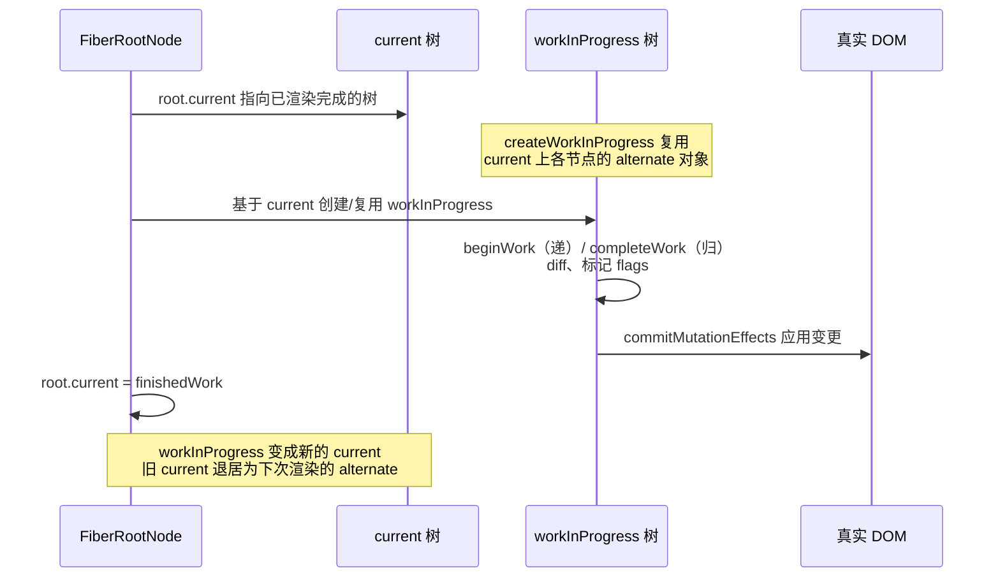
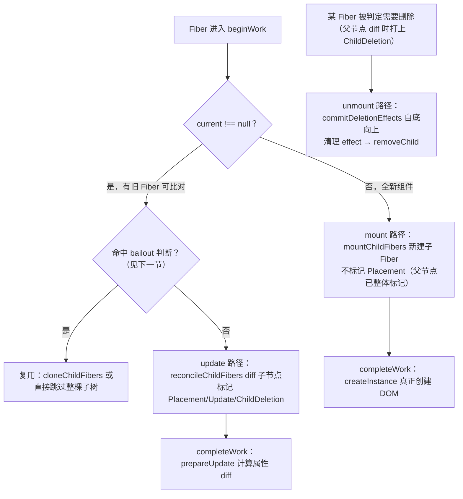
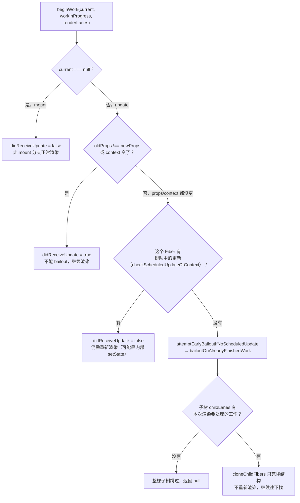

# React 18 渲染原理: mount/update/unmount 全流程与 bailout 复用机制（面试收藏级）

> **副标题**：mount/update/unmount 完整流程、bailout 复用判断、双缓存机制

---

## 🎯 这篇文章解决什么问题

上一篇拆完 Update 队列和 Lane 模型之后，面试官换了个角度追问：「你说 `React.memo` 能减少重渲染，那它具体是怎么在源码层面『减少』的？父组件重渲染了，子组件的渲染函数到底有没有被调用？」

大多数人能背出「`memo` 会浅比较 props，相等就不渲染」，但追问一句「不渲染是指 React 完全没碰这个 Fiber，还是碰了但没执行渲染函数」，就open 不上了——这背后是同一个机制：**`beginWork` 在处理每个 Fiber 之前，会先判断这次要不要真的走一遍渲染逻辑，判断"不需要"的那条分支叫 bailout（复用退出）**。`memo`/`PureComponent` 的效果，正是通过让"新旧 props 浅比较相等时保持引用不变"，去命中这条 bailout 判断实现的。

这一篇要讲透的，是三件事拼成的一张完整地图：Fiber 树怎么第一次长出来（mount）、怎么在原地重新计算一遍（update）、怎么被摘掉（unmount）——以及贯穿 update 全程的那个关键判断：**这次要不要真的往下渲染，还是可以直接复用上一次的结果**。

读完这篇文章，你会同时获得两种确定感：**懂原理**（bailout 具体命中哪一行判断、mount/update/unmount 各自在 `beginWork`/`completeWork`/commit 阶段做了什么）和**会讲**（面试官顺着任何一个分支追问都能拆解回答），并且能在本地手写仓库里对着已经跑通的真实代码打断点验证这些结论。

---

## 一、使用与实践

### 1. `key` 用数组 index：患者列表的错位事故

```jsx
// ❌ 危险写法：key 用数组下标
function PatientList({ patients }) {
  return (
    <ul>
      {patients.map((p, index) => (
        <PatientRow key={index} patient={p} />
      ))}
    </ul>
  )
}
```

某个患者行组件内部维护了"是否展开详情"的本地状态：

```jsx
function PatientRow({ patient }) {
  const [expanded, setExpanded] = useState(false)
  return (
    <li>
      <span onClick={() => setExpanded(!expanded)}>{patient.name}</span>
      {expanded && <PatientDetail patient={patient} />}
    </li>
  )
}
```

复现步骤：患者列表 `[张三, 李四, 王五]`，用户点开"张三"（index=0）这一行的详情，随后有一条新记录插入到列表最前面，变成 `[新患者, 张三, 李四, 王五]`。

用 index 作 key 时，React 看到的 key 序列从 `[0, 1, 2]` 变成 `[0, 1, 2, 3]`——**旧的 key=0 现在对应的是"新患者"这一行，不是"张三"**。React 认为 key=0 这个 Fiber 只是 props 变了（`patient` 从张三变成新患者），于是复用了这个 Fiber 及其 `expanded` 状态——用户展开的详情"跟错了人"，跳到了新插入的这条记录上，而张三那一行反而收起了。

> 💬 **面试官会问**：为什么数组 index 作 key 会导致这种错位？
>
> ✅ **标准答案**：React 用 key 判断"新旧列表里的哪个元素对应同一个组件实例"，而不是看元素内容。index 作 key 时，一旦列表发生插入/删除/排序，同一个 index 在新旧两次渲染里可能对应着完全不同的数据项，但 React 会认为这是"同一个 Fiber，只是 props 变了"，继续复用这个 Fiber 及其内部状态（`useState`/`useRef` 等），导致状态错位到了别的数据项上。
>
> 🎁 **加分答案**：正确的做法是用数据本身的稳定标识（如 `patient.id`）作 key。稳定 key 能让 React 在 diff 阶段正确判断"这个组件实例到底还在不在"，该复用的复用、该新建的新建、该删除的删除，而不是简单按位置对齐。这个 diff 算法本身会在系列第 04 篇专门展开，本篇先建立"key 错了会导致状态跟错组件"这一层直觉。

### 2. `React.memo` 命中 bailout 的直观表现

```jsx
const ExpensiveChart = React.memo(function ExpensiveChart({ data }) {
  console.log('ExpensiveChart 渲染了') // 父组件重渲染时，这行不会打印
  return <canvas ref={/* 绘制逻辑 */} />
})

function Dashboard() {
  const [tick, setTick] = useState(0)
  const chartData = useMemo(() => computeChartData(), []) // 引用稳定

  return (
    <div>
      <button onClick={() => setTick(tick + 1)}>刷新时间：{tick}</button>
      <ExpensiveChart data={chartData} />
    </div>
  )
}
```

点击按钮触发 `Dashboard` 重渲染，但只要 `chartData` 的引用没变，控制台就不会打印"ExpensiveChart 渲染了"——这正是本篇要讲透的 bailout 机制在应用层最直观的体现：`ExpensiveChart` 对应的 Fiber 被 `beginWork` 判定为"props 没变、没有排队的更新"，直接跳过了渲染函数的执行。

### 3. React DevTools Profiler 里看 Fiber 树和各阶段耗时

打开 Profiler 面板录制一次交互，"Ranked"视图会按渲染耗时排序列出这次渲染涉及的组件；"Flamegraph"视图能看到没有被记录耗时的组件（灰色，代表被 bailout 跳过，根本没有重新渲染）。对比"点击按钮前后"两次录制，能验证`ExpensiveChart`这类被`memo`包裹的组件是否真的被跳过。

### 4. `StrictMode` 下 effect 执行两次的现象

```jsx
function PrescriptionEditor() {
  useEffect(() => {
    console.log('effect 执行') // StrictMode + 开发环境下，这里会打印两次
    return () => console.log('cleanup 执行') // 两次 effect 之间会先跑一次 cleanup
  }, [])
  return <textarea />
}
```

`StrictMode` 在开发环境下会对组件做一次"故意的" unmount + 立即 remount 模拟，用来暴露"effect 没写 cleanup 导致状态残留"这类问题。这次模拟 unmount 走的正是本篇「二、3」节讲的卸载路径（`useEffect` 清理函数先被调用），紧接着的 remount 又走一次完整的 mount 路径——现象是"两次渲染日志之间夹了一次 cleanup 日志"。

### 5. Tab 切换隐藏模块对应的卸载流程

```jsx
function ConsultationTabs() {
  const [activeTab, setActiveTab] = useState('vitals')
  return (
    <>
      <TabBar active={activeTab} onChange={setActiveTab} />
      {activeTab === 'vitals' && <VitalsPanel />}
      {activeTab === 'labResults' && <LabResultsPanel />}
    </>
  )
}
```

从"生命体征"Tab 切到"检验报告"Tab，`VitalsPanel` 对应的整个子树（包括它内部可能开着的定时刷新 `setInterval`）会被真正卸载，不是简单的 CSS 隐藏——`VitalsPanel` 里 `useEffect` 的清理函数会在这次切换的 commit 阶段被调用，如果忘了在清理函数里 `clearInterval`，即使面板已经从 DOM 里消失，定时器仍然在背后运行，这是排查"页面切走了但接口还在偷偷请求"这类问题的关键线索。

---

## 二、设计与原理

### 1. Fiber 节点数据结构逐字段讲解

本地手写仓库里的 `FiberNode`（`D:\github\react-source\packages\react-reconciler\src\ReactFiber.ts`）字段和官方逐一对齐，按用途分组理解比死记字段名更容易：

| 分组 | 字段 | 作用 |
|------|------|------|
| 身份 | `type`/`key` | `type` 是这个 Fiber 对应的组件类型（标签名字符串/函数/class），`key` 是 diff 时用来判断"是不是同一个组件实例"的标识 |
| props/state | `pendingProps`/`memoizedProps` | `pendingProps` 是这次渲染即将使用的新 props，`memoizedProps` 是上一次渲染已经生效的 props——`beginWork` 开头比较这两者是否相等，正是 bailout 判断的第一步 |
| DOM 关联 | `stateNode` | 指向这个 Fiber 对应的真实实例——`HostComponent` 上是真实 DOM 节点，`HostRoot` 上是 `FiberRootNode` |
| 树结构 | `return`/`child`/`sibling`/`index` | 链表化的树结构：`return` 指向父节点，`child` 指向第一个子节点，`sibling` 指向下一个兄弟节点，`index` 是在父节点 children 中的位置 |
| 双缓存 | `alternate` | 指向"另一棵树"里对应同一个组件的 Fiber（下一节展开） |
| 副作用 | `flags`/`subtreeFlags` | `flags` 是这个 Fiber 自身需要在 commit 阶段执行的操作（`Placement`/`Update`/`ChildDeletion` 等），`subtreeFlags` 是子树里所有 flags 的汇总，用来在 commit 阶段快速跳过不含任何副作用的子树 |
| 优先级 | `lanes`/`childLanes` | `lanes` 是这个 Fiber 自身待处理的更新优先级，`childLanes` 是子树汇总的优先级——bailout 判断"子树是否有工作"依赖的就是 `childLanes` |

### 2. 双缓存机制：两棵树，一个指针切换

React 在任意时刻维护着两棵 Fiber 树：**`current` 树**是当前已经渲染到屏幕上、和真实 DOM 一致的那棵树；**`workInProgress` 树**是正在构建中、代表"下一次要渲染成什么样"的树。每个 Fiber 节点的 `alternate` 字段指向"另一棵树里对应同一个组件的 Fiber"。



commit 阶段完成所有 DOM 变更之后，只需要把 `FiberRootNode.current` 指针整体切换到刚构建好的 `workInProgress` 树——不需要逐节点搬迁数据，这一步是 O(1) 的指针赋值。这也是双缓存的核心收益：**屏幕上显示的永远是完整、一致的 `current` 树**，不会出现"正在构建中的半成品树"泄漏到屏幕上的情况。

### 3. mount / update / unmount：三条路径概览



**mount 流程**：首次渲染时不存在对应的 `current` 树，`beginWork` 处理每个 Fiber 走的是"全新构建"逻辑——子节点全部通过 `mountChildFibers` 新建（不标记副作用，因为父 Fiber 自身已经是 `Placement`，commit 阶段只需要把顶层节点整体插入）。`completeWork` 阶段需要为每个 `HostComponent`/`HostText` 真正创建 DOM 实例。

**update 流程**：存在对应的 `current` Fiber 可以比对，`beginWork` 会先尝试 bailout（下一节展开），命不中才继续走 `reconcileChildFibers` diff 子节点，`completeWork` 阶段对比新旧 props 计算出需要更新的 DOM 属性，而不是重新创建节点。

**unmount 流程**：一个 Fiber 及其子树被标记为需要删除（父节点 diff 子节点时判定某个旧 Fiber 在新的 children 里已经不存在，打上 `ChildDeletion` flag）时，会在 commit 的 mutation 阶段调用删除逻辑，递归遍历子树依次执行清理（`useLayoutEffect`/`useEffect` 的清理函数、Class 组件的 `componentWillUnmount`），再从真实 DOM 中移除对应节点——这个过程是**自底向上**的，原因见「二、6」节。

### 4. beginWork 的 bailout 复用机制（本篇重点）

React 并不是每次更新都无条件地重新渲染整棵树。`beginWork` 开头会做一组判断，决定这个 Fiber 是否可以直接复用上一次的结果、跳过渲染：



判断的核心是三个条件：**props 引用没变**（`oldProps === newProps`）、**没有 context 变化**、**这个 Fiber 没有排队中的更新**（`checkScheduledUpdateOrContext` 检查 `current.lanes` 是否和本次 `renderLanes` 有交集）——三者同时成立时，调用 `bailoutOnAlreadyFinishedWork` 直接复用 `current` 树对应节点，跳过这个 Fiber 自身的渲染。

`React.memo`/`PureComponent` 的效果正是通过让"新旧 props 浅比较相等时保持引用不变"来命中第一个条件（`oldProps === newProps`）——这是很多人只知道"memo 能减少重渲染"却说不清楚"减少重渲染"具体是怎么在源码层面发生的关键一环。

### 5. bailout ≠ 跳过渲染：子树里的更新仍会被找到

命中 bailout 之后，React 还会检查一件事：`workInProgress.childLanes` 是否包含本次 `renderLanes` 要处理的优先级。如果子树里某个后代组件自己有排队的更新（比如子组件内部 `setState`），即使父节点被跳过渲染，React 仍然会调用 `cloneChildFibers` **只克隆结构、不重新执行渲染函数**，"路过"这个被跳过的父节点继续往下找到那个真正需要更新的子节点。

只有当子树的 `childLanes` 也完全不包含本次要处理的优先级时，才会返回 `null`，把整棵子树都跳过。

> 💬 **面试官会问**：bailout 跳过了某个父节点的渲染，如果它的某个后代组件自己有更新，React 还能找到并渲染这个后代吗，为什么？
>
> ✅ **标准答案**：能找到。bailout 分两层判断——第一层是"这个 Fiber 自身要不要重新渲染"（props/context/自身更新都没有就跳过），第二层是"子树里有没有工作"（看 `childLanes`）。即使第一层命中跳过，只要 `childLanes` 里包含本次渲染要处理的优先级，React 仍会 `cloneChildFibers` 继续往下遍历，找到真正有更新的那个后代节点正常渲染，只是中间路过的这些父节点本身不会重新执行渲染函数。
>
> 🎁 **加分答案**：`childLanes` 之所以能准确反映"子树有没有工作"，是因为每次某个 Fiber 产生更新时，`markUpdateLaneFromFiberToRoot`（上一篇讲过）会沿 `return` 指针一路把 lane 冒泡合并到每个祖先的 `childLanes` 上——这是 bailout 机制能够"精确定位到底哪一段子树需要继续往下找"的数据基础，不是靠遍历整棵子树现场判断的。

### 6. render 阶段整体节奏：beginWork 自顶向下，completeWork 自底向上

一次完整的 render 阶段像是"先递后归"：`beginWork` 从根节点开始自顶向下遍历，对每个 Fiber 尝试 bailout，命不中则处理更新、diff 出子 Fiber，直到叶子节点（没有子节点可以继续递）；随后 `completeWork` 自底向上归——把子树中收集到的 `flags` 冒泡汇总到父节点的 `subtreeFlags`，对 `HostComponent`/`HostText` 做真正的 DOM 创建或属性 diff。

**为什么 unmount 的清理是自底向上而不是自顶向下？** 因为 `commitDeletionEffectsOnFiber` 递归遍历删除子树时，必须先执行完子节点的清理逻辑（`useEffect` cleanup、`componentWillUnmount`），再移除这个子节点对应的 DOM——如果反过来自顶向下先移除父节点的 DOM，子组件的清理函数里如果需要读取自己的 DOM 引用（如 `ref.current`）就会读到已经被父节点移除操作波及的、不再挂载在文档树上的节点，可能拿到意料之外的状态。自底向上保证了"先清理干净、再逐层摘除"的顺序正确性。

### 7. 对比 Vue 3：编译期静态信息 vs 运行时判断

Vue 3 的 bailout 判断依赖 **PatchFlag** 这种编译期产生的静态信息——模板编译器在构建阶段就能分析出"哪些节点的哪些部分是动态的"，运行时 diff 时可以直接跳过被标记为"纯静态"的节点，这个跳过决策在编译期就已经确定好了。

React 的 bailout 判断完全发生在**运行时**：比较 props 引用是否相等、检查 `lanes` 是否有待处理的更新，这些信息在编译期完全拿不到——因为 JSX 允许任意 JavaScript 表达式构造 UI，Babel 只做语法转换，无法像 Vue 的模板编译器那样分析出"这部分内容永远不会变"。

这也解释了为什么 React 需要开发者**主动配合**（`memo`/`useMemo`/`useCallback` 保持引用稳定）才能让 bailout 真正生效，而 Vue 3 的静态节点跳过是编译器自动完成的，不需要开发者手动介入。这不是"谁更聪明"的问题，而是两种架构在"编译期开销"和"运行时灵活性"之间的不同取舍——上一篇结尾对比 Vue 3 调度模型时也提到过同样的架构分野。

> 💬 **面试官会问**：React 和 Vue 3 在"跳过不必要的渲染"这件事上有什么本质区别？
>
> ✅ **标准答案**：Vue 3 依赖编译期产生的 PatchFlag 静态信息，跳过决策在构建阶段就确定了，运行时直接读取标记即可。React 的 bailout 完全是运行时判断——比较 props 引用、检查 lanes 有没有排队更新，没有编译期信息可用，因为 JSX 是完全动态的函数调用，编译器无法分析出"哪些节点不会变"。这也是为什么 React 需要 `memo`/`useMemo` 这类 API 让开发者主动配合，Vue 3 则是编译器自动完成。

---

## 三、源码解析（重点代码，来源 GitHub 仓库）

> React 18 源码地址：https://github.com/facebook/react（沿用第 01 篇锁定的 `v18.2.0`）

### 1. render 阶段入口：packages/react-reconciler/src/ReactFiberBeginWork.js

```javascript
// packages/react-reconciler/src/ReactFiberBeginWork.js（简化示意，保留核心结构）
function beginWork(current, workInProgress, renderLanes) {
  if (current !== null) {
    const oldProps = current.memoizedProps
    const newProps = workInProgress.pendingProps

    if (oldProps !== newProps || hasLegacyContextChanged()) {
      didReceiveUpdate = true // 👈 props 或 context 变了，不能 bailout
    } else {
      const hasScheduledUpdateOrContext = checkScheduledUpdateOrContext(current, renderLanes)
      if (!hasScheduledUpdateOrContext && (workInProgress.flags & DidCapture) === NoFlags) {
        didReceiveUpdate = false
        return attemptEarlyBailoutIfNoScheduledUpdate(current, workInProgress, renderLanes) // 👈 命中 bailout
      }
      didReceiveUpdate = false
    }
  } else {
    didReceiveUpdate = false // mount：没有 current，恒不 bailout
  }

  workInProgress.lanes = NoLanes

  switch (workInProgress.tag) {
    case FunctionComponent:
      return updateFunctionComponent(current, workInProgress, workInProgress.type, workInProgress.pendingProps, renderLanes)
    case HostRoot:
      return updateHostRoot(current, workInProgress, renderLanes)
    case HostComponent:
      return updateHostComponent(current, workInProgress, renderLanes)
    // ...ClassComponent/SuspenseComponent 等分支，本篇聚焦函数组件与 Host 节点主链路
  }
}
```

**关键点**

1. `didReceiveUpdate` 是一个模块级变量，在 `beginWork` 顶部和各 `updateXxx` 分支之间传递"这次到底要不要重新渲染"的信号——`updateFunctionComponent` 会在 `renderWithHooks` 执行完之后检查这个标记，决定是继续 `reconcileChildren` 还是转去 `bailoutOnAlreadyFinishedWork`
2. `checkScheduledUpdateOrContext` 检查 `current.lanes` 是否和本次 `renderLanes` 有交集，这是"这个 Fiber 有没有排队中的更新"的判断依据，源码定义是 `includesSomeLane(current.lanes, renderLanes)`

### 2. bailout 复用：bailoutOnAlreadyFinishedWork、cloneChildFibers

```javascript
// packages/react-reconciler/src/ReactFiberBeginWork.js（简化示意，保留核心结构）
function bailoutOnAlreadyFinishedWork(current, workInProgress, renderLanes) {
  if (current !== null) {
    workInProgress.dependencies = current.dependencies // 复用 context 依赖
  }

  markSkippedUpdateLanes(workInProgress.lanes)

  if (!includesSomeLane(renderLanes, workInProgress.childLanes)) {
    // 子树也没有工作，整棵子树跳过
    return null
  }

  // 子树有工作，只克隆结构，不重新渲染
  cloneChildFibers(current, workInProgress)
  return workInProgress.child
}
```

`cloneChildFibers` 遍历 `current` 的子 Fiber 链表，对每一个都调用 `createWorkInProgress` 生成/复用对应的 `workInProgress` 节点，只是**结构上的浅克隆**——不会调用这些子节点的渲染函数,真正需要重新渲染的节点会在后续遍历到它自己时，因为 `props` 变化或有排队更新而正常走 `updateXxx` 分支。

### 3. mount 阶段 Host 节点创建：packages/react-reconciler/src/ReactFiberCompleteWork.js

```javascript
// packages/react-reconciler/src/ReactFiberCompleteWork.js（简化示意，保留核心结构）
case HostComponent: {
  if (current !== null && workInProgress.stateNode != null) {
    updateHostComponent(current, workInProgress, type, newProps) // update 分支
  } else {
    // mount 分支：真正创建 DOM 实例
    const instance = createInstance(type, newProps, rootContainerInstance, hostContext, workInProgress)
    appendAllChildren(instance, workInProgress, false, false) // 把已创建好的子 DOM 组装上去
    workInProgress.stateNode = instance
  }
  bubbleProperties(workInProgress)
  return null
}
```

`appendAllChildren` 之所以能"组装子 DOM"，是因为 `completeWork` 是自底向上执行的——处理父节点时，它的所有子节点已经在各自的 `completeWork` 里创建好了 DOM 实例、挂在了各自的 `stateNode` 上。

### 4. update 阶段属性 diff：prepareUpdate/diffProperties

```javascript
// packages/react-reconciler/src/ReactFiberCompleteWork.js（简化示意，保留核心结构）
function updateHostComponent(current, workInProgress, type, newProps) {
  const oldProps = current.memoizedProps
  if (oldProps === newProps) {
    return // props 没变，直接跳过（子节点的变更不影响这个节点本身）
  }
  const updatePayload = prepareUpdate(workInProgress.stateNode, type, oldProps, newProps, rootContainerInstance, hostContext)
  workInProgress.updateQueue = updatePayload
  if (updatePayload) {
    markUpdate(workInProgress) // 打 Update flag，commit 阶段才会真正执行 DOM 属性更新
  }
}
```

`prepareUpdate` 只是**计算**出哪些属性变了（产出一个 `[key1, value1, key2, value2, ...]` 的扁平数组），真正把这些属性写回 DOM 的操作被推迟到了 commit 阶段的 `commitUpdate`——这是 render 阶段"只计算不生效"、commit 阶段"批量生效"这个整体设计原则在 Host 节点更新上的体现。

### 5. unmount 递归清理：commitDeletionEffects/commitDeletionEffectsOnFiber

```javascript
// packages/react-reconciler/src/ReactFiberCommitWork.js（简化示意，保留核心结构）
function commitDeletionEffectsOnFiber(finishedRoot, nearestMountedAncestor, deletedFiber) {
  switch (deletedFiber.tag) {
    case HostComponent:
    case HostText: {
      // 递归期间把 hostParent 置空，避免嵌套的 host 节点各自重复调用 removeChild
      const prevHostParent = hostParent
      hostParent = null
      recursivelyTraverseDeletionEffects(finishedRoot, nearestMountedAncestor, deletedFiber) // 👈 先递归清理子树
      hostParent = prevHostParent
      if (hostParent !== null) {
        removeChild(hostParent, deletedFiber.stateNode) // 👈 子树清理完，再移除自己
      }
      return
    }
    // FunctionComponent 等无自身 DOM 的节点：effect 卸载清理挂在这一层（Phase 5 补齐）
  }
}
```

这段代码本身就是"自底向上"的字面体现——`recursivelyTraverseDeletionEffects` 递归深入子树完成清理后才轮到当前节点执行 `removeChild`，调用栈的"归"顺序天然保证了顺序正确性。

### 6. 工作循环驱动：workLoopConcurrent/workLoopSync

```javascript
// packages/react-reconciler/src/ReactFiberWorkLoop.js（简化示意，保留核心结构）
function workLoopSync() {
  while (workInProgress !== null) {
    performUnitOfWork(workInProgress) // 一次不中断，跑到整棵树完成
  }
}

function workLoopConcurrent() {
  while (workInProgress !== null && !shouldYield()) {
    performUnitOfWork(workInProgress) // 每处理一个 Fiber 检查一次时间片
  }
}

function performUnitOfWork(unitOfWork) {
  const current = unitOfWork.alternate
  const next = beginWork(current, unitOfWork, subtreeRenderLanes) // 递
  unitOfWork.memoizedProps = unitOfWork.pendingProps
  if (next === null) {
    completeUnitOfWork(unitOfWork) // 没有子节点了，转向归
  } else {
    workInProgress = next // 继续往下递
  }
}
```

这就是 mount/update 两条路径在调度层面统一的地方——不管是 mount 还是 update，都是同一个 `performUnitOfWork` 循环在驱动，区别只在于 `beginWork` 内部走的是哪个分支。`workLoopConcurrent` 每处理一个 Fiber 就检查一次 `shouldYield`，这正是 Fiber 链表化改造（第 01 篇讲过）带来的"可中断"能力的落地之处——递归调用栈做不到"处理到任意一个节点就能随时暂停"，链表遍历可以。

---

## 四、手写实现（解读已完成代码）

本节基于本地真实项目 `D:\github\react-source`（GitHub：https://github.com/lotosv2010/react-source）编写。需要如实说明一件事：**本篇要讲的 `beginWork`/`completeWork`/commit 阶段的 mutation 逻辑，并不是本篇新写的代码**——按仓库 `docs/roadmap.md` 的记录，这些都在项目的 Phase 2（Fiber 数据结构 + 真实 DOM 渲染）、Phase 3（Diff 算法）就已经和官方 React 18 源码逐段对齐完成了，目前仓库正在推进的是 Phase 5（Hooks 主链路）。本节要做的是把这几段已经跑通的真实代码逐行解读清楚，讲透 mount/update/unmount 和 bailout 具体是怎么落地的，而不是演示"新写了什么"。

### 1. beginWork 的 bailout 判断：ReactFiberBeginWork.ts

仓库这份实现和「三、1」节讲的官方结构完全对齐，`didReceiveUpdate` 同样是模块级变量：

```typescript
// packages/react-reconciler/src/ReactFiberBeginWork.ts（已读过的真实文件，节选）
let didReceiveUpdate = false;

function beginWork(
  current: FiberNode | null,
  workInProgress: FiberNode,
  renderLanes: Lanes,
): FiberNode | null {
  if (current !== null) {
    const oldProps = current.memoizedProps;
    const newProps = workInProgress.pendingProps;

    if (oldProps !== newProps || hasLegacyContextChanged()) {
      didReceiveUpdate = true;
    } else {
      const hasScheduledUpdateOrContext = checkScheduledUpdateOrContext(
        current,
        renderLanes,
      );
      if (
        !hasScheduledUpdateOrContext &&
        (workInProgress.flags & DidCapture) === NoFlags
      ) {
        didReceiveUpdate = false;
        return attemptEarlyBailoutIfNoScheduledUpdate(
          current,
          workInProgress,
          renderLanes,
        );
      }
      didReceiveUpdate = false;
    }
  } else {
    didReceiveUpdate = false;
  }

  workInProgress.lanes = NoLanes;

  switch (workInProgress.tag) {
    case IndeterminateComponent:
      return mountIndeterminateComponent(current, workInProgress, workInProgress.type, renderLanes);
    case FunctionComponent:
      return updateFunctionComponent(current, workInProgress, workInProgress.type, workInProgress.pendingProps, renderLanes);
    case HostRoot:
      return updateHostRoot(current, workInProgress, renderLanes);
    case HostComponent:
      return updateHostComponent(current, workInProgress, renderLanes);
    case HostText:
      return updateHostText(current, workInProgress);
    case Fragment:
      return updateFragment(current, workInProgress, renderLanes);
    case Mode:
      return updateMode(current, workInProgress, renderLanes);
  }

  throw new Error(`Unknown unit of work tag (${workInProgress.tag}).`);
}
```

和官方版本比，唯一的简化是分发的 tag 种类少（`ClassComponent`/`SuspenseComponent` 等留到后续 Phase），但 bailout 判断这一段——`oldProps !== newProps` 检查、`checkScheduledUpdateOrContext` 检查、`attemptEarlyBailoutIfNoScheduledUpdate` 调用——逐行对照官方 `v18.2.0` 的 `ReactFiberBeginWork.js`（4226~4320 行区间）完全一致。

`checkScheduledUpdateOrContext` 和 `attemptEarlyBailoutIfNoScheduledUpdate` 的实现也已经真实落地：

```typescript
// packages/react-reconciler/src/ReactFiberBeginWork.ts（已读过的真实文件）
function checkScheduledUpdateOrContext(
  current: FiberNode,
  renderLanes: Lanes,
): boolean {
  const updateLanes = current.lanes;
  return includesSomeLane(updateLanes, renderLanes);
}

function attemptEarlyBailoutIfNoScheduledUpdate(
  current: FiberNode,
  workInProgress: FiberNode,
  renderLanes: Lanes,
): FiberNode | null {
  // 官方这里会按 tag 把 host context / provider 等压栈，Phase 2/3 的 host config
  // 没有 context 栈，压栈操作先省略，留给 react-dom 落地 host context 时补
  return bailoutOnAlreadyFinishedWork(current, workInProgress, renderLanes);
}
```

`bailoutOnAlreadyFinishedWork` 本身也是真实实现，和「三、2」节的官方结构一一对应：

```typescript
// packages/react-reconciler/src/ReactFiberBeginWork.ts（已读过的真实文件）
function bailoutOnAlreadyFinishedWork(
  current: FiberNode,
  workInProgress: FiberNode,
  renderLanes: Lanes,
): FiberNode | null {
  if (current !== null) {
    workInProgress.dependencies = current.dependencies;
  }

  if (!includesSomeLane(renderLanes, workInProgress.childLanes)) {
    return null; // 子树也没工作，整棵跳过
  }

  cloneChildFibers(current, workInProgress); // 只克隆结构，不重新渲染
  return workInProgress.child;
}
```

`updateFunctionComponent` 里能看到 `didReceiveUpdate` 这个信号具体怎么被消费——`renderWithHooks` 执行完渲染函数之后，如果发现没有真正接收到更新，同样会转去 bailout：

```typescript
// packages/react-reconciler/src/ReactFiberBeginWork.ts（已读过的真实文件）
function updateFunctionComponent(
  current: FiberNode | null,
  workInProgress: FiberNode,
  Component: any,
  nextProps: any,
  renderLanes: Lanes,
): FiberNode | null {
  const nextChildren = renderWithHooks(current, workInProgress, Component, nextProps, renderLanes);

  if (current !== null && !didReceiveUpdate) {
    return bailoutOnAlreadyFinishedWork(current, workInProgress, renderLanes);
  }

  workInProgress.flags |= PerformedWork;
  reconcileChildren(current, workInProgress, nextChildren, renderLanes);
  return workInProgress.child;
}
```

> 💬 **面试官会问**：`React.memo` 为什么能减少重渲染？在源码层面它命中的是哪条判断逻辑？
>
> ✅ **标准答案**：`beginWork` 顶部会比较 `current.memoizedProps` 和 `workInProgress.pendingProps` 的引用是否相等（`oldProps !== newProps`）。`memo` 内部对新旧 props 做浅比较，相等时让这次渲染复用同一个 props 引用（不触发新的渲染流程），这样 `beginWork` 里的引用比较就会判定"没变"，配合"没有排队更新"这个条件，命中 `bailoutOnAlreadyFinishedWork`，直接跳过这个组件的渲染函数执行。

### 2. mount 阶段真实创建 DOM：ReactFiberCompleteWork.ts

`completeWork` 处理 `HostComponent` 时，`current === null`（或 `stateNode` 还没建立）走的是 mount 分支，调用的是真实的 DOM 创建 API，而不是占位：

```typescript
// packages/react-reconciler/src/ReactFiberCompleteWork.ts（已读过的真实文件，节选）
case HostComponent: {
  const type = workInProgress.type;
  if (current !== null && workInProgress.stateNode != null) {
    updateHostComponent(current, workInProgress, type, newProps); // update 分支
  } else {
    const currentHostContext = getHostContext();
    const instance = createInstance(
      type,
      newProps,
      getRootHostContainer(),
      currentHostContext,
      workInProgress,
    );

    appendAllChildren(instance, workInProgress, false, false);
    workInProgress.stateNode = instance;

    if (finalizeInitialChildren(instance, type, newProps, getRootHostContainer(), currentHostContext)) {
      markUpdate(workInProgress);
    }
  }
  bubbleProperties(workInProgress);
  return null;
}
```

`createInstance` 落到 `packages/react-dom-bindings/src/client/ReactDOMHostConfig.ts` 里，是真实的浏览器 API 调用，不是空函数：

```typescript
// packages/react-dom-bindings/src/client/ReactDOMHostConfig.ts（已读过的真实文件）
export function createInstance(
  type: string,
  props: Record<string, any>,
  rootContainerInstance: Container,
  _hostContext: unknown,
  _internalInstanceHandle: unknown,
): Element {
  const ownerDocument = rootContainerInstance.ownerDocument || document;
  const domElement = ownerDocument.createElement(type); // 👈 真实创建 DOM 元素
  setInitialProperties(domElement, props); // 挂载初始属性（className/style/普通属性）
  return domElement;
}
```

`updateHostComponent`（update 分支）里的 `prepareUpdate` 同样是真实的属性 diff 逻辑，落到 `diffProperties`：

```typescript
// packages/react-dom-bindings/src/client/ReactDOMHostConfig.ts（已读过的真实文件）
function diffProperties(
  lastProps: Record<string, any>,
  nextProps: Record<string, any>,
): any[] | null {
  const updatePayload: any[] = [];
  const propKeySet: Set<string> = new Set();
  for (const propKey in lastProps) propKeySet.add(propKey);
  for (const propKey in nextProps) propKeySet.add(propKey);

  for (const propKey of propKeySet) {
    if (propKey === "children") continue;
    const lastValue = lastProps[propKey];
    const nextValue = nextProps[propKey];
    if (lastValue === nextValue) continue;
    if (typeof nextValue === "function") continue; // 事件处理器变化忽略（事件系统未落地）
    updatePayload.push(propKey, nextValue);
  }

  return updatePayload.length > 0 ? updatePayload : null;
}
```

这套属性处理目前的边界很明确：`className`/`style`/普通字符串属性走的是真实实现，`on*` 事件处理器目前被直接忽略——事件系统排在 Phase 6，还没接入。

### 3. commit 阶段的 mutation 三件套：ReactFiberCommitWork.ts

`commitMutationEffects` 是 mount/update/unmount 三条路径最终真正生效的地方，`commitPlacement`（插入）、`commitReconciliationEffects` 里的 `Update` 分支（属性/文本更新）、`commitDeletionEffects`（删除卸载）都是真实实现：

```typescript
// packages/react-reconciler/src/ReactFiberCommitWork.ts（已读过的真实文件，节选）
function commitMutationEffectsOnFiber(
  finishedWork: FiberNode,
  root: FiberRootNode,
  lanes: Lanes,
): void {
  const current = finishedWork.alternate;
  const flags = finishedWork.flags;

  switch (finishedWork.tag) {
    case HostComponent: {
      recursivelyTraverseMutationEffects(root, finishedWork, lanes); // 先处理子树的删除/变更
      commitReconciliationEffects(finishedWork); // 再处理自身的 Placement

      if (flags & Update) {
        const instance = finishedWork.stateNode;
        const newProps = finishedWork.memoizedProps;
        const oldProps = current !== null ? current.memoizedProps : newProps;
        const updatePayload = finishedWork.updateQueue;
        finishedWork.updateQueue = null;
        if (updatePayload !== null) {
          commitUpdate(instance, updatePayload, finishedWork.type, oldProps, newProps, finishedWork);
        }
      }
      return;
    }
    // HostText/HostRoot 分支结构相似，省略
  }
}
```

`commitDeletionEffects`/`commitDeletionEffectsOnFiber` 就是「三、5」节讲的官方逻辑在本地仓库的真实落地，包括用模块级变量 `hostParent` 在递归间传递"最近的宿主父节点"这个技巧：

```typescript
// packages/react-reconciler/src/ReactFiberCommitWork.ts（已读过的真实文件，节选）
function commitDeletionEffectsOnFiber(
  finishedRoot: FiberRootNode,
  nearestMountedAncestor: FiberNode,
  deletedFiber: FiberNode,
): void {
  switch (deletedFiber.tag) {
    case HostComponent:
    case HostText: {
      const prevHostParent = hostParent;
      hostParent = null;
      recursivelyTraverseDeletionEffects(finishedRoot, nearestMountedAncestor, deletedFiber); // 先清理子树
      hostParent = prevHostParent;

      if (hostParent !== null) {
        removeChild(hostParent, deletedFiber.stateNode); // 子树清理完才移除自己
      }
      return;
    }
    default:
      recursivelyTraverseDeletionEffects(finishedRoot, nearestMountedAncestor, deletedFiber);
  }
}
```

**当前边界**：这里的"清理"目前只包含 DOM 移除，还没有 `useEffect`/`useLayoutEffect` 清理函数的调用——按 `docs/roadmap.md`，effect 的卸载清理要等 Phase 5 Hooks 主链路（`useEffect`/`useLayoutEffect` 落地）时一起补上，这是「一、4」「一、5」节讲的"卸载时调用清理函数"这一层，目前在仓库里还是待实现项，不影响本篇讲的"DOM 层面 mount/update/unmount 三条路径"这个主线是完整可跑的。

### 4. commitRoot 的 mutation 子阶段与双缓存树切换：ReactFiberWorkLoop.ts

```typescript
// packages/react-reconciler/src/ReactFiberWorkLoop.ts（已读过的真实文件，节选）
function commitRootImpl(root: FiberRootNode): void {
  const finishedWork = root.finishedWork;
  // ...重置 root 状态、计算 remainingLanes（省略，上一篇「四、5」节讲过）

  const prevExecutionContext = executionContext;
  executionContext |= CommitContext;

  commitMutationEffects(root, finishedWork, lanes); // 👈 应用所有 DOM 变更

  root.current = finishedWork; // 👈 双缓存树切换：workInProgress 提交后成为新的 current

  executionContext = prevExecutionContext;
  ensureRootIsScheduled(root, now());
}
```

`root.current = finishedWork` 这一行，就是「二、2」节 mermaid 图里最后一步"指针切换"的真实源码——没有逐节点搬迁，只是把根节点的指针从旧树改指到新树。

### 5. 验证方式：复用仓库现有的 fixtures 调试环境

这一节不新建 demo，直接复用仓库已经写好的 `fixtures/reconciler/index.ts`——这个 fixture 本身就完整覆盖了 mount/update（含多节点 diff）两条路径：

```typescript
// fixtures/reconciler/index.ts（已读过的真实文件，节选）
function App(props: { stage: number }): any {
  // stage 1 列表 [a, b, c]；stage 2 变成 [c, a]：b 被删除、a 移动到 c 后面
  const list = props.stage === 1
    ? jsx("ul", { children: [
        jsx("li", { key: "a", children: "A" }),
        jsx("li", { key: "b", children: "B" }), // 这一项会在 stage 2 被删除，走 unmount 路径
        jsx("li", { key: "c", children: "C" }),
      ]})
    : jsx("ul", { children: [
        jsx("li", { key: "c", children: "C" }),
        jsx("li", { key: "a", children: "A" }),
      ]});
  // ...
}
```

`li key="b"` 这一项在 stage 2 消失，正好触发一次真实的 unmount；`li key="a"`/`li key="c"` 顺序调整触发 `Placement`（移动）；文本、`className` 变化触发 `Update`——一个 fixture 里同时演示了 mount/update/unmount 三条路径。

```bash
cd D:\github\react-source
pnpm dev   # http://localhost:5173，选择 reconciler fixture
```

调试步骤：

1. 在 `bailoutOnAlreadyFinishedWork` 打断点，观察 `App` 组件的 `heading`/`paragraph` 这两个不随 `stage` 变化的静态节点——如果它们的 props 引用因为闭包写法每次都重新创建，就不会命中 bailout；把 fixture 改造成用 `useMemo`/提到组件外层固定引用后再对比断点是否命中，能直观验证「二、4」节讲的判断条件
2. 在 `createInstance` 打断点，观察 stage 1 首次渲染时，`li` 节点是怎么被逐个 `document.createElement` 出来的
3. 在 `commitDeletionEffectsOnFiber` 打断点，观察 stage 1 → stage 2 切换时，`key="b"` 的 `li` 节点是怎么被识别并移除的，同时验证它是在 `key="a"`/`key="c"` 的 `Placement` 处理之外单独走一条删除路径

> 💬 **面试官**：这份手写实现里 mount/update/unmount 和 bailout 这部分和真实 React 18 源码的差距在哪？
>
> ✅ **标准答案**：`beginWork` 的 tag 分发、bailout 三段判断（props 引用/context/排队更新）、`completeWork` 的真实 DOM 创建与属性 diff、commit mutation 阶段的 Placement/Update/Deletion 处理，都已经和官方源码逐段对齐，是可以直接断点调试验证的真实实现。当前明确的边界是：unmount 阶段目前只做了 DOM 移除，`useEffect`/`useLayoutEffect` 清理函数的调用还没接入（留给 Phase 5 Hooks 落地时一起补），事件系统（`on*`）也还没实现。这两个边界不影响本篇讲的 Fiber 树层面 mount/update/unmount 主链路的正确性。
>
> 🎁 **加分答案**：值得注意这个仓库补齐 mount/update/unmount 主链路的顺序——不是先补 Hooks 再补渲染主链路，而是先在 Phase 2/3 把"没有状态、只有 props 驱动"的渲染主链路和 Diff 算法打磨到和官方逐位对齐，再在 Phase 5 引入 Hooks。这个顺序本身符合 React 架构的天然分层：Fiber 树的构建/复用/提交机制与"状态从哪来"是解耦的，先固化好前者，后续接入任何形式的状态管理（Hooks 也好、Class 也好）都只是在已经跑通的渲染主链路上"多了一种触发更新的来源"，不需要推翻重来。

---

## 五、手写实现源码地址

- GitHub：https://github.com/lotosv2010/react-source
- 本地路径：`D:\github\react-source`（详细目录结构与开发约定见仓库 `README.md`/`CLAUDE.md`/`docs/roadmap.md`）

---

## 六、参考资料

- https://react.iamkasong.com
- https://jonny-wei.github.io/blog/react/
- https://pomb.us/build-your-own-react/

---

## 💡 面试核心问

- **mount、update、unmount 三条路径在 `beginWork`/`completeWork` 里分别是怎么走的？**
- **Fiber 双缓存机制具体解决了什么问题？如果没有双缓存会出现什么现象？**
- **`React.memo` 为什么能减少重渲染？在源码层面它命中的是哪条判断逻辑？**
- **bailout 跳过了某个父节点的渲染，如果它的某个后代组件自己有更新，React 还能找到并渲染这个后代吗，为什么？**
- **unmount 阶段的清理为什么是自底向上而不是自顶向下？**

---

## 💡 一张图总结（面试速记表）

| 知识点 | 一句话核心 | 面试考察频率 |
|--------|-----------|-------------|
| Fiber 数据结构 | `return`/`child`/`sibling` 链表化替代递归调用栈，`alternate` 支撑双缓存 | ⭐⭐⭐⭐⭐ |
| 双缓存机制 | `current`/`workInProgress` 两棵树通过 `alternate` 互指，commit 后整体切换根指针 | ⭐⭐⭐⭐⭐ |
| mount 流程 | 无 `current` 可比对，`completeWork` 真正调用 `createInstance` 创建 DOM | ⭐⭐⭐⭐ |
| update 流程 | 先尝试 bailout，不能复用才 diff 子节点，`completeWork` 做属性 diff 而非重建 | ⭐⭐⭐⭐⭐ |
| unmount 流程 | `ChildDeletion` flag → commit 阶段自底向上清理子树再移除 DOM | ⭐⭐⭐⭐ |
| bailout 判断 | props 引用不变 + context 不变 + 无排队更新，三者同时成立才复用跳过 | ⭐⭐⭐⭐⭐ |
| bailout ≠ 跳过整棵子树 | `childLanes` 有工作时仍会 `cloneChildFibers` 继续往下找 | ⭐⭐⭐⭐ |
| render 阶段节奏 | `beginWork` 自顶向下递，`completeWork` 自底向上归，冒泡 `subtreeFlags` | ⭐⭐⭐⭐ |
| Vue3 对比 | PatchFlag 编译期静态跳过 vs React 运行时 props/lanes 判断 | ⭐⭐⭐ |

---

## 📝 思考题

**留个问题**：本篇「二、5」节讲到，即使父节点命中 bailout，只要 `childLanes` 里有工作，React 仍会 `cloneChildFibers` 继续往下找。那么问题来了——`cloneChildFibers` 克隆出来的这些"只克隆结构不重新渲染"的中间节点，它们的 `memoizedProps` 会不会被更新？如果不会，等这次渲染完成 commit 之后，这些中间节点在下一次渲染时的 `current.memoizedProps` 还是不是"正确"的？结合 `createWorkInProgress` 里对 `memoizedProps` 字段的处理想一想。

答案留在评论区，或者在后续 Diff 算法篇（第 04 篇）涉及类似"结构克隆 vs 内容更新"的边界问题时会再次提到。

---

> 🔖 这是「React 18 全家桶深度拆解系列」第 3 篇。上一篇：《React 18 状态更新: Update 双轨链表与 Lane 优先级模型深度拆解（面试收藏级）》；下一篇预告：《React 18 Diff 算法: 单节点与多节点 Diff 源码精读（面试收藏级）》
