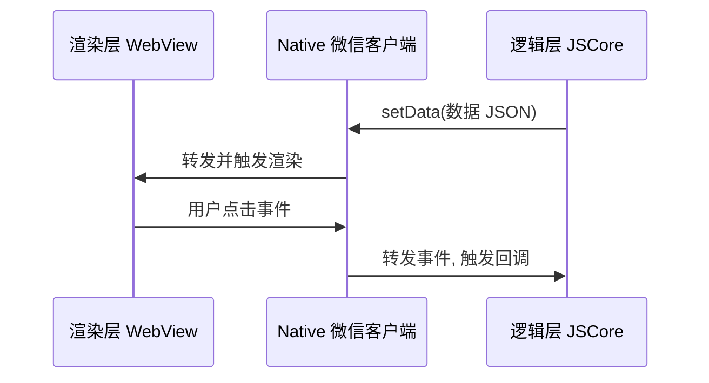

# 泛客户端：微信小程序系列公众号文章大纲

> 目标读者：5-10 年前端或全栈经验，系统补足小程序原生开发体系、备战大厂面试
> 写作原则：使用与实践 → 设计与原理 → 工程落地参考 → 实践演示与验证 → 参考
> 背景：有 1 药网 10 年医疗电商前端经验，示例贴近医疗/处方/药品业务场景
> 与其他系列的分工：本系列讲小程序原生开发体系的通用原理，Node.js 后端接口设计见《09 Node.js 全栈》系列，CI/CD 通用能力（Jenkins/Docker）见《13 前端运维》系列，本系列只讲小程序特有的发布流水线（miniprogram-ci），避免重复

---

## 系列定位

**「泛客户端：微信小程序」系列**

- 篇数：12 篇
- 核心主线：架构原理（双线程模型是一切的基础）→ 生命周期与路由 → 渲染机制（setData）→ 组件化 → 样式层 → 网络与存储 → 安全鉴权 → 支付与开放能力 → 性能优化 → 工程化发布 → 跨端框架 → 云开发
- 篇章编排原则：先讲清楚"为什么小程序要设计成双线程"这个最底层的架构差异，再顺着"页面怎么加载 → 数据怎么更新 → UI 怎么拆分 → 样式怎么写 → 怎么联网存数据 → 怎么鉴权收费 → 怎么优化上线 → 怎么跨端 → 要不要用云开发"的开发者真实决策顺序展开，最后两篇（跨端框架/云开发）是"综合选型"性质，放在系列尾部
- 内容结构：五段式（使用与实践 → 设计与原理 → 工程落地参考 → 实践演示与验证 → 参考）
- 特色：每篇 3-5 个「面试官会问」；代码示例统一用 TypeScript（小程序原生 + `wx.` API 类型声明）；场景命名贴近医疗/药品/处方业务；重点标注与 Web/Vue/React 知识体系的对照与辨析（setData vs 虚拟 DOM diff、behaviors vs mixin、Taro 编译时 vs uni-app 运行时）

---

## 文章规划总览

| 编号 | 标题 | 核心主题 | 状态 |
|------|------|----------|------|
| 01 | 小程序架构解密：双线程模型与渲染层-逻辑层通信机制 | 架构基础 | ⬜ 待写 |
| 02 | 生命周期与路由栈：App/Page/Component 三级生命周期 + 页面栈管理 | 生命周期/路由 | ⬜ 待写 |
| 03 | 数据绑定与更新原理：setData 序列化开销与渲染性能陷阱 | setData 机制 | ⬜ 待写 |
| 04 | 组件化开发：Component 构造器 / behaviors 混入 / 组件通信全解 | 组件系统 | ⬜ 待写 |
| 05 | WXML/WXSS 底层机制：模板编译 / rpx 单位 / 条件与列表渲染性能 | 模板与样式 | ⬜ 待写 |
| 06 | 网络与存储：wx.request 封装实战 / 本地缓存策略 / 文件系统 | 网络/存储 | ⬜ 待写 |
| 07 | 登录鉴权与安全：wx.login 授权流程 / openid-unionid / 数据签名校验 | 鉴权安全 | ⬜ 待写 |
| 08 | 微信支付与开放能力：统一下单流程 / webview 跳转 / 订阅消息 | 支付/开放能力 | ⬜ 待写 |
| 09 | 性能优化实战：分包加载 / 预下载 / 长列表虚拟化 / 首屏优化 | 性能优化 | ⬜ 待写 |
| 10 | 工程化与发布流程：CI/CD 自动化上传 / 分包体积治理 / 审核发布策略 | 工程化发布 | ⬜ 待写 |
| 11 | Taro / uni-app 跨端方案：编译时 vs 运行时架构对比 / 条件编译 / 选型决策 | 跨端框架 | ⬜ 待写 |
| 12 | 小程序云开发：云函数 / 云数据库 / 云调用与自建后端对比 | 云开发 | ⬜ 待写 |

---

## 各篇详细大纲

### 第 01 篇：小程序架构解密：双线程模型与渲染层-逻辑层通信机制

**副标题**：理解了"为什么不能直接操作 DOM"，后面所有的性能优化都有了地基

#### 一、使用与实践

- 刚从 Web 转小程序的开发者最常见的困惑：为什么小程序里没有 `document`、不能直接 `querySelector` 改 DOM，必须通过 `setData`——这个疑问的答案就在双线程架构里
- 医疗小程序处方详情页加载慢，排查后发现是逻辑层脚本体积过大导致 JSCore 初始化耗时——理解双线程模型才能定位这类"启动慢"问题的根因
- 面试高频开场题："说说小程序的整体架构"，考察的正是这一篇的内容

#### 二、设计与原理

- **双线程模型**：小程序运行时分离出两个线程——**渲染层**（View，基于 WebView 渲染 WXML/WXSS）与**逻辑层**（AppService，基于 JSCore 执行 JS 逻辑），二者不能直接通信，必须经由 **Native（微信客户端）转发消息**
- 为什么要设计成双线程：出于安全和性能考量，禁止逻辑层直接操作界面（避免类似 Web 的 XSS/DOM 篡改风险），同时让渲染与逻辑解耦，为分包、后台运行等能力打基础
- 通信链路：逻辑层 `setData()` → 数据以 JSON 形式通过 Native 层桥接 → 渲染层接收并触发 WXML 重新渲染；反之，渲染层的用户操作（点击等）也要经 Native 转发回逻辑层触发事件回调
- iOS 与 Android 渲染层的差异：iOS 用 WKWebView，Android 早期用 X5 内核 WebView，逻辑层统一用 JSCore（iOS）或 V8（Android），这是"同一份代码，两端表现可能不同"的底层原因
- 与 Web 单线程模型对比（面试辨析重点）：Web 的 JS 执行、DOM 渲染、事件处理理论上共享同一个主线程（会互相阻塞），小程序把渲染和逻辑物理隔离到两个线程，逻辑层脚本执行慢不会直接卡住界面渲染，但通信本身有跨线程序列化开销

#### 三、工程落地参考

```typescript
// 逻辑层：Page 或 Component 中触发 setData
// 数据变更不会同步反映到界面，而是异步经由 Native 转发到渲染层
Page({
  data: { prescriptionList: [] as Prescription[] },
  async loadPrescriptions() {
    const list = await fetchPrescriptions();
    // 这一步只是把数据发往 Native 层，真正的界面更新是异步完成的
    this.setData({ prescriptionList: list });
  },
});
```



#### 四、实践演示与验证

用小程序开发者工具的调试面板观察一次 `setData` 调用后 Network/Trace 面板里的耗时分布，直观看到"逻辑层发起 → Native 转发 → 渲染层接收"三段耗时；对比一个大数据量列表连续多次 `setData` 与合并成一次 `setData` 的耗时差异。

#### 五、参考

- 微信官方文档《小程序运行环境》
- 微信官方文档《架构综述》

**面试核心问**：
- 小程序为什么设计成双线程模型？和 Web 单线程模型的本质区别是什么？
- 为什么小程序不能像 Web 一样直接操作 DOM？
- setData 为什么是异步的？数据从逻辑层到渲染层经过了哪几层？

---

### 第 02 篇：生命周期与路由栈：App/Page/Component 三级生命周期 + 页面栈管理

**副标题**：三级生命周期不是要死记的 API 列表，而是"应用-页面-组件"三个粒度各自的生存周期

#### 一、使用与实践

- 处方详情页从列表页跳转进入又返回，`onLoad` 只在页面创建时执行一次，而 `onShow` 每次页面重新可见都会执行——搞不清这个区别，写出来的"刷新逻辑"经常放错生命周期导致重复请求或数据不刷新
- 小程序页面栈最多 10 层，医疗问诊流程里"问诊 → 开方 → 支付 → 结果"四步操作如果都用 `navigateTo` 一路push，容易堆栈溢出或用户回退体验混乱——需要理解四种路由 API 各自对页面栈的影响
- App 级 `onLaunch`/`onShow`/`onHide` 决定了小程序冷启动、热启动、切后台/切前台三种场景下要做什么初始化和什么清理

#### 二、设计与原理

- **App 生命周期**：`onLaunch`（小程序初始化，全局只触发一次，适合做登录状态检查、全局配置拉取）、`onShow`（小程序切前台，冷启动和热启动都会触发）、`onHide`（切后台）、`onError`（全局异常捕获）
- **Page 生命周期**：`onLoad`（页面创建，仅一次，可获取路由参数）→ `onShow`（页面可见，每次都触发）→ `onReady`（首次渲染完成）→ `onHide`（页面切后台/被覆盖）→ `onUnload`（页面销毁，从页面栈移除）
- **Component 生命周期**：`created` → `attached`（组件实例进入节点树）→ `ready`（首次布局完成）→ `moved`（节点树位置改变）→ `detached`（组件实例被移除）——组件生命周期比页面生命周期更细粒度，且和页面生命周期是独立的两套钩子（组件不会自动响应页面的 onShow/onHide，需要用 `pageLifetimes` 显式监听）
- 三级生命周期的触发顺序（面试高频）：小程序冷启动时，`App.onLaunch` → `App.onShow` → `Page.onLoad` → `Page.onShow` → `Component.created` → `Component.attached` → `Page.onReady` → `Component.ready`
- **页面栈（Page Stack）**：小程序维护一个类似浏览器 history 的页面栈，最大深度 10 层；四种跳转 API 对栈的影响不同——`wx.navigateTo`（push 新页面入栈）、`wx.redirectTo`（替换当前页面，出栈再入栈）、`wx.reLaunch`（清空整个栈，只留新页面）、`wx.switchTab`（切换 tabBar 页面，tabBar 页面不计入普通页面栈深度限制）

#### 三、工程落地参考

```typescript
Page({
  data: { prescriptionId: '' },
  onLoad(query: Record<string, string>) {
    // 仅执行一次：解析路由参数，做一次性初始化
    this.setData({ prescriptionId: query.id });
  },
  onShow() {
    // 每次页面重新可见都执行：适合刷新可能已过期的状态（如支付结果轮询后返回）
    this.refreshPrescriptionStatus();
  },
  onUnload() {
    // 页面销毁：清理定时器/取消未完成请求，避免内存泄漏
    clearInterval(this.pollingTimer);
  },
});
```

```typescript
// 问诊流程页面栈规划：用 redirectTo 避免中间步骤堆积
wx.navigateTo({ url: '/pages/consult/index' });      // 问诊页：push 入栈
wx.redirectTo({ url: '/pages/prescription/index' }); // 开方页：替换问诊页，不留中间态
wx.redirectTo({ url: '/pages/payment/index' });       // 支付页：替换开方页
wx.reLaunch({ url: '/pages/result/index' });          // 结果页：清空整个链路，防止用户回退到已完成的流程
```

#### 四、实践演示与验证

在开发者工具里模拟"从问诊页连续 `navigateTo` 5 层页面栈"，观察调试器页面栈面板的深度变化；对比同一个跳转链路换成 `redirectTo`/`reLaunch` 后页面栈深度的差异；给一个自定义组件同时打印 `attached`/`pageLifetimes.show` 的触发时机，验证组件生命周期不会自动跟随页面 onShow。

#### 五、参考

- 微信官方文档《小程序生命周期》
- 微信官方文档《页面路由》

**面试核心问**：
- App/Page/Component 三级生命周期的触发顺序是什么？
- onLoad 和 onShow 的区别是什么？各自适合放什么逻辑？
- navigateTo/redirectTo/reLaunch/switchTab 对页面栈的影响分别是什么？页面栈最大深度是多少，超出会怎样？

---

### 第 03 篇：数据绑定与更新原理：setData 序列化开销与渲染性能陷阱

**副标题**：setData 不是"赋值"，是一次跨线程通信，理解这一点才能理解它为什么会成为性能瓶颈

> 本篇讲小程序 setData 机制的原理和优化手法，与 Vue3 响应式/React Fiber diff 算法的具体实现见对应系列，本篇只做跨技术栈的原理辨析，不重复源码级实现

#### 一、使用与实践

- 药品列表页滚动卡顿，排查发现是每次滚动触发一次全量 `setData({ list: newList })`，而非只更新变化的部分——这是小程序性能问题里最常见的一类
- 高频场景（如问诊倒计时每秒更新）如果不加节流地直接 `setData`，会因为频繁跨线程通信导致明显卡顿
- 面试官经常拿"setData 和 Vue 的响应式更新有什么区别"来考察候选人是否真正理解两套框架的渲染机制差异

#### 二、设计与原理

- **setData 的完整链路**：调用 `setData(data)` → 数据被 **序列化为 JSON 字符串** → 通过 Native 层桥接传递给渲染层 → 渲染层反序列化 → 与 WXML 模板中引用的数据做 **Diff** → 只更新真正变化的 DOM 节点。序列化和跨线程传输是主要开销来源，与数据量大小直接相关
- **setData vs Vue/React 的响应式更新**（面试必考辨析）：Vue/React 的状态变化和渲染发生在**同一个 JS 执行环境**里，diff 后直接操作真实 DOM；小程序的 setData 必须先序列化跨线程传输，diff 发生在渲染层——多了一层"跨线程通信"的固有开销，这是架构层面决定的，无法靠框架优化完全消除
- 常见性能反模式：①频繁小量 setData（应合并批量更新）；②setData 传输不必要的大对象（应只传变化的字段路径，如 `setData({ 'list[3].status': 'done' })` 而非整个 list）；③在 `onPageScroll` 等高频回调里直接 setData 不加节流
- `wx.nextTick` 与 `setData` 回调：setData 是异步的，若需要在数据更新到渲染层完成后再执行逻辑，需用其第二个参数回调或 `wx.nextTick`
- 小程序基础库的优化演进：**按数据路径更新**（只传变化字段，减少序列化体积）、**自定义组件的 `pureDataPattern`**（标记纯数据字段不参与 setData 和渲染，减少无意义的 diff 比较）

#### 三、工程落地参考

```typescript
// 反模式：整个数组重新赋值，序列化体积大且渲染层要 diff 整个列表
this.setData({ drugList: updatedList });

// 优化：按路径更新单个字段，减少序列化体积和 diff 范围
this.setData({ [`drugList[${index}].status`]: 'outOfStock' });

// 高频场景节流：问诊倒计时每秒更新，但不必每次都触发跨线程通信
import { throttle } from '@/utils/throttle';
const throttledSetData = throttle((data: Record<string, unknown>) => {
  this.setData(data);
}, 200);
```

```typescript
// 纯数据字段：不需要渲染到界面的中间状态，标记为 pureDataPattern 避免无意义 diff
Component({
  options: { pureDataPattern: /^_/ },
  data: { _pollingCount: 0, visibleStatus: '待审核' }, // _pollingCount 不参与渲染diff
});
```

#### 四、实践演示与验证

用开发者工具 Trace 面板对比"整个大数组 setData"和"按路径只更新单个字段"两种方式的耗时差异；实现一个节流后的 setData 包装函数，验证高频调用场景下渲染帧率的提升；给一个组件配置 `pureDataPattern`，验证内部计数器变化不会触发多余渲染。

#### 五、参考

- 微信官方文档《小程序性能优化：setData》
- 微信官方文档《自定义组件：pureDataPattern》

**面试核心问**：
- setData 的完整执行链路是什么？为什么它比 Vue 的响应式更新多一层开销？
- 列出至少三种 setData 常见的性能反模式及对应优化手法。
- 什么是按数据路径更新？为什么它能减少性能开销？

---

### 第 04 篇：组件化开发：Component 构造器 / behaviors 混入 / 组件通信全解

**副标题**：behaviors 长得像 mixin，但小程序组件树的通信方式和 Vue/React 完全是另一套逻辑

#### 一、使用与实践

- 药品卡片组件在"搜索结果页"、"收藏页"、"购物车页"里都要用，但每个场景的操作按钮不同——用自定义组件封装通用展示逻辑，用 `slot` 让不同场景注入不同的操作区域
- 处方审核组件和用药提醒组件都需要"倒计时"能力，直接复制代码不可维护——用 `behaviors` 把倒计时逻辑抽成可复用的混入模块
- 父子组件通信、跨层级组件通信（如深层嵌套的表单项要通知最外层表单容器）是小程序组件化开发里最容易写错的部分

#### 二、设计与原理

- **Component 构造器**核心字段：`properties`（外部传入的属性，类似 React props）、`data`（内部状态）、`methods`（方法）、`observers`（监听 data/properties 变化，类似 Vue watch）、`lifetimes`（组件生命周期）、`pageLifetimes`（监听所在页面的生命周期）
- **behaviors**：类似 mixin 的代码复用机制，可以定义一组 `properties`/`data`/`methods`/生命周期，多个组件通过 `behaviors: [myBehavior]` 混入——多个 behavior 混入同一组件时，同名字段有明确的合并规则（方法按 behavior 数组顺序执行，data 深度合并）
- **behaviors vs Vue mixin vs React HOC**（面试辨析重点）：三者都是"横向复用逻辑"的方案，但 behaviors 是小程序框架内置的组合机制（合并规则由框架保证），Vue mixin 也是选项合并但社会淘汰趋势明显（Vue3 推荐 Composition API 替代），React HOC 是包装组件返回新组件（结构上多一层嵌套）——三者的合并/包装方式不同，导致命名冲突排查的难度也不同
- **组件通信方式全览**：`properties` 向下传数据（父→子）、`triggerEvent` 向上派发自定义事件（子→父）、`relations` 声明组件间父子/祖先-后代关系并互相调用方法（用于强关联的组件族，如 `van-tabs` 和 `van-tab`）、`selectComponent`（父组件通过 ref 式选择器直接调用子组件方法，类似 Vue 的 `ref`）、跨层级用全局事件总线或状态管理（如 Store 模式）
- **slot**：默认插槽与具名多插槽（`slot="name"`），是小程序组件内容分发能力，语义上对应 Vue slot / React children

#### 三、工程落地参考

```typescript
// behaviors：抽取可复用的倒计时逻辑
export const countdownBehavior = Behavior({
  data: { remainSeconds: 0 },
  methods: {
    startCountdown(seconds: number) {
      this.setData({ remainSeconds: seconds });
      this._timer = setInterval(() => {
        const next = this.data.remainSeconds - 1;
        if (next <= 0) clearInterval(this._timer);
        this.setData({ remainSeconds: Math.max(next, 0) });
      }, 1000);
    },
  },
});

Component({
  behaviors: [countdownBehavior], // 混入倒计时能力
  properties: { prescriptionId: String },
  methods: {
    onConfirm() {
      // 子组件通过 triggerEvent 向父组件派发自定义事件
      this.triggerEvent('confirm', { id: this.properties.prescriptionId });
    },
  },
});
```

```xml
<!-- 父组件监听子组件事件，selectComponent 主动调用子组件方法 -->
<drug-card bind:confirm="handleConfirm" id="card1" />
```

#### 四、实践演示与验证

给两个不同场景的卡片组件混入同一个 `countdownBehavior`，验证复用逻辑生效且互不干扰；用 `triggerEvent` 实现子组件向父组件通信，用 `selectComponent` 实现父组件主动调用子组件方法，对比两种通信方向的适用场景；实现一个具名多插槽的通用卡片组件，验证不同页面注入不同内容。

#### 五、参考

- 微信官方文档《自定义组件》
- 微信官方文档《behaviors》

**面试核心问**：
- behaviors 和 Vue mixin、React HOC 分别有什么相似和不同？
- 小程序组件通信有哪几种方式？分别适合什么场景？
- 多个 behaviors 混入同一组件，同名字段/方法的合并规则是什么？

---

### 第 05 篇：WXML/WXSS 底层机制：模板编译 / rpx 单位 / 条件与列表渲染性能

**副标题**：WXML 长得像 HTML，但它在渲染层的处理方式和浏览器解析 HTML 完全不同

#### 一、使用与实践

- 药品列表用 `wx:if` 还是 `hidden` 控制某个促销标签的显隐，看起来效果一样，但高频切换场景下性能差异明显
- 长列表渲染忘记绑定 `wx:key`，导致数据更新后列表项渲染错乱或产生不必要的重新创建
- 多语言医疗小程序需要给不同屏幕尺寸做适配，`rpx` 单位的换算规则决定了设计稿到代码的还原精度

#### 二、设计与原理

- **WXML 编译机制**：WXML 不是运行时解析的 HTML，而是在**构建阶段被编译为 JS 可执行的渲染函数**（类似 Vue 模板编译为 render 函数），运行时直接执行编译产物生成虚拟节点树再交给渲染层展示——这是 WXML 比字符串拼接 HTML 更高效的原因
- **wx:if vs hidden**（面试高频辨析）：`wx:if` 是条件渲染，为 false 时该节点及其内部数据绑定**完全不会被创建**（结构层面移除）；`hidden` 是显隐控制，节点始终被创建只是加了 `display: none` 样式。频繁切换场景用 `hidden`（避免反复创建销毁的开销），初始条件确定且很少切换的场景用 `wx:if`（避免不必要节点常驻内存）
- **列表渲染与 wx:key**：`wx:for` 渲染列表时必须指定 `wx:key`，其作用与 Vue/React 的 `key` 一致——帮助渲染层在 diff 阶段准确复用/移动已有节点，而非整体重建，key 缺失或使用 index 在数据顺序变化场景下会导致状态错乱
- **rpx（responsive pixel）单位**：以 375px 屏幕宽度为基准，规定 750rpx = 屏幕宽度，换算比例 `1rpx = 屏幕宽度/750 px`，让同一份代码在不同屏幕宽度设备上自动等比缩放，与 Web 里 `vw`/`rem` 方案解决的是同一类适配问题但换算基准不同
- **WXSS 与 CSS 的差异**：WXSS 支持 `rpx` 单位和 `@import`，但不支持 CSS 表达式、部分复杂选择器和伪类；组件样式默认**隔离**（`styleIsolation`，类似 Shadow DOM 的样式封装），外部样式默认不会影响组件内部，需要显式配置才能穿透

#### 三、工程落地参考

```xml
<!-- wx:if：条件不满足时节点完全不创建，适合初始化后很少切换的场景 -->
<view wx:if="{{ isPrescriptionDrug }}">处方药提示</view>

<!-- hidden：节点始终创建，仅切换 display，适合高频切换场景（如倒计时结束态） -->
<view hidden="{{ !showPromotionTag }}">限时促销</view>

<!-- wx:key 指定唯一标识，避免用 index 导致的 diff 错乱 -->
<view wx:for="{{ drugList }}" wx:key="drugId">{{ item.name }}</view>
```

```css
/* rpx 单位：设计稿 750px 宽度下，1px 设计稿标注 = 1rpx */
.drug-card { width: 200rpx; padding: 24rpx; }
```

```typescript
// 组件样式隔离配置：允许外部样式类穿透到组件内部（谨慎使用，会破坏封装性）
Component({ options: { styleIsolation: 'apply-shared' } });
```

#### 四、实践演示与验证

对比高频切换场景下 `wx:if` 和 `hidden` 的渲染耗时差异（用开发者工具 Trace 面板测量）；构造一个列表顺序变化的场景，验证不设 `wx:key` 或用 index 作 key 导致的渲染异常，再改为业务唯一 id 验证问题消失；用不同屏幕尺寸的模拟器验证 rpx 换算的等比缩放效果。

#### 五、参考

- 微信官方文档《WXML》《WXSS》
- 微信官方文档《rpx 尺寸单位》

**面试核心问**：
- wx:if 和 hidden 的核心区别是什么？分别适合什么场景？
- wx:key 的作用是什么？和 Vue/React 的 key 是同一个原理吗？
- rpx 单位的换算规则是什么？和 Web 的 rem/vw 方案有什么本质不同？

---

### 第 06 篇：网络与存储：wx.request 封装实战 / 本地缓存策略 / 文件系统

**副标题**：把 wx.request 封装成 axios 的手感，是小程序工程化的第一道门槛

#### 一、使用与实践

- 每个业务组件都直接裸调 `wx.request` 写一遍 header/超时/错误处理，代码重复且难以统一升级——需要封装成统一的请求层，做法上与 axios 拦截器思路一致
- 药品说明书 PDF、处方图片等文件需要下载到本地缓存复用，避免重复请求消耗流量——涉及 `wx.downloadFile` 和文件系统 API
- `wx.setStorageSync` 单个 key 有存储上限（10MB），本地缓存病历/处方历史记录较多时需要设计淘汰策略而不是无限堆积

#### 二、设计与原理

- **wx.request 封装为统一请求层**：思路与 axios 拦截器一致——统一 baseURL、统一 header（携带 token）、统一超时处理、统一错误码映射、支持请求/响应拦截器、支持并发请求数限制（小程序原生对同时进行的 `wx.request` 数量有上限，超出会排队）
- **重试与取消**：`wx.request` 返回的 task 对象有 `abort()` 方法可以主动取消请求（对应 axios 的 CancelToken/AbortController），网络失败重试需要业务层自行实现指数退避
- **本地存储体系**：`wx.setStorageSync`/`wx.getStorageSync`（同步，单 key 上限 10MB，所有 key 合计上限 10MB，因设备而异）、`wx.setStorage`/`wx.getStorage`（异步版本）——本质是对设备本地 KV 存储的封装，容量有限，不适合存大量数据
- **文件系统**：`wx.getFileSystemManager()` 提供更底层的文件读写能力（对应 Node.js fs 模块的能力子集），`wx.downloadFile`/`wx.saveFile` 用于下载并持久化保存文件（如处方 PDF），小程序框架会自动管理临时文件和永久文件的生命周期与清理策略
- **多级缓存策略**：内存缓存（本次运行期，最快但重启丢失）→ Storage 本地缓存（跨次运行持久，但容量有限）→ 网络请求（最慢但数据最新）——三级缓存的失效策略（TTL）与更新策略是常见的设计考点

#### 三、工程落地参考

```typescript
// 统一请求层：思路对齐 axios 拦截器
interface RequestConfig { url: string; method?: 'GET' | 'POST'; data?: unknown; }
function request<T>(config: RequestConfig): Promise<T> {
  return new Promise((resolve, reject) => {
    wx.request({
      url: `${BASE_URL}${config.url}`,
      method: config.method ?? 'GET',
      data: config.data,
      header: { Authorization: `Bearer ${getToken()}` }, // 统一注入 token
      timeout: 8000,
      success: (res) => {
        if (res.statusCode === 200) resolve(res.data as T);
        else reject(mapErrorCode(res.statusCode)); // 统一错误码映射
      },
      fail: reject,
    });
  });
}
```

```typescript
// 多级缓存：内存 -> Storage -> 网络
async function getDrugDetail(id: string): Promise<DrugDetail> {
  if (memoryCache.has(id)) return memoryCache.get(id)!;
  const cached = wx.getStorageSync(`drug_${id}`);
  if (cached && Date.now() - cached.time < TTL) return cached.value;
  const detail = await request<DrugDetail>({ url: `/drugs/${id}` });
  wx.setStorageSync(`drug_${id}`, { value: detail, time: Date.now() });
  memoryCache.set(id, detail);
  return detail;
}
```

#### 四、实践演示与验证

封装一个带拦截器、超时、错误码映射的统一请求层，替换项目里所有裸调 `wx.request` 的地方；实现处方 PDF 的下载与本地缓存复用，验证二次访问不再重新下载；演示 Storage 容量超限时的报错场景，并实现一个简单的 LRU 淘汰策略清理过期缓存。

#### 五、参考

- 微信官方文档《网络》《本地存储》《文件系统》
- axios 拦截器设计（跨系列指引，见《02 TypeScript》系列 axios 封装篇）

**面试核心问**：
- wx.request 封装成统一请求层需要考虑哪些方面？
- Storage 本地存储的容量限制是多少？超限怎么处理？
- 小程序的文件系统和 Node.js fs 模块有什么关系和区别？

---

### 第 07 篇：登录鉴权与安全：wx.login 授权流程 / openid-unionid / 数据签名校验

**副标题**：小程序登录看起来一行 wx.login 就搞定，但背后的账号体系设计是真正的考点

> 本篇讲小程序特有的登录鉴权链路（code2Session、openid/unionid），JWT/OAuth2 等通用认证协议原理见《09 Node.js 全栈》系列认证篇，避免重复

#### 一、使用与实践

- 医疗小程序要求用户授权登录才能查看处方历史，但小程序端拿到的只是一个临时 `code`，真正的用户身份（openid）必须由后端换取——前端拿不到、也不该拿到 openid，这是常见的安全设计误区
- 同一家医疗集团既有小程序又有 App/公众号，需要判断是否是"同一个用户"——这就是 unionid 要解决的问题
- 处方数据属于敏感医疗信息，接口传输和存储都需要额外的签名校验与加密手段，不能只依赖 HTTPS

#### 二、设计与原理

- **code2Session 登录流程**：小程序端调用 `wx.login()` 拿到一次性 `code` → 传给自己的后端服务器 → 后端用 `code` + AppID + AppSecret 调用微信 `code2Session` 接口 → 微信服务器返回 `openid`（该用户在本小程序下的唯一标识）和 `session_key`（用于数据加解密，不能下发到前端）→ 后端自行生成自定义登录态（如 JWT）返回给前端，前端后续请求携带这个自定义登录态，而非直接使用 openid
- **openid vs unionid**：openid 是用户在**单个**小程序/公众号下的唯一标识（同一用户在不同小程序下 openid 不同），unionid 是同一个微信开放平台账号下**跨小程序/公众号/App 打通**的唯一标识（需要将小程序绑定到同一个开放平台账号才会返回 unionid）——多端识别同一用户的正确做法是用 unionid
- **session_key 与数据签名校验**：`session_key` 是加密解密用户敏感数据（如手机号、地址）的密钥，只应留在后端，不下发前端；前端拿到的加密数据（如 `wx.getUserProfile` 返回的加密字段）需要连同 `session_key` 一起发给后端做 AES 解密和签名校验，防止数据被篡改
- **账号体系设计**：正确做法是后端维护自己的用户体系（用户表以 openid/unionid 作为外部关联字段），自定义登录态（如短期 JWT + refreshToken）替代 openid 暴露给前端使用——这样即便 openid/session_key 泄露风险也被隔离在后端

#### 三、工程落地参考

```typescript
// 前端：拿到 code，换取自定义登录态（不直接使用 openid）
async function login(): Promise<void> {
  const { code } = await wx.login();
  const { token } = await request<{ token: string }>({
    url: '/auth/wx-login',
    method: 'POST',
    data: { code },
  });
  wx.setStorageSync('token', token); // 后续请求携带自定义 token，而非 openid
}
```

```typescript
// 后端（Node.js 示意）：code2Session + 生成自定义登录态
async function wxLogin(code: string) {
  const { openid, unionid, session_key } = await fetchCode2Session(code); // 调用微信接口
  const user = await findOrCreateUser({ openid, unionid }); // 维护自己的用户体系
  const token = signJwt({ userId: user.id }); // 自定义登录态，与微信 openid 解耦
  return { token };
}
```

#### 四、实践演示与验证

搭建一个最小化的 code2Session 后端接口（可用 `apps/api` 里的 Hono 路由），验证小程序端 `wx.login` 拿到的 code 只能使用一次；演示前端错误地尝试直接获取 openid 会失败（微信不允许前端直连该接口）；对比同一用户在小程序和公众号下 openid 不同、但 unionid 相同的场景。

#### 五、参考

- 微信官方文档《小程序登录》
- 微信官方文档《UnionID 机制说明》

**面试核心问**：
- 小程序登录的完整流程是什么？为什么前端不能直接拿到 openid？
- openid 和 unionid 的区别是什么？分别用在什么场景？
- session_key 是做什么用的？为什么不能下发到前端？

---

### 第 08 篇：微信支付与开放能力：统一下单流程 / webview 跳转 / 订阅消息

**副标题**：支付流程里前端只做"临门一脚"，真正的风险控制都在后端完成

#### 一、使用与实践

- 医疗问诊/购药下单后需要接入微信支付，前端只负责调起支付面板，真正的下单、签名、回调校验都需要后端完成——理解这个边界能避免把敏感逻辑错误地放在前端
- 医院官网的历史 H5 页面（如药品说明书详情）想复用在小程序里，又不想完全重写——用 `web-view` 组件承载已有 H5 页面
- 处方审核结果需要及时通知用户，但小程序没有常驻后台推送能力，只能通过订阅消息在用户授权后一次性下发

#### 二、设计与原理

- **微信支付统一下单流程**：小程序端调用后端"创建订单"接口 → 后端携带订单信息调用微信支付**统一下单 API**（`unifiedorder`/新版 JSAPI 下单）→ 微信返回预支付会话标识 `prepay_id` → 后端按微信签名算法生成前端调起支付所需的参数（`paySign` 等）→ 前端调用 `wx.requestPayment` 唤起支付面板 → 用户确认支付 → 微信服务器异步回调后端**支付结果通知**接口（需要校验签名防伪造）→ 后端更新订单状态。前端全程不接触密钥，签名生成和回调校验都在后端
- **签名校验的安全意义**：支付回调通知理论上任何人都可以伪造 HTTP 请求打到回调地址，后端必须校验微信官方签名（新版为证书签名验证）确认请求真实来自微信服务器，才能标记订单为已支付——这是防止"伪造支付成功回调"攻击的关键
- **web-view 组件**：小程序内嵌 H5 页面的能力，本质是一个受限的 WebView 容器，H5 页面与小程序逻辑层可以通过 `postMessage` 简单通信，但 H5 页面本身仍运行在独立的浏览器环境里，不能直接调用小程序原生 API（需要通过 JS-SDK 桥接）
- **订阅消息**：一次性/长期订阅消息机制，用户主动授权后，小程序可在特定业务场景下（如处方审核完成）通过服务端调用模板消息接口推送提醒——不同于 App 的常驻 Push 能力，订阅消息需要用户在触发场景下主动点击授权，且一次性订阅消息用一次就需要重新授权
- **开放能力速览**：地理位置（`wx.getLocation`）、卡包卡券、客服消息、小程序码/太阳码生成（用于线下渠道拉新，常见于医院线下诊室海报）

#### 三、工程落地参考

```typescript
// 前端：调起支付面板，签名和订单创建都在后端完成
async function payOrder(orderId: string) {
  const payParams = await request<WxPayParams>({
    url: '/orders/prepay',
    method: 'POST',
    data: { orderId },
  }); // 后端已完成统一下单+签名
  await wx.requestPayment(payParams); // 前端只做临门一脚
}
```

```xml
<!-- web-view 嵌入已有 H5 说明书页面，与小程序逻辑层通过 message 通信 -->
<web-view src="https://his.example.com/drug-instruction?id={{drugId}}" bindmessage="onWebviewMessage" />
```

#### 四、实践演示与验证

用微信支付沙箱环境走通一次"创建订单 → 统一下单 → 前端调起支付 → 后端接收回调"的完整链路，重点观察回调签名校验的实现；用 `web-view` 嵌入一个现有 H5 页面并实现双向 `postMessage` 通信；演示订阅消息从用户授权到服务端推送的完整链路。

#### 五、参考

- 微信支付官方文档《JSAPI 下单》
- 微信官方文档《web-view》《订阅消息》

**面试核心问**：
- 微信支付的完整下单流程是什么？前端和后端各自的职责边界在哪？
- 为什么支付回调通知必须做签名校验？如果不校验会有什么风险？
- 订阅消息和传统 App 推送有什么区别？为什么小程序不能做常驻推送？

---

### 第 09 篇：性能优化实战：分包加载 / 预下载 / 长列表虚拟化 / 首屏优化

**副标题**：小程序的性能优化，一半靠代码技巧，另一半靠对包体积和加载策略的工程规划

#### 一、使用与实践

- 医疗小程序功能越做越多，主包体积逼近 2MB 限制（主包+所有分包总大小上限 20MB，单个分包/主包各自上限 2MB），首次启动加载慢——需要分包策略把非首屏功能拆出去
- 药品列表几千条数据一次性渲染导致页面卡顿甚至白屏——需要虚拟列表只渲染可视区域内的节点
- 从首页进入问诊模块前，用户会有一个"选择科室"的中间操作时间——可以利用这个间隙提前预下载问诊分包，让用户点击时几乎无感知加载

#### 二、设计与原理

- **分包加载（Subpackages）**：小程序支持把代码拆分成主包（首屏必须的页面和公共资源）+ 多个分包（按业务模块拆分，如"问诊分包"、"商城分包"），用户只在首次访问某个分包对应页面时才会下载该分包，降低首次启动下载和解析的体积
- **分包类型**：普通分包（独立按需加载）、**独立分包**（可以不依赖主包独立运行，用于插件化或特定入口场景，如广告投放落地页）、分包预下载（`preloadRule` 配置在进入某个页面时提前静默下载即将访问的分包）
- **首屏优化手段**：主包只放首屏必需页面和组件，公共基础库/组件下沉到 `packages/ui` 之类的公共分包；图片资源用 CDN 而非打包进代码包；合理使用骨架屏和分批渲染，避免用户感知到白屏
- **长列表虚拟化**：类似 Web 端虚拟列表的思路（呼应《04 性能与前端监控》系列感知性能优化篇），只渲染可视区域内的节点，滚动时动态计算并替换渲染区间——小程序生态里有社区方案（`recycle-view`）和官方 `virtual-list` 相关能力，核心原理与 Web 虚拟列表一致，区别在于底层用 setData 驱动更新而非直接操作 DOM
- **代码层面优化**：避免在 `onPageScroll` 等高频事件里做重逻辑（结合第 03 篇 setData 节流）、图片懒加载（`lazy-load` 属性）、`wx.createSelectorQuery` 谨慎使用（跨线程通信有开销，避免在滚动中频繁查询节点信息）

#### 三、工程落地参考

```json
// app.json：分包配置示例
{
  "subpackages": [
    { "root": "packages/consult", "pages": ["pages/list/index", "pages/detail/index"] },
    { "root": "packages/mall", "pages": ["pages/goods/index"] }
  ],
  "preloadRule": {
    "pages/index/index": { "network": "all", "packages": ["packages/consult"] }
  }
}
```

```typescript
// 虚拟列表核心思路：只渲染可视区间内的数据项
function getVisibleRange(scrollTop: number, itemHeight: number, viewportHeight: number, total: number) {
  const start = Math.max(0, Math.floor(scrollTop / itemHeight) - BUFFER);
  const end = Math.min(total, Math.ceil((scrollTop + viewportHeight) / itemHeight) + BUFFER);
  return { start, end };
}
```

#### 四、实践演示与验证

把一个单主包的小程序按业务模块拆分成 2-3 个分包，用开发者工具的"分包大小分析"验证主包体积下降；配置 `preloadRule` 后，用调试面板观察分包在用户进入触发页面前已被静默下载；实现一个几千条数据的虚拟列表，对比全量渲染和虚拟化渲染的帧率与内存占用差异。

#### 五、参考

- 微信官方文档《分包加载》《分包预下载》
- 微信官方文档《性能优化：渐进式加载》

**面试核心问**：
- 分包加载解决了什么问题？分包大小限制是多少？
- 分包预下载的原理是什么？和分包本身有什么区别？
- 小程序的虚拟列表和 Web 端虚拟列表原理有什么相同和不同？

---

### 第 10 篇：工程化与发布流程：CI/CD 自动化上传 / 分包体积治理 / 审核发布策略

**副标题**：小程序发布不只是点一下"上传"按钮，还有版本管理、审核策略和体积治理这些容易被忽视的工程细节

> 本篇聚焦小程序特有的发布流水线（miniprogram-ci、体验版/审核/发布策略），通用 CI/CD 流水线设计（Jenkins Pipeline、多分支策略）见《13 前端运维》系列，本篇不重复讲解 Jenkins 本身如何搭建，只讲小程序发布这一步骤如何接入既有流水线

#### 一、使用与实践

- 团队多人协作开发医疗小程序，每次发布都要有人手动登录管理后台上传代码，效率低且容易出错——需要用 `miniprogram-ci` 把上传步骤接入 CI/CD 流水线自动化
- 小程序审核有明确的内容规范（医疗类小程序涉及资质核验，比普通电商更严格），审核被拒会打断发布节奏——需要理解体验版/审核/发布这三个阶段各自的作用
- 随着功能增多，分包体积逐渐逼近上限，需要定期做体积分析和治理，而不是等到超限才紧急处理

#### 二、设计与原理

- **miniprogram-ci**：微信官方提供的 Node.js 库，可以在没有图形界面的 CI 环境里完成代码上传、预览、体验版设置等操作，核心 API 是 `ci.upload()`（携带私钥文件和版本号完成上传）——是把"人工登录后台点击上传"这一步骤自动化的关键工具
- **发布三阶段**：**开发版**（开发者工具直接预览，不影响线上）→ **体验版**（团队成员和内测用户可扫码体验，用于上线前验收）→ **审核 + 线上版本**（提交审核，微信人工/机审通过后可发布到线上，普通用户可见）。三者互相独立，上传新代码默认生成开发版，需要显式设置体验版和提交审核
- **CI/CD 接入方式**：在 Jenkins/GitHub Actions 等既有流水线里增加一个"小程序上传"步骤，调用 `miniprogram-ci` 的 API，结合 git tag 或分支策略自动设置版本号和描述，私钥文件需要作为 CI 密钥安全存储（不能提交进代码仓库）
- **分包体积治理**：定期用开发者工具"分析"面板查看主包/分包体积构成，常见治理手段——第三方 npm 依赖按需引入而非全量打包、图片资源迁移到 CDN、公共组件下沉到分包避免主包冗余、审查未使用代码
- **审核规范要点**（医疗行业特有）：医疗类小程序需要提交医疗机构执业许可证等资质，涉及处方/诊疗内容的功能点需要额外的类目资质审核，这类审核周期通常比普通电商类目更长，工程排期需要预留缓冲

#### 三、工程落地参考

```typescript
// CI 脚本：调用 miniprogram-ci 自动上传
import ci from 'miniprogram-ci';

async function uploadMiniProgram(version: string, desc: string) {
  const project = new ci.Project({
    appid: process.env.WX_APPID!,
    type: 'miniProgram',
    projectPath: './dist',
    privateKeyPath: process.env.WX_PRIVATE_KEY_PATH!, // CI 密钥安全存储，不入库
  });
  await ci.upload({ project, version, desc, setting: { es6: true, minify: true } });
}
```

```yaml
# CI 流水线片段：在既有 Node.js 构建后接入小程序上传步骤
- name: Upload MiniProgram
  run: node scripts/upload-miniprogram.js --version=$GIT_TAG --desc="$COMMIT_MESSAGE"
```

#### 四、实践演示与验证

写一个 `miniprogram-ci` 上传脚本并接入本项目已有的 CI 流水线，验证 push 到指定分支后自动生成体验版；用开发者工具的分包分析面板对当前项目做一次体积审计，找出至少一项可优化的体积治理点；梳理一次医疗类目资质审核所需材料清单。

#### 五、参考

- 微信官方文档《miniprogram-ci》
- 微信官方文档《小程序审核规范》

**面试核心问**：
- miniprogram-ci 解决了什么问题？和手动上传相比核心价值是什么？
- 开发版/体验版/线上版本三者的关系和用途分别是什么？
- 小程序体积治理常见的手段有哪些？

---

### 第 11 篇：Taro / uni-app 跨端方案：编译时 vs 运行时架构对比 / 条件编译 / 选型决策

**副标题**：两大跨端框架的性能差异，根源在于"何时把小程序语法转换成目标平台代码"这一个架构选择

#### 一、使用与实践

- 医疗集团需要同时维护小程序、H5、可能未来还有 App 端，如果三端各写一套代码维护成本极高——这是跨端框架要解决的核心问题
- 团队里有 React 背景的同学更适应 Taro（React 语法），有 Vue 背景的同学更适应 uni-app（Vue 语法）——技术选型不能只看性能，还要看团队现有技能栈
- 条件编译（`#ifdef`）用来处理"同一份代码，不同平台需要不同实现"的场景（如小程序用 `wx.request`，H5 用 `fetch`）

#### 二、设计与原理

- **Taro 的编译时方案**：开发时用 React（或 Vue）语法编写，Taro 在**构建阶段**把 JSX/模板编译成目标平台（微信小程序/支付宝小程序/H5等）的原生代码（WXML+WXSS+JS），运行时不需要额外的框架层介入，性能更接近原生小程序开发
- **uni-app 的运行时方案**：开发时用 Vue 语法编写，运行时打包进一个 **uni-app 运行时框架**，该框架在小程序端负责把 Vue 的响应式更新转换为 setData 调用——多了一层运行时框架的转换开销，但换来的是更灵活的动态特性支持（如更完整的 JS 动态能力）
- **架构差异导致的实际影响**（面试辨析重点）：编译时方案（Taro）产出的代码体积和运行时性能更接近纯原生开发，但对一些高度动态的 JS 特性（如运行时动态生成组件结构）支持有限；运行时方案（uni-app）灵活性更好，但运行时框架本身占用体积和执行开销，在低端设备上性能差距会被放大
- **条件编译**：跨端框架都提供条件编译能力（Taro 用 `process.env.TARO_ENV` 或文件后缀 `.weapp.tsx`，uni-app 用 `#ifdef MP-WEIXIN` 注释块），用于处理无法跨端统一抽象的平台差异代码
- **选型决策维度**：团队技术栈（React 背景选 Taro，Vue 背景选 uni-app）、目标平台数量与差异程度、对性能敏感度、生态插件丰富度（uni-app 生态历史更久、插件市场更成熟）、是否需要同时产出 App（uni-app 的 App 端基于原生渲染引擎，生态更完整）

#### 三、工程落地参考

```tsx
// Taro：React 语法，编译时转换为小程序 WXML/WXSS/JS
export default function DrugCard({ drug }: { drug: Drug }) {
  return (
    <View className="drug-card">
      <Text>{drug.name}</Text>
    </View>
  );
}
```

```vue
<!-- uni-app：Vue 语法，运行时框架转换为 setData 调用 -->
<template>
  <view class="drug-card">
    <text>{{ drug.name }}</text>
  </view>
</template>
```

```typescript
// 条件编译示例（uni-app）：同一份代码处理平台差异
// #ifdef MP-WEIXIN
wx.requestPayment(payParams);
// #endif
// #ifdef H5
window.location.href = h5PayUrl;
// #endif
```

#### 四、实践演示与验证

用同一个简单页面分别在 Taro 和 uni-app 里实现，对比构建产物体积和真机渲染耗时；针对一个"小程序用 wx.request、H5 用 fetch"的场景分别用两个框架的条件编译语法实现，对比语法差异；整理一份选型决策清单，结合本项目团队技术栈（React/Next.js 为主）给出倾向性结论。

#### 五、参考

- Taro 官方文档《编译原理》
- uni-app 官方文档《条件编译》

**面试核心问**：
- Taro 和 uni-app 最核心的架构差异是什么？分别带来什么优劣势？
- 什么是条件编译？为什么跨端框架都需要这个能力？
- 如果团队是 React 背景，为什么更适合选 Taro 而不是 uni-app？

---

### 第 12 篇：小程序云开发：云函数 / 云数据库 / 云调用与自建后端对比

**副标题**：云开发不是要取代后端工程师，而是给"没有后端团队"的场景提供另一个选择

> 本篇讲云开发能力边界与选型判断，自建 Node.js 后端的具体架构设计见《09 Node.js 全栈》系列，本篇重点是"什么场景选云开发、什么场景选自建后端"的决策依据，不重复讲解 Node.js 后端工程细节

#### 一、使用与实践

- 医疗集团的一个小型内部工具小程序（如内部用药登记表），没有独立后端团队支持，用云开发可以让前端工程师独立完成全部开发，不依赖后端排期
- 已有成熟的 `apps/his-api`（Node.js/Hono 后端）承载核心业务，新的营销活动小程序页面是否值得再引入一套云开发体系，还是直接复用现有后端接口——这是真实项目中常见的选型判断
- 云函数里直接操作云数据库、调用微信开放接口，省去了"部署服务器、管理运维"的环节，但也带来了供应商锁定的代价

#### 二、设计与原理

- **云函数（Cloud Functions）**：运行在腾讯云环境的 Node.js 函数，小程序端可以直接 `wx.cloud.callFunction()` 调用，无需自己搭建 HTTP 服务器和处理路由——类似 Serverless/FaaS 架构，按调用次数和资源消耗计费
- **云数据库**：基于 MongoDB 的文档型数据库，提供小程序端直接读写的 SDK（需配合安全规则限制权限），也可以在云函数内用管理员权限访问——省去了搭建和运维数据库的成本，但查询能力和复杂事务支持不如自建 MySQL/PostgreSQL 灵活
- **云调用（Cloud Call）**：云函数内可以直接、免鉴权地调用微信开放接口（如发送订阅消息、获取 openid），不需要像自建后端那样自己维护 access_token 的获取和刷新逻辑
- **云开发 vs 自建后端**（决策核心）：云开发的优势是**开发效率高、无需运维、与微信生态无缝集成**，代价是**供应商锁定**（迁移成本高）、**复杂业务逻辑和多端复用能力弱于自建后端**（如果同时要支持 App/H5/小程序共享同一套后端，云开发不是好选择）；自建后端（如本项目 `apps/his-api`）的优势是架构自主可控、可被多端复用、复杂查询和事务能力更强，代价是需要自己承担运维和基础设施成本
- **适用边界判断**：功能相对独立、生命周期短、无需与现有后端数据打通的小工具/活动页适合云开发；核心业务、需要多端复用、需要复杂数据关系和事务保证的场景应该用自建后端，医疗行业对数据合规和可控性要求高，核心处方/病历数据更适合放在自建后端而非云开发

#### 三、工程落地参考

```typescript
// 云函数：直接操作云数据库并云调用发送订阅消息
// cloudfunctions/reviewPrescription/index.js
exports.main = async (event) => {
  const db = cloud.database();
  await db.collection('prescriptions').doc(event.id).update({ data: { status: 'approved' } });
  await cloud.openapi.subscribeMessage.send({ // 云调用：免鉴权调用微信开放接口
    touser: event.openid,
    templateId: TEMPLATE_ID,
    data: { thing1: { value: '处方审核已通过' } },
  });
};
```

```typescript
// 小程序端调用云函数
await wx.cloud.callFunction({ name: 'reviewPrescription', data: { id: prescriptionId } });
```

#### 四、实践演示与验证

用云开发快速搭建一个最小化的"用药登记"云函数+云数据库 demo，验证从提交到发送订阅消息的完整链路；对比同一个功能如果改用 `apps/his-api` 自建后端实现，两者的开发耗时和后续可扩展性差异；整理一份"云开发 vs 自建后端"的选型决策清单。

#### 五、参考

- 微信官方文档《云开发》
- 腾讯云开发官方文档《云函数》《云数据库》

**面试核心问**：
- 云开发和 Serverless/FaaS 架构是什么关系？
- 云开发相比自建后端的优势和代价分别是什么？
- 什么场景应该用云开发，什么场景应该用自建后端？结合业务复杂度和多端复用需求说明。

---

## 面试高频专题

以下是本系列反复强调、容易混淆的辨析对比，建议整理成单独的速查笔记：

| 辨析对比 | 核心区别 | 对应篇章 |
|---------|---------|---------|
| 双线程模型 vs Web 单线程模型 | 小程序渲染层与逻辑层物理隔离，通信需经 Native 转发；Web 渲染与逻辑共享同一主线程 | 第 01 篇 |
| setData vs Vue/React 响应式更新 | setData 需序列化后跨线程传输再在渲染层 diff，多一层固有通信开销；Vue/React 状态变化与渲染在同一 JS 环境内完成 | 第 03 篇 |
| behaviors vs Vue mixin vs React HOC | 三者都是逻辑复用方案，但 behaviors 是框架内置合并机制，mixin 是选项合并，HOC 是包装组件多一层嵌套 | 第 04 篇 |
| wx:if vs hidden | wx:if 为 false 时节点完全不创建，hidden 始终创建仅切换 display；高频切换用 hidden，低频用 wx:if | 第 05 篇 |
| openid vs unionid | openid 是单个小程序/公众号下的用户标识，unionid 是跨端（同开放平台账号下）统一的用户标识 | 第 07 篇 |
| 分包加载 vs 分包预下载 | 分包加载是按需下载（访问对应页面才下载），预下载是在指定页面提前静默下载即将访问的分包 | 第 09 篇 |
| Taro 编译时 vs uni-app 运行时 | Taro 构建阶段编译为原生代码无运行时框架层，uni-app 运行时框架实时转换 Vue 更新为 setData，前者性能更接近原生，后者更灵活 | 第 11 篇 |
| 云开发 vs 自建后端 | 云开发开发效率高但供应商锁定、复杂业务能力弱；自建后端架构自主可控、多端复用能力强但需自行运维 | 第 12 篇 |

---

## 各篇标准笔记模板

每篇文章发布前，先在 `docs/learning/notes/miniprogram/{knowledge-point}.md` 建立对应笔记，笔记结构与文章五段式一致：

```markdown
# {知识点名称}

## 核心概念
一句话描述这个知识点解决的问题

## 使用场景（医疗/电商业务）
- 场景 1
- 场景 2

## 核心实现
（TypeScript/小程序代码 + 必要的架构图）

## 易混淆辨析
（如与本知识点相似、原理不同的概念对比，尤其是与 Web/Vue/React 的对照）

## 面试问答记录
- Q:
  A:
```

命名示例：`docs/learning/notes/miniprogram/setdata-vs-vdom-diff.md`、`docs/learning/notes/miniprogram/behaviors.md`

---

## 参考资源池

- 微信官方文档《小程序开发指南》：https://developers.weixin.qq.com/miniprogram/dev/framework/
- 微信支付官方文档：https://pay.weixin.qq.com/doc/v3/merchant/4012791554
- Taro 官方文档：https://taro-docs.jd.com/
- uni-app 官方文档：https://uniapp.dcloud.net.cn/
- 微信官方文档《云开发》：https://developers.weixin.qq.com/miniprogram/dev/wxcloud/basis/getting-started.html
- 《小程序云开发实战》、社区高星小程序性能优化实践文章

---

*规划时间：2026-09-11 | 目标读者：5-10 年前端/全栈，系统备战小程序原生开发面试*
